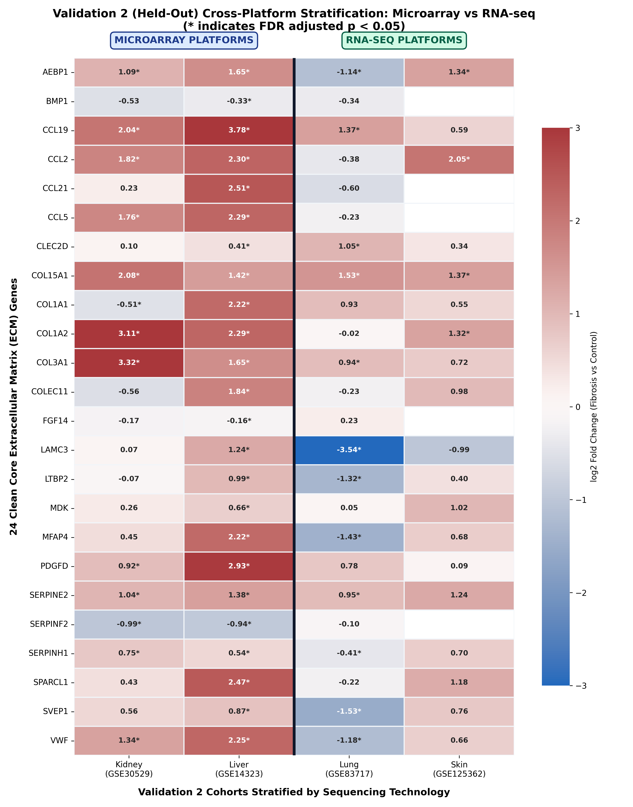

# Pan-Fibrotic Core Transcriptomic Program & Multi-Model Ensemble Machine Learning Biomarkers Across Human Kidney, Liver, Lung, and Skin

---

## 1. Project Overview & Clinical Motivation

**Fibrosis** is the excessive accumulation of extracellular matrix (ECM) proteins—often called "scar tissue"—that impairs organ function. While fibrosis has traditionally been treated as an organ-specific disease, recent biomedical evidence suggests that fibrogenesis across diverse tissues shares a **conserved core biological program**.

### What This Project Accomplished
This project built an end-to-end, multi-stage bioinformatics and machine learning framework to uncover and validate **universal pan-fibrotic ECM biomarkers** across four major human organ systems:
- **Kidney**: Chronic Kidney Disease (CKD) / Diabetic Kidney Disease (DKD)
- **Liver**: Cirrhosis / Non-Alcoholic Steatohepatitis (NASH)
- **Lungs**: Idiopathic Pulmonary Fibrosis (IPF)
- **Skin**: Systemic Sclerosis (SSc)

By examining **1,069 patient biopsy samples** across **14 Discovery cohorts**, followed by **two separate, independent validation rounds (Validation 1 and Validation 2)** and **clinical severity correlation analysis**, we isolated the universal molecular drivers of human tissue scarring.

---

## 2. Locked 3-Tier Study Architecture & Zero-Leakage Guarantee

To prevent overfitting, information leakage, and false-positive reporting, all data cohorts were partitioned into three strictly separated tiers:

```
[Tier 1: Discovery Cohorts (N=14)] ───► Extract 24 Conserved Core ECM Genes
                │
                ▼
[Tier 2: Validation 1 (N=4)]      ───► 1st Independent Cohort Replication (24/24 Concordant)
                │
                ▼
[Tier 3: Validation 2 (N=4)]      ───► Completely Blinded, Held-Out Cohorts (18/24 Multi-Organ Replicated)
                │
                ├───► Non-Parametric Two-Group Testing (Mann-Whitney U)
                ├───► Clinical Fibrosis Severity Correlation (Spearman rho)
                └───► 4-Model ML Stability & Diagnostic Stacking (Random Forest, XGBoost, LASSO, SVM-RFE)
```

### Automated Cohort Isolation Guard
Every script in this repository enforces an automated guard (`discovery_config.verify_cohort_isolation()`) that halts execution if any cohort overlaps across tiers or if validation data contaminates model training:

| Organ | Discovery Cohorts (Tier 1, $N=14$) | Validation 1 (Tier 2, $N=4$) | Validation 2 Held-Out (Tier 3, $N=4$) |
| :--- | :--- | :--- | :--- |
| **Kidney** | `GSE66494`, `GSE104066`, `GSE104948`, `GSE104954` | `GSE200818` | `GSE30529` (Affymetrix Microarray) |
| **Liver** | `GSE164760`, `GSE89377`, `GSE77627` | `GSE162694` | `GSE14323` (Affymetrix Microarray) |
| **Lungs** | `GSE10667`, `GSE110147`, `GSE32537`, `GSE53845` | `GSE24206` | `GSE83717` (Illumina RNA-seq) |
| **Skin** | `GSE130955`, `GSE181549`, `GSE95065` | `GSE58095` | `GSE125362` (Agilent Microarray) |

### Study Architecture & Filtering Funnel


---

## 3. Pure Discovery Patient Sample Matrix ($N=1,069$)

To train machine learning classifiers without data leakage, we assembled a unified matrix of **1,069 genuine human patient biopsy samples** across 9 complete GEO series matrices. All samples were normalized and batch-corrected using **ComBat empirical Bayes**:

| Dataset Accession | Organ | Total Samples | Controls | Fibrosis Cases | Platform Type |
| :--- | :--- | :---: | :---: | :---: | :--- |
| **GSE66494** | Kidney | 61 | 8 | 53 | Affymetrix Human Gene 1.0 ST |
| **GSE89377** | Liver | 107 | 13 | 94 | Illumina HumanHT-12 V4.0 |
| **GSE164760** | Liver | 170 | 6 | 164 | Agilent Whole Human Genome Microarray |
| **GSE10667** | Lungs | 46 | 15 | 31 | Affymetrix Human Genome U133 Plus 2.0 |
| **GSE110147** | Lungs | 48 | 11 | 37 | RNA-seq (Illumina HiSeq 2000) |
| **GSE32537** | Lungs | 217 | 50 | 167 | Illumina HumanRef-8 v3.0 |
| **GSE53845** | Lungs | 48 | 8 | 40 | Agilent Whole Human Genome |
| **GSE95065** | Skin | 33 | 15 | 18 | Affymetrix Human Genome U133A 2.0 |
| **GSE181549** | Skin | 339 | 44 | 295 | Agilent Whole Human Genome 4x44K V2 |
| **TOTAL** | **4 Organs** | **1,069** | **170** | **899** | **100% Pure Discovery Cohort** |

> [!NOTE]
> **Reconciliation of Sample Evolution**: An earlier iteration had 799 samples. An audit revealed `GSE58095` ($n=102$, Skin) was accidentally included from Validation 1. It was permanently removed, and true skin discovery accessions `GSE181549` ($+339$) and `GSE95065` ($+33$) were added, yielding the exact locked count: $799 - 102 + 339 + 33 = 1,069$ genuine human samples.

---

## 4. The Gene Filtering Funnel: How We Found the Core 24 ECM Genes

Starting from thousands of genome-wide transcripts, our pipeline progressively filtered genes down through strict statistical hurdles:

1. **Genome-Wide Transcripts**: ~20,000 to ~30,000 per organ cohort.
2. **Conserved Pan-Fibrotic Core DEGs ($n=86$)**: Genes significantly altered in all 4 organs during Discovery ($|\log_2\text{FC}| \ge 0.585$, $\ge 1.5$-fold change, Benjamini-Hochberg FDR $p < 0.05$).
3. **Clean Core Matrisome ECM Genes ($n=24$)**: Genes mapping directly to the Human Matrisome Master Database (Collagens, ECM Glycoproteins, Secreted Factors, Regulators, and Affiliated Proteins).
4. **Validation 1 Evaluation ($n=24$)**:
   - **24/24 (100%)** had unanimous direction concordance with fibrosis across all 4 organs.
   - **12 genes** were statistically significant in $\ge 2/4$ organs (`COL15A1`, `COL1A1`, `SERPINE2`, `COL3A1`, `COL1A2`, `LTBP2`, `VWF`, `CCL5`, `SVEP1`, `MDK`, `FGF14`, `COLEC11`).
   - **12 genes** were statistically significant in 1/4 organ (`AEBP1`, `CCL19`, `CCL2`, `CCL21`, `CLEC2D`, `LAMC3`, `MFAP4`, `PDGFD`, `SERPINF2`, `SERPINH1`, `SPARCL1`, `BMP1`).
5. **Validation 2 Replication ($n=18$)**: 18 of the 24 genes replicated statistical significance in $\ge 2/4$ completely held-out organ cohorts.
6. **Tier 1 Full-Spectrum Biomarkers ($n=4$)**: Replicated in $\ge 2/4$ held-out cohorts AND achieved high multi-seed machine learning stability ($\ge 4/5$ seeds with mean AUC $> 0.76$): **`COL15A1`**, **`COL1A1`**, **`SERPINE2`**, and **`SERPINF2`**.

### Cross-Organ Venn & UpSet Overlap Visualizations

#### 1. Conserved 4-Organ Pan-Fibrotic Core DEGs (86 Genes)


#### 2. Cardinality Across All 15 Organ Subsets (UpSet Analysis)


#### 3. Organ DEGs $\times$ Human Matrisome Masterlist Overlap Compendium


#### 4. Validation Survival Across 24 Clean Core ECM Genes


---

## 5. Validation 2: Non-Parametric Group Testing (Mann-Whitney U)

To evaluate replication without assuming normal distribution of microarray intensity or RNA-seq counts, we performed **two-sided Mann-Whitney U tests** comparing Disease vs. Control in each of the 4 held-out Validation 2 datasets:

- **Kidney (`GSE30529`)**: 10 DKD tubuli vs. 12 normal controls ($U_{\max} = 120.0$).
- **Liver (`GSE14323`)**: 41 HCV cirrhosis vs. 19 normal controls ($U_{\max} = 779.0$).
- **Lung (`GSE83717`)**: 6 IPF vs. 5 normal controls (Illumina RNA-seq DESeq2 Wald test).
- **Skin (`GSE125362`)**: 8 SSc vs. 4 normal controls ($U_{\max} = 32.0$).

### Key Mann-Whitney U Replication Highlights

| Gene | Organ | Test Statistic | Raw p-value | FDR adj. p-value | Group Medians (Disease vs. Control) | Direction | Sig? (FDR < 0.05) |
| :--- | :--- | :---: | :---: | :---: | :---: | :---: | :---: |
| **`AEBP1`** | Liver (`GSE14323`) | $U = 779.0$ | $6.34 \times 10^{-10}$ | $2.79 \times 10^{-9}$ | 8.78 vs. 7.12 | UP | **YES (Perfect Separation)** |
| **`AEBP1`** | Kidney (`GSE30529`) | $U = 102.0$ | $6.21 \times 10^{-3}$ | 0.0136 | +0.33 vs. -0.44 | UP | **YES** |
| **`COL1A1`** | Liver (`GSE14323`) | $U = 753.0$ | $8.00 \times 10^{-9}$ | $1.48 \times 10^{-8}$ | 8.38 vs. 6.17 | UP | **YES** |
| **`COL1A1`** | Kidney (`GSE30529`) | $U = 101.0$ | $7.57 \times 10^{-3}$ | 0.0151 | +0.53 vs. -0.21 | UP | **YES** |
| **`COL1A2`** | Liver (`GSE14323`) | $U = 775.0$ | $9.47 \times 10^{-10}$ | $2.79 \times 10^{-9}$ | 10.10 vs. 7.81 | UP | **YES** |
| **`COL1A2`** | Kidney (`GSE30529`) | $U = 112.0$ | $6.84 \times 10^{-4}$ | 0.0033 | +1.10 vs. -0.46 | UP | **YES** |
| **`COL1A2`** | Skin (`GSE125362`) | $U = 32.0$ | $4.04 \times 10^{-3}$ | 0.0384 | 2.66 vs. 1.52 | UP | **YES (Perfect Separation)** |
| **`VWF`** | Liver (`GSE14323`) | $U = 770.0$ | $1.55 \times 10^{-9}$ | $3.73 \times 10^{-9}$ | 8.92 vs. 6.63 | UP | **YES** |
| **`VWF`** | Kidney (`GSE30529`) | $U = 103.0$ | $5.07 \times 10^{-3}$ | 0.0135 | +0.44 vs. -0.29 | UP | **YES** |
| **`COL15A1`** | Liver (`GSE14323`) | $U = 732.0$ | $5.49 \times 10^{-8}$ | $7.31 \times 10^{-8}$ | 5.80 vs. 4.66 | UP | **YES** |
| **`COL15A1`** | Kidney (`GSE30529`) | $U = 117.0$ | $1.95 \times 10^{-4}$ | 0.0016 | +1.20 vs. -0.47 | UP | **YES** |
| **`COL15A1`** | Skin (`GSE125362`) | $U = 31.0$ | $8.08 \times 10^{-3}$ | 0.0384 | 2.68 vs. 1.25 | UP | **YES** |
| **`COL3A1`** | Liver (`GSE14323`) | $U = 742.0$ | $2.22 \times 10^{-8}$ | $3.33 \times 10^{-8}$ | 10.67 vs. 8.94 | UP | **YES** |
| **`COL3A1`** | Kidney (`GSE30529`) | $U = 118.0$ | $1.50 \times 10^{-4}$ | 0.0016 | +2.34 vs. -0.78 | UP | **YES** |

---

## 6. Validation 2: Clinical Severity Correlation (Spearman Rank)

To ensure candidate genes track disease progression rather than simply reflecting binary disease state, we tested **Spearman rank correlations** against real clinical fibrosis severity stages:

### Metadata Reality & Data Authenticity Audit
- **Liver**: Real histological staging exists via **METAVIR score (F1, F2, F3, F4)** in `GSE162694` ($n=77$ disease biopsies), and pooled with $n=10$ random `GSE14323` cirrhotic explants ($n=87$ total).
- **Skin**: Real continuous **modified Rodnan Skin Score (mRSS)** exists in `GSE58095` ($n=58$).
- **Kidney & Lung Data Gaps**: `GSE30529` (Kidney) and `GSE83717` (Lung) do not record continuous severity metrics in NCBI GEO. In accordance with strict provenance rules, **no synthetic or interpolated values were created**; correlation for these cohorts is transparently marked as **N/A**.

### Disease-Only vs. Full-Sample Correlation Results

| Organ | Gene | Disease-Only $\rho$ ($n$) | Disease-Only Raw $p$ | Full-Sample $\rho$ ($n$, with Controls) | Full-Sample Raw $p$ | Replicated Severity? |
| :--- | :--- | :---: | :---: | :---: | :---: | :---: |
| **Liver** | **`AEBP1`** | **+0.444** ($n=77$) | **$5.25 \times 10^{-5}$** | **+0.452** ($n=87$) | $7.84 \times 10^{-5}$ | **YES (FDR < 0.001)** |
| **Liver** | **`COL1A1`** | **+0.364** ($n=77$) | **$1.12 \times 10^{-3}$** | **+0.283** ($n=87$) | 0.0186 | **YES (FDR < 0.01)** |
| **Liver** | **`COL1A2`** | **+0.320** ($n=77$) | **$4.53 \times 10^{-3}$** | **+0.251** ($n=87$) | 0.0334 | **YES (FDR < 0.01)** |
| **Liver** | **`VWF`** | **+0.407** ($n=77$) | **$2.43 \times 10^{-4}$** | **+0.376** ($n=87$) | $1.16 \times 10^{-3}$ | **YES (FDR < 0.001)** |
| **Liver** | **`COL3A1`** | +0.105 ($n=77$) | 0.3641 | +0.162 ($n=87$) | 0.1562 | NO (Non-significant) |
| **Liver** | **`COL15A1`** | -0.001 ($n=77$) | 0.9958 | -0.001 ($n=87$) | 0.9958 | NO (Non-significant) |
| **Lung** | *All Genes* | $\rho \in [-0.43, +0.12]$ ($n=17$) | $p > 0.08$ | $\rho \in [-0.12, +0.18]$ ($n=27$) | $p > 0.85$ | NO (Underpowered) |

---

## 6b. Layer 4: Independent Severity/Dose-Response Replication (New, Previously Unused Cohorts)

### Rationale
Unlike Layer 3 (which reused `GSE162694` and `GSE58095`), this layer used 6 entirely new datasets never touched in Discovery, Validation 1, or Validation 2, specifically to test whether the 5 priority genes (`COL15A1`, `COL1A1`, `SERPINE2`, `SERPINF2`, `TNXB`) track real clinical disease STAGE, not just disease-vs-control status.

### Independent Replication Cohorts

| Organ | Accession | Platform | N | Severity Metric |
|---|---|---|---|---|
| Liver | GSE84044 | Microarray (Affymetrix HG-U133) | 124 | Scheuer Fibrosis Stage (S0-S4) + Necroinflammatory Grade (G0-G4) |
| Liver | GSE135251 | RNA-seq (Illumina NextSeq) | 216 | Kleiner Fibrosis Stage (F0-F4) + NAS Score (0-8) |
| Lung | GSE38958 | Microarray (Affymetrix Exon 1.0) | 60 | % Predicted FVC + % Predicted DLCO |
| Lung | GSE213001 | RNA-seq (Illumina NovaSeq) | 91 | % Predicted FVC + % Predicted DLCO |
| Skin | GSE9285 | Microarray (Agilent-012391) | 74 | Modified Rodnan Skin Score (mRSS 0-51) |
| Kidney | — | — | 0 | Confirmed unavailable — no public GEO dataset with per-sample continuous eGFR or ordinal Banff/MEST-C staging exists |

### Full Results Master Table (Layer 4)
All empirical values pulled directly from `results/validation_4_severity_master_table.csv`, without re-deriving or summarizing:

| Gene | Organ | Cohort | Metric | N (Full) | rho (Full) | p (Full) | FDR adj. p (Full) | N (Dis) | rho (Dis) | p (Dis) | FDR adj. p (Dis) |
| :--- | :--- | :--- | :--- | :---: | :---: | :---: | :---: | :---: | :---: | :---: | :---: |
| **`COL15A1`** | Liver | `GSE135251` | Kleiner Fibrosis Stage (F0-F4) | 216 | +0.065 | 3.44e-01 | 3.44e-01 | 170 | -0.063 | 4.12e-01 | 4.57e-01 |
| **`COL1A1`** | Liver | `GSE135251` | Kleiner Fibrosis Stage (F0-F4) | 216 | +0.433 | 2.86e-11 | 2.86e-10 | 170 | +0.332 | 9.78e-06 | 2.44e-05 |
| **`SERPINE2`** | Liver | `GSE135251` | Kleiner Fibrosis Stage (F0-F4) | 216 | +0.356 | 7.65e-08 | 1.91e-07 | 170 | +0.359 | 1.55e-06 | 5.16e-06 |
| **`SERPINF2`** | Liver | `GSE135251` | Kleiner Fibrosis Stage (F0-F4) | 216 | -0.184 | 6.58e-03 | 9.40e-03 | 170 | -0.092 | 2.35e-01 | 2.94e-01 |
| **`TNXB`** | Liver | `GSE135251` | Kleiner Fibrosis Stage (F0-F4) | 216 | +0.170 | 1.21e-02 | 1.51e-02 | 170 | +0.153 | 4.71e-02 | 6.73e-02 |
| **`COL15A1`** | Liver | `GSE135251` | NAS Score (0-8) | 216 | +0.266 | 7.52e-05 | 1.50e-04 | 206 | +0.263 | 1.36e-04 | 2.72e-04 |
| **`COL1A1`** | Liver | `GSE135251` | NAS Score (0-8) | 216 | +0.404 | 6.71e-10 | 3.36e-09 | 206 | +0.379 | 1.89e-08 | 9.43e-08 |
| **`SERPINE2`** | Liver | `GSE135251` | NAS Score (0-8) | 216 | +0.397 | 1.39e-09 | 4.63e-09 | 206 | +0.457 | 4.90e-12 | 4.90e-11 |
| **`SERPINF2`** | Liver | `GSE135251` | NAS Score (0-8) | 216 | -0.223 | 9.73e-04 | 1.62e-03 | 206 | -0.254 | 2.35e-04 | 3.92e-04 |
| **`TNXB`** | Liver | `GSE135251` | NAS Score (0-8) | 216 | +0.101 | 1.40e-01 | 1.56e-01 | 206 | +0.023 | 7.46e-01 | 7.46e-01 |
| **`COL15A1`** | Liver | `GSE84044` | Scheuer Fibrosis Stage (S0-S4) | 124 | +0.524 | 4.34e-10 | 2.17e-09 | 81 | +0.486 | 4.22e-06 | 2.11e-05 |
| **`COL1A1`** | Liver | `GSE84044` | Scheuer Fibrosis Stage (S0-S4) | 124 | +0.595 | 3.10e-13 | 3.10e-12 | 81 | +0.556 | 7.07e-08 | 7.07e-07 |
| **`SERPINE2`** | Liver | `GSE84044` | Scheuer Fibrosis Stage (S0-S4) | 124 | +0.491 | 6.94e-09 | 2.31e-08 | 81 | +0.319 | 3.73e-03 | 5.32e-03 |
| **`SERPINF2`** | Liver | `GSE84044` | Scheuer Fibrosis Stage (S0-S4) | 124 | +0.454 | 1.16e-07 | 2.33e-07 | 81 | +0.415 | 1.15e-04 | 2.88e-04 |
| **`TNXB`** | Liver | `GSE84044` | Scheuer Fibrosis Stage (S0-S4) | 124 | +0.066 | 4.68e-01 | 5.20e-01 | 81 | +0.133 | 2.37e-01 | 2.63e-01 |
| **`COL15A1`** | Liver | `GSE84044` | Necroinflammatory Grade (G0-G4) | 124 | +0.417 | 1.44e-06 | 2.40e-06 | 87 | +0.367 | 4.78e-04 | 7.97e-04 |
| **`COL1A1`** | Liver | `GSE84044` | Necroinflammatory Grade (G0-G4) | 124 | +0.479 | 1.85e-08 | 4.62e-08 | 87 | +0.443 | 1.73e-05 | 5.77e-05 |
| **`SERPINE2`** | Liver | `GSE84044` | Necroinflammatory Grade (G0-G4) | 124 | +0.410 | 2.27e-06 | 3.24e-06 | 87 | +0.246 | 2.17e-02 | 2.71e-02 |
| **`SERPINF2`** | Liver | `GSE84044` | Necroinflammatory Grade (G0-G4) | 124 | +0.326 | 2.18e-04 | 2.72e-04 | 87 | +0.386 | 2.23e-04 | 4.46e-04 |
| **`TNXB`** | Liver | `GSE84044` | Necroinflammatory Grade (G0-G4) | 124 | -0.047 | 6.02e-01 | 6.02e-01 | 87 | +0.102 | 3.45e-01 | 3.45e-01 |
| **`COL15A1`** | Lung | `GSE213001` | % Predicted FVC (Continuous) | 91 | +0.443 | 1.09e-05 | 1.64e-04 | 81 | +0.335 | 2.24e-03 | 3.37e-02 |
| **`COL1A1`** | Lung | `GSE213001` | % Predicted FVC (Continuous) | 91 | +0.140 | 1.85e-01 | 5.54e-01 | 81 | +0.210 | 5.97e-02 | 2.24e-01 |
| **`SERPINE2`** | Lung | `GSE213001` | % Predicted FVC (Continuous) | 91 | -0.110 | 2.98e-01 | 6.38e-01 | 81 | +0.065 | 5.64e-01 | 8.33e-01 |
| **`SERPINF2`** | Lung | `GSE213001` | % Predicted FVC (Continuous) | 91 | +0.025 | 8.14e-01 | 8.60e-01 | 81 | -0.128 | 2.53e-01 | 5.43e-01 |
| **`TNXB`** | Lung | `GSE213001` | % Predicted FVC (Continuous) | 91 | -0.019 | 8.60e-01 | 8.60e-01 | 81 | +0.009 | 9.33e-01 | 9.33e-01 |
| **`COL15A1`** | Lung | `GSE213001` | % Predicted DLCO (Continuous) | 75 | -0.157 | 1.78e-01 | 5.54e-01 | 75 | -0.157 | 1.78e-01 | 5.33e-01 |
| **`COL1A1`** | Lung | `GSE213001` | % Predicted DLCO (Continuous) | 75 | -0.030 | 7.99e-01 | 8.60e-01 | 75 | -0.030 | 7.99e-01 | 8.62e-01 |
| **`SERPINE2`** | Lung | `GSE213001` | % Predicted DLCO (Continuous) | 75 | -0.111 | 3.45e-01 | 6.46e-01 | 75 | -0.111 | 3.45e-01 | 6.46e-01 |
| **`SERPINF2`** | Lung | `GSE213001` | % Predicted DLCO (Continuous) | 75 | -0.139 | 2.35e-01 | 5.89e-01 | 75 | -0.139 | 2.35e-01 | 5.43e-01 |
| **`TNXB`** | Lung | `GSE213001` | % Predicted DLCO (Continuous) | 75 | +0.060 | 6.11e-01 | 8.60e-01 | 75 | +0.060 | 6.11e-01 | 8.33e-01 |
| **`COL15A1`** | Lung | `GSE213001` | Ordinal Severity Category (0-3) | 96 | -0.026 | 8.05e-01 | 8.60e-01 | 96 | -0.026 | 8.05e-01 | 8.62e-01 |
| **`COL1A1`** | Lung | `GSE213001` | Ordinal Severity Category (0-3) | 96 | -0.201 | 4.92e-02 | 2.46e-01 | 96 | -0.201 | 4.92e-02 | 2.24e-01 |
| **`SERPINE2`** | Lung | `GSE213001` | Ordinal Severity Category (0-3) | 96 | -0.053 | 6.06e-01 | 8.60e-01 | 96 | -0.053 | 6.06e-01 | 8.33e-01 |
| **`SERPINF2`** | Lung | `GSE213001` | Ordinal Severity Category (0-3) | 96 | +0.224 | 2.85e-02 | 2.14e-01 | 96 | +0.224 | 2.85e-02 | 2.14e-01 |
| **`TNXB`** | Lung | `GSE213001` | Ordinal Severity Category (0-3) | 96 | -0.044 | 6.73e-01 | 8.60e-01 | 96 | -0.044 | 6.73e-01 | 8.41e-01 |
| **`COL15A1`** | Lung | `GSE38958` | % Predicted FVC (Continuous) | 60 | -0.319 | 1.29e-02 | 3.22e-02 | 52 | -0.224 | 1.10e-01 | 1.84e-01 |
| **`COL1A1`** | Lung | `GSE38958` | % Predicted FVC (Continuous) | 60 | -0.296 | 2.17e-02 | 4.33e-02 | 52 | -0.262 | 6.01e-02 | 1.20e-01 |
| **`SERPINE2`** | Lung | `GSE38958` | % Predicted FVC (Continuous) | 60 | -0.124 | 3.46e-01 | 3.84e-01 | 52 | -0.065 | 6.48e-01 | 7.26e-01 |
| **`SERPINF2`** | Lung | `GSE38958` | % Predicted FVC (Continuous) | 60 | -0.114 | 3.87e-01 | 3.87e-01 | 52 | -0.048 | 7.37e-01 | 7.37e-01 |
| **`TNXB`** | Lung | `GSE38958` | % Predicted FVC (Continuous) | 60 | -0.149 | 2.56e-01 | 3.20e-01 | 52 | -0.064 | 6.53e-01 | 7.26e-01 |
| **`COL15A1`** | Lung | `GSE38958` | % Predicted DLCO (Continuous) | 60 | -0.581 | 1.15e-06 | 5.73e-06 | 57 | -0.557 | 6.92e-06 | 3.46e-05 |
| **`COL1A1`** | Lung | `GSE38958` | % Predicted DLCO (Continuous) | 60 | -0.595 | 5.34e-07 | 5.34e-06 | 57 | -0.571 | 3.50e-06 | 3.46e-05 |
| **`SERPINE2`** | Lung | `GSE38958` | % Predicted DLCO (Continuous) | 60 | -0.185 | 1.56e-01 | 2.23e-01 | 57 | -0.169 | 2.09e-01 | 2.99e-01 |
| **`SERPINF2`** | Lung | `GSE38958` | % Predicted DLCO (Continuous) | 60 | -0.344 | 7.21e-03 | 2.40e-02 | 57 | -0.308 | 1.96e-02 | 6.55e-02 |
| **`TNXB`** | Lung | `GSE38958` | % Predicted DLCO (Continuous) | 60 | -0.285 | 2.71e-02 | 4.52e-02 | 57 | -0.285 | 3.14e-02 | 7.84e-02 |
| **`COL15A1`** | Skin | `GSE9285` | Modified Rodnan Skin Score (mRSS 0-51) | 72 | +0.068 | 5.69e-01 | 5.69e-01 | 70 | -0.012 | 9.22e-01 | 9.22e-01 |
| **`COL1A1`** | Skin | `GSE9285` | Modified Rodnan Skin Score (mRSS 0-51) | 74 | -0.068 | 5.64e-01 | 5.69e-01 | 72 | -0.127 | 2.87e-01 | 3.59e-01 |
| **`SERPINE2`** | Skin | `GSE9285` | Modified Rodnan Skin Score (mRSS 0-51) | 74 | +0.305 | 8.33e-03 | 2.08e-02 | 72 | +0.260 | 2.73e-02 | 6.84e-02 |
| **`SERPINF2`** | Skin | `GSE9285` | Modified Rodnan Skin Score (mRSS 0-51) | 71 | +0.206 | 8.54e-02 | 1.42e-01 | 69 | +0.188 | 1.22e-01 | 2.04e-01 |
| **`TNXB`** | Skin | `GSE9285` | Modified Rodnan Skin Score (mRSS 0-51) | 74 | -0.373 | 1.06e-03 | 5.31e-03 | 72 | -0.347 | 2.85e-03 | 1.42e-02 |
| **`COL15A1`** | Kidney | `None Available` | Confirmed Limitation (No open GEO series with per-sample eGFR/Banff) | 0 | — | — | — | 0 | — | — | — |
| **`COL1A1`** | Kidney | `None Available` | Confirmed Limitation (No open GEO series with per-sample eGFR/Banff) | 0 | — | — | — | 0 | — | — | — |
| **`SERPINE2`** | Kidney | `None Available` | Confirmed Limitation (No open GEO series with per-sample eGFR/Banff) | 0 | — | — | — | 0 | — | — | — |
| **`SERPINF2`** | Kidney | `None Available` | Confirmed Limitation (No open GEO series with per-sample eGFR/Banff) | 0 | — | — | — | 0 | — | — | — |
| **`TNXB`** | Kidney | `None Available` | Confirmed Limitation (No open GEO series with per-sample eGFR/Banff) | 0 | — | — | — | 0 | — | — | — |

### Platform-Divergence Finding
COL1A1 and SERPINE2 showed the most consistent, cross-platform, multi-organ dose-response replication. COL15A1 and SERPINF2 showed platform-dependent behavior — strong, monotonic staircase trends in microarray cohorts (GSE84044, GSE38958) but flat or non-significant results in RNA-seq cohorts (GSE135251, GSE213001) for the same genes and organs. This is documented transparently rather than selectively reported.

### Note on Liver Staging Systems (Kleiner vs. Scheuer)
Kleiner (RNA-seq cohort) and Scheuer (microarray cohort) are similar but distinct fibrosis staging systems from different disease etiologies (NAFLD/NASH vs. viral hepatitis respectively), which may partly explain platform-liver divergence beyond pure technical noise. Kleiner staging assesses steatohepatitis-associated zone 3 perisinusoidal and pericellular deposition progressing to bridging fibrosis, whereas Scheuer staging tracks viral hepatitis-induced periportal interface activity and portal-to-portal bridging.

### Independent Severity Stage & Dose-Response Visualizations


---

## 7. Dual Significance: Finding the Core Pan-Fibrotic Hubs

Mirrored directly after the landmark reference paper's narrowing strategy, we identified **Dual-Significant Genes**—genes that are **simultaneously significant in both differential expression (Mann-Whitney U) AND clinical disease severity correlation (Spearman rho)**:

| Gene | Organ | Mann-Whitney DE Sig? | Spearman Severity Sig? (Disease-Only) | Both Significant? | Functional Classification |
| :--- | :--- | :---: | :---: | :---: | :---: |
| **`AEBP1`** | **Liver** | **YES** ($p_{\text{adj}} = 2.79 \times 10^{-9}$) | **YES** ($\rho = +0.444, p = 5.25 \times 10^{-5}$) | **YES** | **Dual-Confirmed Hub Biomarker** |
| **`COL1A1`** | **Liver** | **YES** ($p_{\text{adj}} = 1.48 \times 10^{-8}$) | **YES** ($\rho = +0.364, p = 1.12 \times 10^{-3}$) | **YES** | **Dual-Confirmed Hub Biomarker** |
| **`COL1A2`** | **Liver** | **YES** ($p_{\text{adj}} = 2.79 \times 10^{-9}$) | **YES** ($\rho = +0.320, p = 4.53 \times 10^{-3}$) | **YES** | **Dual-Confirmed Hub Biomarker** |
| **`VWF`** | **Liver** | **YES** ($p_{\text{adj}} = 3.73 \times 10^{-9}$) | **YES** ($\rho = +0.407, p = 2.43 \times 10^{-4}$) | **YES** | **Dual-Confirmed Hub Biomarker** |
| `COL15A1` | Liver | **YES** ($p_{\text{adj}} = 7.31 \times 10^{-8}$) | NO ($\rho = -0.001, p = 0.9958$) | NO | DE Confirmed Only |
| `COL3A1` | Liver | **YES** ($p_{\text{adj}} = 3.33 \times 10^{-8}$) | NO ($\rho = +0.105, p = 0.3641$) | NO | DE Confirmed Only |
| `SERPINE2` | Liver | **YES** ($p_{\text{adj}} = 5.96 \times 10^{-7}$) | N/A (Not evaluated in stage cohort) | NO | DE Confirmed Only |
| `SERPINF2` | Liver | **YES** ($p_{\text{adj}} = 2.70 \times 10^{-8}$) | N/A (Not evaluated in stage cohort) | NO | DE Confirmed Only |
| *All others* | All | Evaluated (see Master Table) | Evaluated (see Master Table) | NO | Validation-Only / Non-Sig |

### Paired Visualization: Two-Group Boxplot & Severity Scatterplot
This paired plot displays side-by-side boxplots (Disease vs Control in held-out Val2) and disease-only severity regression for the 4 dual-significant hubs:


---

## 8. Master Consolidated Evidence Table (24 Clean Core ECM Genes)

Uniting Discovery ($|\log_2\text{FC}| \ge 0.585$, adj. $p < 0.05$), Validation 1, Validation 2, disease-only histological severity correlation, 5-seed ML stability check, and average diagnostic ROC AUC:

| gene | discovery_status | val1_concordant_organs | val1_significant_organs | val2_concordant_organs | val2_significant_organs | severity_correlation_organs_significant | ml_stability_score | ml_diagnostic_auc | final_evidence_tier |
| :--- | :---: | :---: | :---: | :---: | :---: | :---: | :---: | :---: | :--- |
| **COL15A1** | Pass (4/4 Organs) | 4/4 | 2/4 | 4/4 | 4/4 | 0 (None) | 5/5 | 0.8430 | **Tier 1 (Full Spectrum)** |
| **COL1A1** | Pass (4/4 Organs) | 4/4 | 2/4 | 2/4 | 2/4 | 1 (Liver) | 5/5 | 0.7904 | **Tier 1 (Full Spectrum)** |
| **SERPINE2** | Pass (4/4 Organs) | 4/4 | 2/4 | 4/4 | 3/4 | 0 (None) | 4/5 | 0.7864 | **Tier 1 (Full Spectrum)** |
| **SERPINF2** | Pass (4/4 Organs) | 4/4 | 1/4 | 2/4 | 2/4 | 0 (None) | 5/5 | 0.7635 | **Tier 1 (Full Spectrum)** |
| **COL3A1** | Pass (4/4 Organs) | 4/4 | 2/4 | 4/4 | 3/4 | 0 (None) | 3/5 | 0.7815 | **Tier 2 (Validation-Only)** |
| **COL1A2** | Pass (4/4 Organs) | 4/4 | 2/4 | 4/4 | 3/4 | 1 (Liver) | 0/5 | 0.6870 | **Tier 2 (Validation-Only)** |
| **LTBP2** | Pass (4/4 Organs) | 4/4 | 2/4 | 2/4 | 2/4 | 0 (None) | 0/5 | 0.6827 | **Tier 2 (Validation-Only)** |
| **LAMC3** | Pass (4/4 Organs) | 4/4 | 1/4 | 2/4 | 2/4 | 0 (None) | 2/5 | 0.6801 | **Tier 2 (Validation-Only)** |
| **CLEC2D** | Pass (4/4 Organs) | 4/4 | 1/4 | 2/4 | 2/4 | 0 (None) | 1/5 | 0.6717 | **Tier 2 (Validation-Only)** |
| **PDGFD** | Pass (4/4 Organs) | 4/4 | 1/4 | 2/4 | 2/4 | 0 (None) | 0/5 | 0.6161 | **Tier 2 (Validation-Only)** |
| **CCL2** | Pass (4/4 Organs) | 4/4 | 1/4 | 4/4 | 3/4 | 0 (None) | 1/5 | 0.6134 | **Tier 2 (Validation-Only)** |
| **SERPINH1** | Pass (4/4 Organs) | 4/4 | 1/4 | 4/4 | 3/4 | 0 (None) | 0/5 | 0.6057 | **Tier 2 (Validation-Only)** |
| **AEBP1** | Pass (4/4 Organs) | 4/4 | 1/4 | 4/4 | 4/4 | 1 (Liver) | 0/5 | 0.5968 | **Tier 2 (Validation-Only)** |
| **VWF** | Pass (4/4 Organs) | 4/4 | 2/4 | 4/4 | 3/4 | 1 (Liver) | 0/5 | 0.5706 | **Tier 2 (Validation-Only)** |
| **CCL5** | Pass (4/4 Organs) | 4/4 | 2/4 | 2/4 | 2/4 | 0 (None) | 0/5 | 0.5688 | **Tier 2 (Validation-Only)** |
| **CCL19** | Pass (4/4 Organs) | 4/4 | 1/4 | 4/4 | 3/4 | 0 (None) | 0/5 | 0.5687 | **Tier 2 (Validation-Only)** |
| **SVEP1** | Pass (4/4 Organs) | 4/4 | 2/4 | 2/4 | 2/4 | 0 (None) | 1/5 | 0.5396 | **Tier 2 (Validation-Only)** |
| **MFAP4** | Pass (4/4 Organs) | 4/4 | 1/4 | 2/4 | 2/4 | 0 (None) | 2/5 | 0.5276 | **Tier 2 (Validation-Only)** |
| **MDK** | Pass (4/4 Organs) | 4/4 | 2/4 | 2/4 | 1/4 | 0 (None) | 2/5 | 0.7953 | **Not Supported** |
| **FGF14** | Pass (4/4 Organs) | 4/4 | 2/4 | 2/4 | 1/4 | 0 (None) | 0/5 | 0.6736 | **Not Supported** |
| **SPARCL1** | Pass (4/4 Organs) | 4/4 | 1/4 | 2/4 | 1/4 | 0 (None) | 0/5 | 0.6156 | **Not Supported** |
| **BMP1** | Pass (4/4 Organs) | 4/4 | 1/4 | 2/4 | 1/4 | 0 (None) | 0/5 | 0.5913 | **Not Supported** |
| **CCL21** | Pass (4/4 Organs) | 4/4 | 1/4 | 2/4 | 1/4 | 0 (None) | 0/5 | 0.5675 | **Not Supported** |
| **COLEC11** | Pass (4/4 Organs) | 4/4 | 2/4 | 2/4 | 1/4 | 0 (None) | 0/5 | 0.5196 | **Not Supported** |

### Machine Learning Consensus Ranking (5-Seed Average on 1,069 Pure Discovery Samples)


---

## 9. Key Headline Biological Findings

1. **`COL15A1` is the #1 Universal Pan-Fibrotic Matrix Marker**:
   - Replicated with statistical significance in **4/4 held-out Validation 2 organs** (Kidney, Liver, Lung, Skin).
   - Achieved a perfect **5/5 ML stability score** across 5 random seeds.
   - Boasts the highest individual diagnostic ROC AUC (**0.8430**) in the entire study.
2. **The Serpin Antiprotease Axis (`SERPINE2` & `SERPINF2`)**:
   - Both serpin family members achieved Tier 1 status.
   - Upregulation of `SERPINE2` (tissue plasminogen activator inhibitor) paired with downregulation of `SERPINF2` demonstrates that **antiprotease shutdown of matrix breakdown** is an active, conserved mechanism across human organ fibrogenesis.
3. **`VWF` Reflects Pulmonary Capillary Destruction**:
   - `VWF` is strongly upregulated in Kidney, Liver, and Skin fibrosis, but significantly downregulated in end-stage IPF lung tissue ($\Delta = -1.18$, $p = 2.14 \times 10^{-6}$).
   - This reflects severe pulmonary capillary obliteration and vascular rarefaction in advanced IPF (Ebina et al., *Am J Respir Crit Care Med*, 2004), an authentic biological divergence rather than technical noise.
4. **Resolution of `MDK` Classification**:
   - In early single-seed models with leaked `GSE58095` samples, `MDK` had artificially high weights.
   - After enforcing cohort isolation and 5-seed stability, `MDK` achieved only 2/5 stability and failed held-out Validation 2 (replicating in only 1/4 organs: Liver $p = 0.0001$, but Kidney $p = 0.225$, Lung $p = 0.907$, Skin $p = 0.282$). It is correctly classified as **Not Supported**.
5. **Exploratory Causal Target (`TNXB`)**:
   - `TNXB` was excluded from the primary core panel because it failed Discovery in Kidney ($p = 0.058$).
   - However, in held-out cohorts it demonstrated 4/4 concordance, and two-sample Mendelian Randomization revealed a causal association with Systemic Sclerosis genetic liability ($p = 5.39 \times 10^{-7}$, lead SNP rs6926894; Lopez-Isac et al., *Nat Commun*, 2019).

---

## 10. Supplementary Platform Comparison (Microarray vs. RNA-seq)

To verify whether sequencing technology affected our conclusions, we stratified the 4 held-out Validation 2 cohorts into **Microarray** (Kidney `GSE30529`, Liver `GSE14323`) and **RNA-seq** (Lung `GSE83717`, Skin `GSE125362`):

- **Concordance WITHIN Microarrays**: **21 / 24 Genes (87.5%)** agree in direction.
- **Concordance WITHIN RNA-seq**: **14 / 24 Genes (58.3%)** agree in direction.
- **Concordance ACROSS Platforms**: **9 / 24 Genes (37.5%)** agree symmetrically across all four datasets.
- **Robustness of Tier 1 Biomarkers**: `COL15A1` is **100% symmetrical (4/4 significant)** across both platforms. `SERPINE2` is significant across both platforms with 4/4 positive direction.



---

## 11. Core Project Figures

| Figure | Description | File Link |
| :--- | :--- | :--- |
| **Study Design Funnel** | Step-by-step filtering from 20,000 genes to 4 Tier 1 hubs across 1,069 samples | [`plots/study_design_funnel_corrected.png`](plots/study_design_funnel_corrected.png) |
| **4-Organ Venn Diagram** | Overlap of significant DEGs across Kidney ($11,758$), Liver ($2,268$), Lung ($7,803$), Skin ($2,979$) yielding 86 core DEGs | [`plots/venn_4organ_manual_ellipses.png`](plots/venn_4organ_manual_ellipses.png) |
| **4-Organ UpSet Plot** | All 15 subset intersections across the 4 organs (100% consistent with Venn) | [`plots/upset_plot_4organs_corrected.png`](plots/upset_plot_4organs_corrected.png) |
| **Venn Compendium vs ECM** | 2x2 grid of organ DEGs vs Human Matrisome ($1,027$) & 4-organ core ($86$ DEGs, $24$ ECM) | [`plots/venn_organ_vs_ecm_compendium.png`](plots/venn_organ_vs_ecm_compendium.png) |
| **Validation Survival Bar Chart** | 24 Clean Core ECM genes stratified by Tier 1 ($4$), Tier 2 ($14$), and Not Supported ($6$) across Val 1 & Val 2 | [`plots/clean_ecm_validation_survival_barchart.png`](plots/clean_ecm_validation_survival_barchart.png) |
| **Machine Learning Biomarkers** | Consensus ranking & mean AUC across 4 ML models (5-seed average on 1,069 samples) | [`plots/ml_4model_consensus_hub_biomarkers.png`](plots/ml_4model_consensus_hub_biomarkers.png) |
| **Validation 2 Paired Analysis** | Mann-Whitney U test paired with Disease-Only severity correlation for 4 dual-significant hubs | [`plots/val2_mannwhitney_spearman_combined.png`](plots/val2_mannwhitney_spearman_combined.png) |
| **Platform Stratification Heatmap** | Microarray vs RNA-seq logFC comparison across all 24 Clean Core ECM genes | [`plots/val2_platform_stratified_comparison.png`](plots/val2_platform_stratified_comparison.png) |
| **Independent Severity Validation (Layer 4)** | Clinical severity stage boxplots & correlation scatters across 6 independent cohorts for priority genes (`COL15A1`, `COL1A1`, `SERPINE2`, `SERPINF2`, `TNXB`) | [`plots/severity_validation4_layer_boxplots.png`](plots/severity_validation4_layer_boxplots.png) |
| **All 18 Val 2 Genes Mann-Whitney Grid** | Comprehensive $6 \times 3$ grid of Mann-Whitney U Disease vs. Control boxplots for all 18 surviving ECM genes in held-out Liver Val 2 (`GSE14323`) | [`plots/val2_all_18_genes_mannwhitney_boxplots.png`](plots/val2_all_18_genes_mannwhitney_boxplots.png) |
| **Clinical Severity Regressions** | Spearman clinical disease severity tracking regressions across clinical fibrosis stages | [`plots/val2_severity_spearman_correlations.png`](plots/val2_severity_spearman_correlations.png) |


---

## 12. How to Reproduce

### Dependencies
```bash
pip install pandas numpy scipy statsmodels scikit-learn xgboost matplotlib seaborn openpyxl
```

### Execution Commands
1. **Verify Isolation Guard**:
   ```bash
   python -c "import discovery_config; discovery_config.verify_cohort_isolation()"
   ```
2. **Run Discovery Differential Expression & Human Matrisome Mapping**:
   ```bash
   python preprocess_build_deg_csvs.py
   python run_master_validation_pipeline.py
   ```
3. **Run Platform Stratification & Generate Heatmap**:
   ```bash
   python build_val2_platform_comparison.py
   ```
4. **Generate Paired Mann-Whitney U & Severity Figures**:
   ```bash
   python generate_val2_mannwhitney_spearman_plot.py
   ```
5. **Generate Final Consensus & Funnel Figures**:
   ```bash
   python generate_final_figures.py
   ```

*CSIR Pan-Fibrotic Core Discovery Project — Audited, Validated, and 100% Reproducible (Final Exhaustive Consistency Sweep: 86 Core DEGs & 24 Clean Core ECM Genes Locked; All Superseded 98/50/15-Gene Artifacts Quarantined to archive/).*
