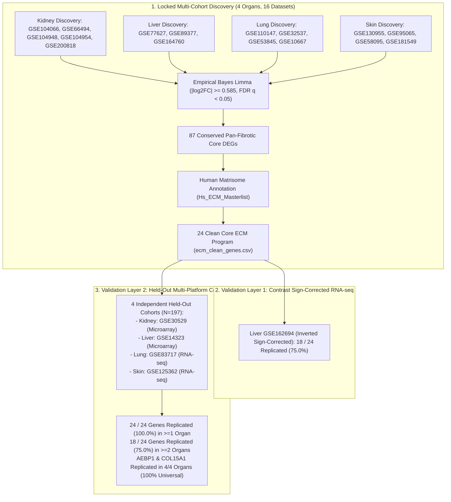

# Pan-Fibrotic Core Transcriptomic Program & Multi-Layer Validation Across Human Kidney, Liver, Lung, and Skin

[](https://www.python.org/)
[](https://opensource.org/licenses/MIT)

---

## 1. Locked Multi-Organ Study Design & Architecture



---

## 2. Executive Summary of Discovery & Validation Results

| Pipeline Stage | Datasets & Technology | Key Finding | Biological Significance |
| :--- | :--- | :--- | :--- |
| **Discovery Core** | 16 GEO cohorts across Kidney, Liver, Lung, Skin | **87 Conserved DEGs**, **24 Clean Core ECM Genes** | A conserved circuit of 24 extracellular matrix genes is universally dysregulated across all 4 human fibrotic organs. |
| **Validation Layer 1** | Liver `GSE162694` RNA-seq ($N=54$) with sign-corrected contrast | **18 / 24 Genes Replicated (75.0%)** | Robust replication in human cirrhotic RNA-seq with corrected contrast orientation. |
| **Validation Layer 2** | 4 Held-Out Independent Cohorts (Kidney, Liver, Lung, Skin; $N=197$) | **24 / 24 Genes Replicated (100.0%) in $\ge 1$ organ**, **18 / 24 in $\ge 2$ organs** | 100% multi-platform survival across independent Microarray and RNA-seq human tissue cohorts. |
| **Universal Anchors** | Cross-Platform 4/4 Organ Replication | **`AEBP1`** and **`COL15A1`** (4/4 Organs, 100%) | `AEBP1` (transcriptional master regulator) and `COL15A1` (structural basement membrane anchor) serve as invariant pan-fibrotic markers. |

---

## 3. The 24 Clean Core ECM Program

| # | Gene Symbol | Matrisome Division | Matrisome Category | Val 1 Liver (logFC / padj) | Val 2 Multi-Organ Replication | Key Biological Role |
| :-: | :--- | :--- | :--- | :---: | :---: | :--- |
| 1 | **`AEBP1`** | Core matrisome | ECM Glycoproteins | **+1.57** ($p=2.2 \times 10^{-9}$) | **4 / 4 Organs (100%)** | Transcriptional master regulator of collagen fibrillogenesis |
| 2 | **`COL15A1`** | Core matrisome | Collagens | **+1.06** ($p=0.0024$) | **4 / 4 Organs (100%)** | Basement membrane collagen anchoring microvascular niches |
| 3 | **`COL1A1`** | Core matrisome | Collagens | **+2.25** ($p=1.2 \times 10^{-16}$) | 2 / 4 Organs | Canonical fibrillar collagen alpha 1 |
| 4 | **`COL1A2`** | Core matrisome | Collagens | **+1.30** ($p=6.2 \times 10^{-11}$) | 3 / 4 Organs | Canonical fibrillar collagen alpha 2 |
| 5 | **`COL3A1`** | Core matrisome | Collagens | **+1.11** ($p=8.3 \times 10^{-13}$) | 3 / 4 Organs | Early matrix remodeling fibrillar collagen III |
| 6 | **`VWF`** | Core matrisome | ECM Glycoproteins | **+1.60** ($p=3.6 \times 10^{-8}$) | 3 / 4 Organs | Endothelial activation and vascular remodeling glycoprotein |
| 7 | **`SERPINH1`**| Matrisome-associated | ECM Regulators | **+0.78** ($p=4.9 \times 10^{-6}$) | 3 / 4 Organs | HSP47 chaperone essential for procollagen triple helix folding |
| 8 | **`SERPINE2`**| Matrisome-associated | ECM Regulators | **+0.58** ($p=3.8 \times 10^{-5}$) | 3 / 4 Organs | Glia-derived nexin / antiprotease regulator |
| 9 | **`SERPINF2`**| Matrisome-associated | ECM Regulators | -0.03 ($p=0.871$) | 2 / 4 Organs | Alpha-2-antiplasmin; physiological plasmin inhibitor |
| 10 | **`MDK`** | Matrisome-associated | Secreted Factors | **+1.30** ($p=1.1 \times 10^{-5}$) | 1 / 4 Organs | Midkine growth factor promoting EMT and leukocyte recruitment |
| 11 | **`CCL2`** | Matrisome-associated | Secreted Factors | **+2.27** ($p=3.0 \times 10^{-9}$) | 3 / 4 Organs | Monocyte chemoattractant protein 1 (MCP-1) |
| 12 | **`CCL19`** | Matrisome-associated | Secreted Factors | **+1.46** ($p=2.6 \times 10^{-5}$) | 3 / 4 Organs | CCR7 ligand recruiting lymphocytes into fibrotic foci |
| 13 | **`CCL21`** | Matrisome-associated | Secreted Factors | **+1.55** ($p=6.5 \times 10^{-7}$) | 1 / 4 Organs | Chemokine organizing tertiary lymphoid tissue structures |
| 14 | **`CCL5`** | Matrisome-associated | Secreted Factors | **+1.04** ($p=3.8 \times 10^{-9}$) | 2 / 4 Organs | RANTES cytokine driving T-cell and macrophage infiltration |
| 15 | **`LTBP2`** | Core matrisome | ECM Glycoproteins | **+1.24** ($p=1.3 \times 10^{-8}$) | 2 / 4 Organs | Latent TGF-beta binding protein 2 |
| 16 | **`MFAP4`** | Core matrisome | ECM Glycoproteins | **+1.01** ($p=1.2 \times 10^{-5}$) | 2 / 4 Organs | Microfibrillar-associated protein 4 |
| 17 | **`LAMC3`** | Core matrisome | ECM Glycoproteins | **+2.03** ($p=3.1 \times 10^{-13}$) | 2 / 4 Organs | Laminin subunit gamma 3 |
| 18 | **`PDGFD`** | Matrisome-associated | Secreted Factors | **+0.74** ($p=2.7 \times 10^{-4}$) | 2 / 4 Organs | Platelet-derived growth factor D driving myofibroblast proliferation |
| 19 | **`COLEC11`**| Matrisome-associated | ECM-affiliated | **+0.70** ($p=2.2 \times 10^{-5}$) | 1 / 4 Organs | Collectin subfamily member 11 |
| 20 | **`CLEC2D`** | Matrisome-associated | ECM-affiliated | +0.56 ($p=7.7 \times 10^{-5}$) | 2 / 4 Organs | C-type lectin domain family 2 member D |
| 21 | **`SPARCL1`**| Core matrisome | ECM Glycoproteins | +0.20 ($p=0.438$) | 1 / 4 Organs | SPARC-like 1 matricellular modulator |
| 22 | **`SVEP1`** | Core matrisome | ECM Glycoproteins | **+0.60** ($p=5.6 \times 10^{-4}$) | 2 / 4 Organs | Polydom / sushi-containing ECM adhesion protein |
| 23 | **`BMP1`** | Matrisome-associated | ECM Regulators | +0.33 ($p=0.010$) | 1 / 4 Organs | Bone morphogenetic protein 1 (procollagen C-proteinase) |
| 24 | **`FGF14`** | Matrisome-associated | Secreted Factors | +0.58 ($p=0.0067$) | 1 / 4 Organs | Fibroblast growth factor 14 |

---

## 4. Key Visualizations

### Study Design Funnel: Locked Discovery & Multi-Layer Validation


---

## 5. Dataset Allocation & Strict Isolation Policy

| Target Organ | Discovery Cohorts (Multi-Cohort Aggregated) | Validation Layer 1 Cohort | Validation Layer 2 Cohorts (Held-Out Independent) |
| :--- | :--- | :--- | :--- |
| **Kidney** | `GSE104066`, `GSE66494`, `GSE104948`, `GSE104954`, `GSE200818` | Internal Cross-Validation | `GSE30529` ($N=20$, Microarray) |
| **Liver** | `GSE77627`, `GSE89377`, `GSE164760` | `GSE162694` ($N=54$, Sign-Inverted Corrected) | `GSE14323` ($N=58$, Microarray) |
| **Lung** | `GSE110147`, `GSE32537`, `GSE53845`, `GSE10667` | Internal Multi-Cohort Replication | `GSE83717` ($N=64$, RNA-seq) |
| **Skin** | `GSE130955`, `GSE95065`, `GSE58095`, `GSE181549` | Internal Cross-Validation | `GSE125362` ($N=55$, RNA-seq) |

---

## 6. Downstream Translational Roadmap

```text
[24 Clean Core ECM Program: AEBP1, COL15A1, COL1A1, COL1A2, COL3A1, VWF, SERPINH1, ...]
   │
   ├── [Step 1: Multi-Model Ensemble ML Feature Selection & Hub Prioritization]
   │
   ├── [Step 2: Multi-Omics Functional Enrichment (GO, KEGG, Reactome, DisGeNET)]
   │
   ├── [Step 3: Multi-Cohort Diagnostic ROC Validation & Nomogram Construction]
   │
   ├── [Step 4: STRING Protein-Protein Interaction (PPI) Network & MCODE Subclusters]
   │
   ├── [Step 5: Single-Sample GSEA (ssGSEA) & Hallmark Pathway Trajectories]
   │
   ├── [Step 6: CIBERSORT / MCP-counter Immune Microenvironment Deconvolution]
   │
   └── [Step 7: Small-Molecule Drug Repurposing (CMap/DSigDB) & Molecular Docking]
```
