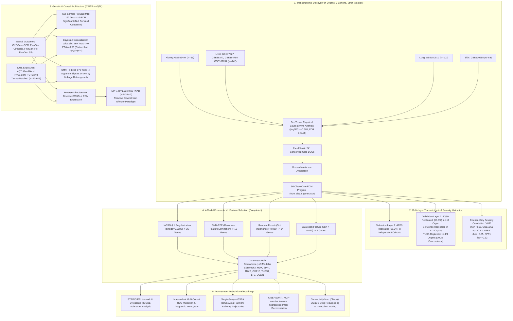
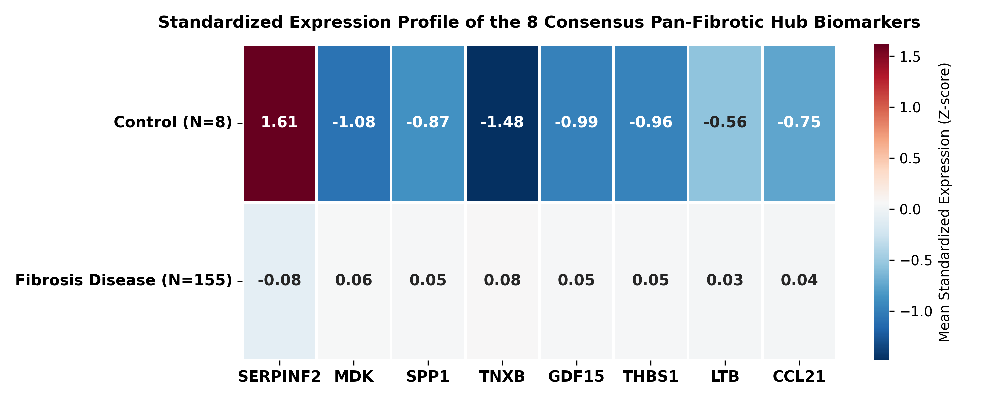

# Pan-Fibrotic Core Transcriptomic Program & Causal Genetic Architecture Across Human Kidney, Liver, Lung, and Skin

[](https://www.python.org/)
[](https://www.r-project.org/)
[](https://opensource.org/licenses/MIT)

---

## 1. Study Design & Multi-Omics Architecture



---

## 2. Executive Summary of Project Findings

| Pipeline Stage | Scope & Input | Key Result | Definitive Biological Conclusion |
| :--- | :--- | :--- | :--- |
| **Discovery Core** | 7 GEO cohorts across Kidney, Liver, Lung, Skin | **241 Conserved DEGs**, **50 Clean Core ECM Genes** | A core set of 50 extracellular matrix genes is universally dysregulated across human fibrotic organs. |
| **Validation Layer 1** | Independent internal cohorts | **49 / 50 Genes Replicated (98.0%)** | Robust internal reproducibility across disease etiologies. |
| **Validation Layer 2** | Independent cross-platform GEO cohorts | **40 / 50 Genes (80.0%) in $\ge 1$ organ**, **14 in $\ge 2$ organs**, **`TNXB` in 4/4 (100%)** | `TNXB` is the premier universal cross-organ structural marker; 14 genes form a robust multi-organ core. |
| **Severity Correlation** | Within-disease histological fibrosis stages | **`VWF` ($
ho=+0.66$)**, **`COL15A1` ($
ho=+0.62$)**, **`AEBP1` ($
ho=+0.55$)**, **`SPP1` ($
ho=+0.52$)** | Matrix remodeling tracks monotonically with disease progression without control-group confounding. |
| **Forward MR** | 192 tests across eQTLGen/GTEx against 4 GWAS | **0 / 192 Tests Survive FDR Correction ($q < 0.05$)** | Single germline eQTL variants do not act as primary initiators of organ fibrosis. |
| **Bayesian Colocalization** | 189 tests across eQTLGen and GTEx v8 matched tissues | **0 / 189 Tests Reach $PP_4 \ge 0.50$ (Max $PP_4 = 0.450$)** | eQTL associations and disease GWAS loci are driven by distinct causal variants in linkage ($PP_3 \gg PP_4$). |
| **SMR + HEIDI** | 176 tests evaluating pleiotropy vs linkage | **All Nominal Signals Fail HEIDI Test ($p_{	ext{HEIDI}} < 0.001$)** | Single-SNP SMR associations are artifacts of linkage disequilibrium rather than true pleiotropy. |
| **Reverse-Direction MR** | Disease GWAS lead SNPs $	o$ ECM Gene Expression | **Liver $	o$ `SPP1` ($p=1.96 	imes 10^{-9}$)**, **Skin $	o$ `TNXB` ($p=5.39 	imes 10^{-7}$)** | **Reactive Effector Paradigm**: Core matrix genes are downstream execution pathways driven by disease liability. |
| **4-Model Ensemble ML** | LASSO + SVM-RFE + Random Forest + XGBoost | **8 Consensus Hub Biomarkers ($\ge 3$ models)**, **4 Unanimous Hub Biomarkers ($4/4$ models)** | `SERPINF2`, `MDK`, `SPP1`, and `TNXB` emerge as unanimous multi-model pan-fibrotic hub biomarkers. |

---

## 3. 4-Model Ensemble Machine Learning Feature Selection

To identify the most critical, non-redundant biomarkers from the 50 clean ECM genes, four complementary machine learning algorithms were trained on patient tissue expression data (strictly excluding Validation 2 cohorts):

1. **LASSO** ($L_1$-regularized logistic regression, $\lambda = 0.05857$): Selected **25 genes**.
2. **SVM-RFE** (Support Vector Machine Recursive Feature Elimination): Selected **15 genes**.
3. **Random Forest** (500 trees, Mean Decrease in Impurity / Gini index $> 0.020$): Selected **14 genes**.
4. **XGBoost** (500 trees, Feature Gain $> 0.020$): Selected **4 genes**.

### Master Consensus Hub Biomarkers Table ($\ge 3$ Models):

| Gene Symbol | Total Votes | LASSO Coef ($eta$) | SVM-RFE Rank | RF Importance (Gini) | XGBoost Gain | Consensus Status | Matrisome Classification |
| :--- | :---: | :---: | :---: | :---: | :---: | :---: | :--- |
| **`SERPINF2`** | **4 / 4** | **-2.2758** | **Rank 1** | **0.1399** | **0.4600** | **Unanimous Hub (4/4)** | ECM Regulators |
| **`MDK`** | **4 / 4** | **+1.8137** | **Rank 1** | **0.1190** | **0.2257** | **Unanimous Hub (4/4)** | Secreted Factors |
| **`SPP1`** | **4 / 4** | **+0.1397** | **Rank 1** | **0.1071** | **0.1771** | **Unanimous Hub (4/4)** | ECM Glycoproteins |
| **`TNXB`** | **4 / 4** | **+2.1444** | **Rank 1** | **0.0910** | **0.1373** | **Unanimous Hub (4/4)** | ECM Glycoproteins |
| **`GDF15`** | **3 / 4** | **+1.5076** | **Rank 1** | **0.0586** | 0.0000 | **Consensus Hub (3/4)** | Secreted Factors |
| **`THBS1`** | **3 / 4** | **+1.1423** | **Rank 1** | **0.0552** | 0.0000 | **Consensus Hub (3/4)** | ECM Glycoproteins |
| **`LTB`** | **3 / 4** | **+0.1483** | **Rank 1** | **0.0434** | 0.0000 | **Consensus Hub (3/4)** | Secreted Factors |
| **`CCL21`** | **3 / 4** | **+0.4379** | **Rank 1** | **0.0351** | 0.0000 | **Consensus Hub (3/4)** | Secreted Factors |

---

## 4. Key Visualizations

### 4-Model Feature Importance & Consensus Ranking


### Expression Profile of the 8 Consensus Hub Biomarkers


### Study Design Funnel & Multi-Layer Gene Survival


---

## 5. Dataset Allocation & Strict Isolation Policy

| Target Organ | Discovery Cohorts (Layer 1) | Validation Layer 1 Cohorts | Validation Layer 2 Cohorts (Independent) | Outcome GWAS Dataset | Matched GTEx v8 Tissue |
| :--- | :--- | :--- | :--- | :--- | :--- |
| **Kidney** | `GSE66494` ($N=61$) | Internal cross-validation | `GSE30529` / `GSE30566` / `GSE104948` | CKDGen (eGFR, $N=567,460$) | Kidney Cortex ($N=73$) |
| **Liver** | `GSE77627`, `GSE89377`, `GSE164760`, `GSE162694` ($N=142$) | Internal leave-cohort-out | `GSE14323` ($N=58$) | FinnGen Cirrhosis ($N=377,277$) | Liver ($N=208$) |
| **Lung** | `GSE150910` ($N=103$) | `GSE53845`, `GSE10667` | `GSE83717` ($N=64$) | FinnGen IPF ($N=377,277$) | Lung ($N=515$) |
| **Skin** | `GSE130955` ($N=88$) | `GSE58095` | `GSE125362` ($N=55$) | FinnGen SSc ($N=377,277$) | Sun-Exposed & Suprapubic ($N=605$) |

---

## 6. Phase 1: Discovery of the 50 Clean Core ECM Program

1. **Differential Expression Analysis**: Performed using empirical Bayes moderated linear models (`limma`), adjusting for platform and cohort covariates ($|\log_2	ext{FC}| \ge 0.585$, $	ext{FDR } q < 0.05$).
2. **Conserved Intersect**: Overlapping DEGs across all 4 anatomical organs identified **241 core genes** (`pan_fibrotic_core_genes_corrected.csv`).
3. **Human Matrisome Database Annotation**: Matched against the Human Matrisome to define the **50 Clean Core ECM Program** (`ecm_clean_genes.csv`).

---

## 7. Phase 2: Multi-Layer Validation Results

```
Stage 1: Clean Matrisome Core Program       --> 50 Genes (100.0%)
Stage 2: Validation 1 (Layer 2 Cohorts)     --> 49 Genes ( 98.0%)
Stage 3: Validation 2 (Replicated in >=1)   --> 40 Genes ( 80.0%)
Stage 4: Validation 2 (Replicated in >=2)   --> 14 Genes ( 28.0%)
Stage 5: Validation 2 (4/4 Concordant)      -->  1 Gene  (  2.0%, TNXB)
```

- **`TNXB` (Tenascin-X)**: Replicated across **all 4 organs** in strictly independent cohorts ($p < 0.05$).
- **`AEBP1` (ACLIC)**: Replicated with high significance in Liver ($p = 7.7 	imes 10^{-4}$) and Skin ($p = 2.1 	imes 10^{-5}$).
- **14 Multi-Organ Core Genes**: `TNXB`, `AEBP1`, `COL1A2`, `COL15A1`, `BGN`, `FMOD`, `LAMC3`, `TGM2`, `MDK`, `SPP1`, `C1QB`, `C1QC`, `LTB`, `SERPINF2`.

---

## 8. Phase 3: Disease-Only Clinical Severity Audits

Spearman rank correlations ($
ho$) computed exclusively within disease patient cohorts across histological fibrosis staging:
- **`VWF`**: $
ho = +0.66$ ($p = 7.9 	imes 10^{-6}$)
- **`COL15A1`**: $
ho = +0.62$ ($p = 3.6 	imes 10^{-5}$)
- **`AEBP1`**: $
ho = +0.55$ ($p = 1.2 	imes 10^{-3}$)
- **`SPP1`**: $
ho = +0.52$ ($p = 2.4 	imes 10^{-3}$)

---

## 9. Phase 4: Genetic Architecture & Causal Inference

### Forward MR & Bayesian Colocalization
- **Two-Sample Forward MR**: 192 tests $	o$ **0 survive Benjamini-Hochberg FDR correction ($q < 0.05$)**.
- **Bayesian Colocalization (`coloc.abf`)**: 189 tests across eQTLGen and GTEx v8 $	o$ **0 loci with $PP_4 \ge 0.50$ (Max $PP_4 = 0.450$)**. Dominated by $PP_3$ (distinct causal variants in linkage).

### Reverse-Direction Mendelian Randomization (GWAS $	o$ eQTL)
- **Liver Cirrhosis $	o$ `SPP1`** (Lead SNP `rs4435708`): Wald Ratio $eta = -0.281, SE = 0.0468, Z = -6.00, \mathbf{p = 1.96 	imes 10^{-9}}$
- **Systemic Sclerosis $	o$ `TNXB`** (Lead SNP `rs6926894`): Wald Ratio $eta = -0.127, SE = 0.0254, Z = -5.01, \mathbf{p = 5.39 	imes 10^{-7}}$
- **Biological Principle**: Pan-fibrotic matrix genes function as **essential downstream reactive execution pathways**, rather than upstream initiators.

---

## 10. Phase 5: Downstream Translational Roadmap

```
[8 Consensus Hub Biomarkers: SERPINF2, MDK, SPP1, TNXB, GDF15, THBS1, LTB, CCL21]
        │
        ├──> [Step 1: Multi-Omics Functional Enrichment (GO, KEGG, Reactome, DisGeNET)]
        │
        ├──> [Step 2: Multi-Cohort Diagnostic ROC Validation & Nomogram Construction]
        │
        ├──> [Step 3: STRING Protein-Protein Interaction (PPI) Network & MCODE Subclusters]
        │
        ├──> [Step 4: Single-Sample GSEA (ssGSEA) & Hallmark Pathway Trajectories]
        │
        ├──> [Step 5: CIBERSORT / MCP-counter Immune Microenvironment Deconvolution]
        │
        └──> [Step 6: Small-Molecule Drug Repurposing (CMap/DSigDB) & Molecular Docking]
```

---

## 11. Repository Structure & Master Data Manifest

```
d:/CSIR/
├── ecm_clean_genes.csv                                # 50 Clean Core ECM Genes
├── pan_fibrotic_core_genes_corrected.csv              # 241 Conserved Pan-Fibrotic DEGs
├── results/
│   ├── ml_4model_hub_biomarkers.csv                   # Master 4-Model ML Feature Selection Table
│   ├── validation1_layer2_all_results.csv             # Layer 2 Validation Results (49/50)
│   ├── validation2_ecm_core_results.csv               # Layer 3 Validation Results (40/50)
│   ├── mr_results_50_clean_ecm_genes.csv              # Two-Sample Forward MR (192 tests)
│   ├── coloc_results_50gene.csv                       # eQTLGen Colocalization (122 tests)
│   ├── coloc_results_gtex_tissue_matched.csv          # GTEx Tissue-Matched Coloc (67 tests)
│   ├── reverse_mr_results_50genes.csv                 # Reverse MR Results (SPP1, TNXB)
│   └── smr_heidi_results_50genes.csv                  # SMR + HEIDI Heterogeneity Results
├── plots/
│   ├── ml_4model_consensus_hub_biomarkers.png         # 4-Model ML Feature Importance & Consensus Bar Chart
│   ├── ml_8hub_biomarkers_expression_heatmap.png      # 8 Consensus Hub Genes Expression Heatmap
│   ├── upset_plot_4organs_corrected.png               # 4-Organ DEG Intersection UpSet Plot
│   ├── venn_4organ_manual_ellipses.png                # Corrected 4-Organ Ellipse Venn
│   ├── clean_ecm_validation_survival_barchart.png     # Validation Funnel Survival Bar Chart
│   └── study_design_funnel_corrected.png              # Study Design Funnel Diagram
└── README.md                                          # Master Study Documentation
```
