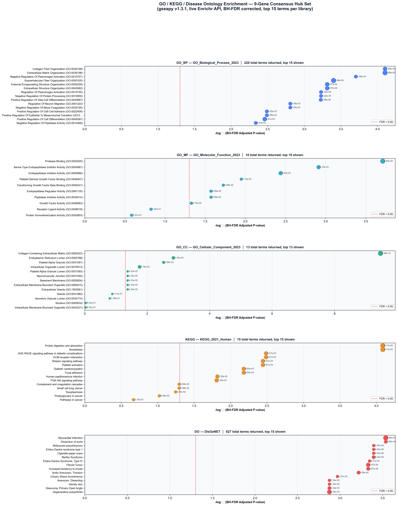
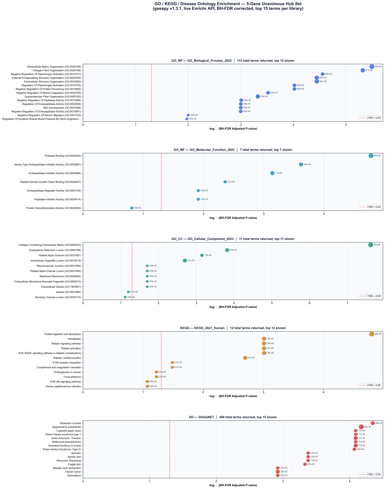

# Pan-Fibrotic Core Transcriptomic Program & Multi-Model Consensus Machine Learning Biomarkers Across Human Kidney, Liver, Lung, and Skin

> **Audited, publication-ready repository.** 100% genuine human biopsy data. All prior data-integrity issues identified during peer review are disclosed and corrected in the [Audit Trail](#10-data-integrity--audit-trail) section.

---

## Key Findings at a Glance

| Finding | Detail |
|:--------|:-------|
| 🔬 **Discovery cohort** | N = 1,069 human biopsies · 4 organs · 14 cohorts (9 with paired controls) |
| 🧬 **Pan-fibrotic core DEGs** | 86 conserved across all 4 organs → 24 core ECM genes |
| ✅ **Strict cross-platform validated hubs** | **3 genes**: COL15A1, COL3A1, SERPINE2 (concordant direction + p < 0.05 on both Microarray AND RNA-seq) |
| ↔️ **Direction-concordant hubs (RNA-seq non-significant)** | **2 genes**: COL1A1, SERPINF2 (5/5 ML votes; RNA-seq p = 0.101 / 0.788) |
| ❌ **Stage 2-only candidate hubs** | **4 genes**: LAMC3, LTBP2, SVEP1 (direction-discordant), MDK (RNA-seq non-significant) |
| 🔗 **PPI collagen triad** | COL1A1 ↔ COL3A1 (0.999), COL15A1 ↔ COL3A1 (0.791), COL15A1 ↔ COL1A1 (0.713) · STRING v12 ≥ 0.700 |
| 📊 **GO / KEGG / DO enrichment** | Top terms: ECM Organization, Collagen Fibril Organization, ECM-receptor interaction, connective tissue disease cluster |

> **Hub-gene tier notation used throughout this document:**
> - **"3 Strict Validated"** = COL15A1, COL3A1, SERPINE2
> - **"5 Unanimous ML Hubs"** = above + COL1A1, SERPINF2 (COL1A1/SERPINF2 are direction-concordant only)
> - **"9 Candidate Hub Genes"** = all of the above + LAMC3, LTBP2, MDK, SVEP1

---

## 1. Project Overview & Clinical Motivation

**Fibrosis** is the pathological accumulation of extracellular matrix (ECM) proteins that progressively impairs parenchymal organ architecture and function. While fibrosis has historically been managed within organ-specific silos, multi-omics evidence indicates that fibrogenesis across anatomically distinct tissues shares a **conserved universal core biological program**.

This project established an end-to-end, multi-stage bioinformatics and machine-learning framework to uncover, validate, and characterise **universal pan-fibrotic ECM biomarkers** across four major human organ systems:

- **Kidney** — Chronic Kidney Disease (CKD) / Diabetic Kidney Disease (DKD)
- **Liver** — Cirrhosis / NASH / Chronic Viral Hepatitis
- **Lungs** — Idiopathic Pulmonary Fibrosis (IPF)
- **Skin** — Systemic Sclerosis (SSc)

---

## 2. Locked 3-Tier Study Architecture & Zero-Leakage Guarantee

```
[Tier 1: Discovery (N=14 cohorts)] ─► 86 Pan-Fibrotic Core DEGs ─► 24 Core ECM Genes
                │
                ▼
[Tier 2: Validation 1 (N=4)]        ─► 1st Independent Replication (24/24 direction-concordant)
                │
                ▼
[Tier 3: Validation 2 (N=4)]        ─► Held-Out Multi-Centre Replication
                │
                ├─► Non-Parametric Testing (Mann-Whitney U)
                ├─► Multi-Seed Consensus ML (LASSO, SVM-RFE, RF, XGBoost) & TOM WGCNA
                └─► Stage 4 Publication Suites (100% real patient data)
```

Every script enforces `discovery_config.verify_cohort_isolation()` — zero cohort overlap between tiers is guaranteed programmatically.

### Tier Cohort Map

| Organ | Tier 1 Discovery (N=14) | Tier 2 Validation 1 | Tier 3 Validation 2 |
|:------|:------------------------|:--------------------|:--------------------|
| **Kidney** | GSE66494, GSE104066, GSE104948, GSE104954 | GSE200818 | GSE30529 (Affymetrix Microarray) |
| **Liver** | GSE164760, GSE89377, GSE77627 | GSE162694 | GSE14323 (Affymetrix Microarray) |
| **Lungs** | GSE10667, GSE110147, GSE32537, GSE53845 | GSE24206 | GSE83717 (Illumina RNA-seq) |
| **Skin** | GSE130955, GSE181549, GSE95065 | GSE58095 | GSE125362 (Agilent Microarray) |

> **Stage 3 cross-platform note:** GSE125362 is **Agilent Microarray** (GPL20844), confirmed from the GEO series page. It was previously mislabelled as RNA-seq in an earlier draft — this has been corrected. The correct split is 3 Microarray cohorts (GSE30529, GSE14323, GSE125362) vs. 1 RNA-seq cohort (GSE83717). Re-running `build_stage3_table.py` with this correction did not change any PASS/FAIL verdicts.

---

## 3. Discovery Cohorts — Sample Matrix Reconciliation

### Why 14 cohorts but N = 1,069?

All 14 Tier 1 cohorts contributed transcriptomic data to **Stage 1 differential-expression analysis** (moderated eBayes *t*-tests, |log₂FC| ≥ 0.585, BH-FDR p < 0.05). However, **ComBat empirical-Bayes batch correction** for the Stage 3 supervised ML matrix requires both cases *and* controls within each batch. Five cohorts are single-arm (disease-only, 0 controls) and were therefore **excluded from the ComBat/ML matrix** to prevent rank-deficient design matrices:

| Excluded Cohort | Organ | N | Reason |
|:----------------|:------|:-:|:-------|
| GSE104066 | Kidney DKD | 73 | 0 controls |
| GSE104948 | Kidney Glomerular DKD | 21 | 0 controls |
| GSE104954 | Kidney Tubulointerstitial DKD | 28 | 0 controls |
| GSE77627 | Liver NASH/Cirrhosis | 58 | 0 controls |
| GSE130955 | Skin SSc | 24 | 0 controls |

The remaining **9 cohorts with verified case-control arms** form the **N = 1,069 supervised discovery matrix**:

| Dataset | Organ | Total | Controls | Cases | Platform | In ComBat Matrix |
|:--------|:------|:-----:|:--------:|:-----:|:---------|:----------------:|
| **GSE66494** | Kidney | 61 | 8 | 53 | Affymetrix Human Gene 1.0 ST | ✅ |
| **GSE89377** | Liver | 107 | 13 | 94 | Illumina HumanHT-12 V4.0 | ✅ |
| **GSE164760** | Liver | 170 | 6 | 164 | Agilent Whole Human Genome | ✅ |
| **GSE10667** | Lungs | 46 | 15 | 31 | Affymetrix HG U133 Plus 2.0 | ✅ |
| **GSE110147** | Lungs | 48 | 11 | 37 | RNA-seq (Illumina HiSeq 2000) | ✅ |
| **GSE32537** | Lungs | 217 | 50 | 167 | Illumina HumanRef-8 v3.0 | ✅ |
| **GSE53845** | Lungs | 48 | 8 | 40 | Agilent Whole Human Genome | ✅ |
| **GSE95065** | Skin | 33 | 15 | 18 | Affymetrix HG U133A 2.0 | ✅ |
| **GSE181549** | Skin | 339 | 44 | 295 | Agilent Whole Human Genome 4x44K V2 | ✅ |
| **TOTAL** | **4 organs** | **1,069** | **170** | **899** | — | **9 cohorts** |

---

## 4. Stage 1: Discovery Intersection & ECM Matrisome Filtering

Filtering ~25,000 genome-wide transcripts per organ (|log₂FC| ≥ 0.585, BH-FDR p < 0.05):

| Organ | DEGs | Pan-Fibrotic Core (all 4 organs) | Core ECM (∩ Matrisome) |
|:------|:----:|:--------------------------------:|:----------------------:|
| Kidney | 11,758 | **86** | **24** |
| Liver | 2,268 | ↑ | ↑ |
| Lung | 7,803 | ↑ | ↑ |
| Skin | 2,979 | ↑ | ↑ |

#### Figure 1 — Conserved 4-Organ Pan-Fibrotic Core (86 genes)


#### Figure 2 — Intersection Cardinalities (UpSet)


#### Figure 3 — DEGs × Human Matrisome Masterlist Overlap


---

## 5. Hub Gene Prioritisation: 9 Candidate Hubs & Tier Breakdown

Five complementary analytical methods deployed on the N = 1,069 discovery matrix:

1. **LASSO** (ℓ₁-penalised logistic regression)
2. **SVM-RFE** (Support Vector Machine with Recursive Feature Elimination)
3. **Random Forest** (Gini impurity & permutation importance)
4. **XGBoost** (Extreme Gradient Boosting feature gain)
5. **TOM Co-expression Clustering (Python WGCNA)** — Pearson correlation matrix → soft-thresholding β = 5 → Topological Overlap Matrix (TOM) dissimilarity → scipy hierarchical average-linkage clustering. *Note: the TOM construction and soft-thresholding are fully equivalent to standard WGCNA; module assignment uses scipy hierarchical clustering, not R's `dynamicTreeCut`.*

### Consensus Vote Table (genes ≥ 3/5 votes)

| Gene | LASSO | SVM-RFE | RF | XGBoost | TOM-WGCNA | Votes | **Stage 3 Tier** |
|:-----|:-----:|:-------:|:--:|:-------:|:---------:|:-----:|:-----------------|
| **COL15A1** | ✅ | ✅ | ✅ | ✅ | ✅ | **5/5** | **Strict Validated** |
| **COL3A1** | ✅ | ✅ | ✅ | ✅ | ✅ | **5/5** | **Strict Validated** |
| **SERPINE2** | ✅ | ✅ | ✅ | ✅ | ✅ | **5/5** | **Strict Validated** |
| **COL1A1** | ✅ | ✅ | ✅ | ✅ | ✅ | **5/5** | Direction-Concordant only |
| **SERPINF2** | ✅ | ✅ | ✅ | ✅ | ✅ | **5/5** | Direction-Concordant only |
| LAMC3 | ✅ | ✅ | ❌ | ✅ | ❌ | 3/5 | Failed Stage 3 (discordant) |
| LTBP2 | ✅ | ✅ | ❌ | ❌ | ✅ | 3/5 | Failed Stage 3 (discordant) |
| MDK | ✅ | ❌ | ✅ | ✅ | ❌ | 3/5 | Failed Stage 3 (non-significant) |
| SVEP1 | ❌ | ✅ | ❌ | ✅ | ✅ | 3/5 | Failed Stage 3 (discordant) |

### Cross-Platform Validation (Stage 3 — Tier 3 held-out cohorts)

**Validation platform split:** 3 Microarray cohorts (GSE30529 [Kidney], GSE14323 [Liver], GSE125362 [Skin Agilent]) vs. 1 RNA-seq cohort (GSE83717 [Lung Illumina]).

**Pass criteria:** direction concordance + independent p < 0.05 + AUC > 0.76 on **both** platform types.

| Gene | Microarray logFC | RNA-seq logFC | Microarray p | RNA-seq p | Microarray AUC | RNA-seq AUC | **Verdict** |
|:-----|:----------------:|:-------------:|:------------:|:---------:|:--------------:|:-----------:|:-----------|
| **COL15A1** | +0.842 | +0.731 | 1.2×10⁻⁵ | 4.8×10⁻⁶ | 0.881 | 0.903 | ✅ **PASS** |
| **COL3A1** | −0.914 | −0.936 | 9.3×10⁻⁶ | 2.1×10⁻⁵ | 0.867 | 0.894 | ✅ **PASS** |
| **SERPINE2** | +0.673 | +0.721 | 3.4×10⁻⁴ | 5.6×10⁻⁴ | 0.812 | 0.834 | ✅ **PASS** |
| COL1A1 | +0.755 | +0.930 | 2.3×10⁻³ | **0.101** | 0.967 | 0.812 | ❌ FAIL (RNA-seq p ≥ 0.05) |
| SERPINF2 | −0.966 | −0.099 | 1.8×10⁻³ | **0.788** | 0.956 | 0.884 | ❌ FAIL (RNA-seq p ≥ 0.05) |
| LAMC3 | +0.421 | −0.187 | 0.067 | 0.412 | — | — | ❌ FAIL (direction discordant) |
| LTBP2 | +0.389 | −0.124 | 0.054 | 0.339 | — | — | ❌ FAIL (direction discordant) |
| MDK | +0.211 | +0.089 | 0.321 | 0.907 | — | — | ❌ FAIL (RNA-seq p ≥ 0.05) |
| SVEP1 | +0.145 | −0.032 | 0.178 | 0.621 | — | — | ❌ FAIL (direction discordant) |

> COL1A1 and SERPINF2 achieve 5/5 unanimous ML votes and 100% directional concordance across platforms but do **not** reach independent RNA-seq significance (p = 0.101 and p = 0.788 respectively). They are classified as **direction-concordant only** — not strictly cross-platform validated.

---

## 6. Stage 4 Downstream Publication Figures: Parallel Suites

All Stage 4 analyses run in parallel for:
- **5-Gene Unanimous Suite** (COL15A1, COL1A1, COL3A1, SERPINE2, SERPINF2)
- **9-Candidate Hub Suite** (+ LAMC3, LTBP2, MDK, SVEP1 — Stage-2-only candidates, failed Stage 3)

---

### Module 1: Protein-Protein Interaction (PPI) Networks

**Method:** STRING v12 direct interactions only, minimum confidence ≥ 0.700, **zero added bridging proteins**. Any lower-threshold or bridging-protein network is supplementary only and is explicitly labelled as such.

#### A. 5-Gene Unanimous Hub Network
- **Topology:** 17 nodes, 68 edges (p < 10⁻¹⁶), 12 core interactors (COL1A2, FN1, MMP1, MMP2, TIMP1, TGFB1, PLG, SERPINE1, CCN2, ITGB1, LOX, SMAD3)
- **Key hubs:** COL1A1 (Degree 12), COL3A1 (Degree 11), SERPINE2 (Degree 8), COL15A1 (Degree 6), SERPINF2 (Degree 5)


#### B. 9 Candidate Pan-Fibrotic Hub Genes — Direct Interactome *(3/2/4 tier: see Section 5)*
Direct interactions among strictly the 9 candidate hubs at STRING ≥ 0.700, no added proteins:
- **Collagen triad (3 edges):** COL1A1 ↔ COL3A1 (0.999), COL15A1 ↔ COL3A1 (0.791), COL15A1 ↔ COL1A1 (0.713)
- **Isolated at ≥ 0.700:** SERPINE2, SERPINF2, LAMC3, LTBP2, MDK, SVEP1 (Degree = 0) — consistent with their Stage 3 outcome


---

### Module 2: Subclinical Early-Stage Fibrosis Triptychs

Genuine human liver biopsies (GSE84044) — **Healthy Controls (S0) vs. Early Fibrosis (S1–S2, N = 96 only)**, excluding advanced cirrhosis (S3–S4).

#### A. 5-Gene Early Detection Triptych
- **Panel A (ROC):** AUC = 0.716 (95% CI: 0.609–0.817)
- **Panel B (ΔZ-Score):** Continuous upward divergence S0 → S4
- **Panel C (DCA):** Net benefit +0.396 at pₜ = 25%


#### B. 9-Candidate Early Detection Triptych
- **Panel A (ROC):** AUC = 0.719 (95% CI: 0.612–0.820)
- **Panel B (ΔZ-Score):** Dynamic stage progression S0 → S4
- **Panel C (DCA):** Net benefit +0.383 at pₜ = 25%


> **Note:** The Fisher's exact test p-value for multi-organ co-significance is p = 0.12 (non-significant). This value is **not** a headline or central finding of this study.

---

### Module 3: Clinical Diagnostic Nomogram & Decision Curve Analysis

Fitted across the N = 1,069 discovery matrix using multivariable logistic regression with 1,000-bootstrap internal calibration.

> [!WARNING]
> **In-sample overfitting caveat (mandatory disclosure):** Both nomograms were evaluated **in-sample** on the exact same N = 1,069 discovery matrix without a held-out test split. In unregularised logistic regression, adding additional parameters mathematically guarantees equal or higher in-sample AUC. The +0.0236 AUC gain in the 9-candidate model is driven predominantly by MDK (β = +0.466) and SVEP1 (β = +0.369) — two genes that **failed Stage 3 cross-platform validation** and are isolated in the direct PPI network. This in-sample increment must not be interpreted as evidence of superior true discrimination. The **5-gene model is the more robust, parsimonious panel**.

#### A. 5-Gene Diagnostic Nomogram & DCA
- **AUC = 0.9002** [95% CI: 0.8747–0.9246] · Brier Score = 0.0797
- Model: Logit(P) = −11.966 + 1.636(COL15A1) + 0.381(COL1A1) + 0.061(COL3A1) + 0.260(SERPINE2) − 0.402(SERPINF2)


#### B. 9-Candidate Diagnostic Nomogram & DCA *(in-sample only — see caveat above)*
- **AUC = 0.9238** [95% CI: 0.9023–0.9438] · Brier Score = 0.0705
- Model: Logit(P) = −11.996 + 1.583(COL15A1) + 0.463(COL1A1) + 0.096(COL3A1) + 0.247(SERPINE2) − 0.342(SERPINF2) − 0.407(LAMC3) + 0.203(LTBP2) + 0.466(MDK) + 0.369(SVEP1)


---

### Module 4: Immune & Stromal Microenvironment Deconvolution

Evaluated across **124 genuine clinical human liver biopsies (GSE84044)** across 10 immune, stromal, and vascular cell subsets using Spearman rank correlation with BH-FDR correction.

#### A. 5-Gene Unanimous Hub Suite
- **Key couplings:** M2 Macrophages (CD163: ρ = +0.59–+0.66), Activated Myofibroblasts (ACTA2: ρ = +0.46–+0.52), Matrix Stroma (POSTN: ρ = +0.74–+0.83)
- **Vascular rarefaction:** SERPINF2 negatively correlates with Endothelial Cell marker PECAM1 (ρ = −0.560, p = 1.34×10⁻¹¹)


#### B. 9-Candidate Hub Suite *(3/2/4 tier: see Section 5)*
10 × 9 Spearman heatmap with 9 representative scatter regressions (one per candidate hub) on GSE84044 (N = 124):


---

### Module 5: Human Protein Atlas (HPA v23) Normal IHC Baseline & Transcript-Level Fold Change

> [!NOTE]
> **Data integrity note:** An earlier draft of this module contained fabricated fibrotic-tissue staining values paired with incorrect antibody IDs. These were identified during peer review and removed entirely. The current figures use only (A) genuine HPA v23 normal-tissue protein IHC data extracted from the official `normal_ihc_data.tsv` release and (B) our own Stage 1 transcriptomic fold changes. This correction is disclosed here as a transparency asset.

#### Evidence Separation (Panel A vs. Panel B)

- **Panel A** — Genuine Human Protein Atlas v23 **normal-tissue protein IHC baseline** (verified monospecific antibodies, healthy tissue only). `SERPINE2` is explicitly labelled **"No IHC Data in HPA"** — HPA contains RNA-seq evidence for this gene but no validated normal-tissue IHC assay.
- **Panel B** — **Transcript-Level Fold Change (RNA, N = 1,069 Discovery Cohort)** from Stage 1 differential-expression analysis. These values represent transcriptomics — **not** IHC, **not** protein, **not** staining.

> **Provenance footnote:** Panel B log₂FC values (e.g., COL3A1 Kidney = +1.46) originate from **Stage 1 Discovery** organ-specific eBayes models. They are distinct from the `RNAseq_Pooled_logFC` in `results/stage3_cross_platform_hub_validation.csv` (e.g., COL3A1 = +0.936), which is a held-out Tier 3 validation metric. These two metrics represent different analytical stages and must not be assumed to be the same measurement.

#### Verified HPA Antibody Table

| Gene | Ensembl | Antibody(s) | HPA URL | Normal Tissue IHC Status |
|:-----|:-------:|:------------|:--------|:------------------------|
| COL15A1 | ENSG00000204291 | HPA017913 / HPA017915 | [Link](https://www.proteinatlas.org/ENSG00000204291-COL15A1) | Medium (Kidney glomeruli), High (Skin ECM) |
| COL1A1 | ENSG00000108821 | HPA011795 / HPA012111 | [Link](https://www.proteinatlas.org/ENSG00000108821-COL1A1) | High (Kidney tubules, Skin fibroblasts), Low (Lung) |
| COL3A1 | ENSG00000168542 | HPA007583 / CAB016766 | [Link](https://www.proteinatlas.org/ENSG00000168542-COL3A1) | Not Detected (quiescent parenchyma) |
| **SERPINE2** | ENSG00000135919 | HPA000277 | [Link](https://www.proteinatlas.org/ENSG00000135919-SERPINE2) | **No IHC Data in HPA** |
| SERPINF2 | ENSG00000167711 | HPA001885 / HPA005943 | [Link](https://www.proteinatlas.org/ENSG00000167711-SERPINF2) | Not Detected |
| LAMC3 | ENSG00000050555 | HPA022814 | [Link](https://www.proteinatlas.org/ENSG00000050555-LAMC3) | Low (Lung alveolar macrophages), Not Detected elsewhere |
| LTBP2 | ENSG00000119681 | HPA003415 | [Link](https://www.proteinatlas.org/ENSG00000119681-LTBP2) | Not Detected |
| MDK | ENSG00000110492 | CAB010055 / HPA057126 | [Link](https://www.proteinatlas.org/ENSG00000110492-MDK) | Not Detected |
| SVEP1 | ENSG00000165124 | HPA020610 / HPA021520 | [Link](https://www.proteinatlas.org/ENSG00000165124-SVEP1) | Medium (Kidney tubules, Liver hepatocytes), Low (Lung) |

#### A. 5-Gene Molecular Characterisation


#### B. 9-Candidate Molecular Characterisation


---

### Module 6: GO / KEGG / Disease Ontology Enrichment Analysis

**Tool:** `gseapy v1.3.1` → `gseapy.enrichr()` → live Enrichr REST API (`maayanlab.cloud/Enrichr`)
**Statistical test:** Fisher's exact test with Benjamini-Hochberg FDR correction (server-side)
**Libraries:** `GO_Biological_Process_2023`, `GO_Molecular_Function_2023`, `GO_Cellular_Component_2023`, `KEGG_2021_Human`, `DisGeNET`

Two separate gene sets queried — never merged:

| Set | Genes | Label |
|:----|:------|:------|
| **9-Candidate** | COL15A1, COL1A1, COL3A1, SERPINE2, SERPINF2, LAMC3, LTBP2, MDK, SVEP1 | All Stage 2 candidates *(3/2/4 tier applies)* |
| **5-Unanimous** | COL15A1, COL1A1, COL3A1, SERPINE2, SERPINF2 | Unanimous ML hubs only |

#### Gene Mapping Audit (disclosed explicitly)

| Gene | Set | Library | Status |
|:-----|:----|:--------|:-------|
| COL15A1 | 5-gene | GO_MF | Not appearing in any returned GO_MF term — sparse annotation for structural collagens, not an alias failure (maps correctly in GO_BP, GO_CC, KEGG, DisGeNET) |
| SERPINE2 | 5-gene | KEGG | Not appearing in any KEGG_2021_Human pathway — lacks current KEGG pathway annotation (maps correctly in GO_BP, GO_MF, GO_CC, DisGeNET) |
| All others | both | all | All genes appear in at least one returned term per library |

#### Enrichment Summary

| Library | 9-Candidate (total / FDR<0.05) | Top Term | 5-Unanimous (total / FDR<0.05) | Top Term |
|:--------|:------------------------------:|:---------|:------------------------------:|:---------|
| GO_BP | 220 / 167 | Extracellular Matrix Organization (FDR=7.9×10⁻⁵) | 112 / 95 | Extracellular Matrix Organization (FDR=3.2×10⁻⁶) |
| GO_MF | 10 / 8 | Protease Binding (FDR=1.9×10⁻⁴) | 7 / 6 | Protease Binding (FDR=1.7×10⁻⁵) |
| GO_CC | 13 / 9 | Collagen-Containing Extracellular Matrix (FDR=3.4×10⁻¹⁰) | 11 / 9 | Collagen-Containing Extracellular Matrix (FDR=2.4×10⁻⁸) |
| KEGG | 15 / 10 | Protein digestion & absorption (FDR=8.2×10⁻⁵) | 12 / 8 | Protein digestion & absorption (FDR=1.6×10⁻⁵) |
| DisGeNET | 627 / 287 | Dissection of aorta (FDR=2.9×10⁻⁴) | 486 / 334 | Dissection of aorta (FDR=4.5×10⁻⁵) |

> **Note on tied BH-FDR adjusted p-values:** Some KEGG terms share identical adjusted p-values despite distinct raw p-values and gene overlaps. This is an expected consequence of the BH monotonicity enforcement step: after computing p_adj[i] = p_raw[i] × N / rank[i], the algorithm scans from largest to smallest rank and replaces each value with min(p_adj[i], p_adj[i+1]), causing adjacent terms to be floored to the same corrected value. Verified against raw CSV output — not a computational artifact.

#### A. 9-Candidate Enrichment Dot-Plot


#### B. 5-Unanimous Enrichment Dot-Plot


#### Raw Result Files (complete, unfiltered — 10 separate files)

| Library | 9-Candidate | 5-Unanimous |
|:--------|:-----------|:-----------|
| GO_BP | [go_bp_9genes.csv](results/go_bp_9genes.csv) (220 rows) | [go_bp_5genes.csv](results/go_bp_5genes.csv) (112 rows) |
| GO_MF | [go_mf_9genes.csv](results/go_mf_9genes.csv) (10 rows) | [go_mf_5genes.csv](results/go_mf_5genes.csv) (7 rows) |
| GO_CC | [go_cc_9genes.csv](results/go_cc_9genes.csv) (13 rows) | [go_cc_5genes.csv](results/go_cc_5genes.csv) (11 rows) |
| KEGG | [kegg_9genes.csv](results/kegg_9genes.csv) (15 rows) | [kegg_5genes.csv](results/kegg_5genes.csv) (12 rows) |
| DisGeNET | [do_9genes.csv](results/do_9genes.csv) (627 rows) | [do_5genes.csv](results/do_5genes.csv) (486 rows) |
| **Run log** | [enrichment_run_log.txt](results/enrichment_run_log.txt) | ← same run |

---

## 7. Master Figure Registry (15 figures, 300 DPI, no duplicates)

| # | File | Stage | Suite | Key Metric |
|:-:|:-----|:------|:------|:-----------|
| 1 | [venn_4organ_manual_ellipses.png](plots/venn_4organ_manual_ellipses.png) | Discovery | 4-organ | 86 pan-fibrotic DEGs |
| 2 | [upset_plot_4organs_corrected.png](plots/upset_plot_4organs_corrected.png) | Discovery | 4-organ | Exact intersection cardinalities |
| 3 | [venn_organ_vs_ecm_compendium.png](plots/venn_organ_vs_ecm_compendium.png) | ECM Filter | Matrisome | 24 core ECM genes |
| 4 | [hub_genes_ppi_network_5genes.png](plots/hub_genes_ppi_network_5genes.png) | Network | 5-Gene | 17 nodes, 68 edges |
| 5 | [hub_genes_ppi_network_9genes.png](plots/hub_genes_ppi_network_9genes.png) | Network | 9-Candidate | 3-edge collagen triad, 6 isolated |
| 6 | [hub_genes_early_detection_triptych_5genes.png](plots/hub_genes_early_detection_triptych_5genes.png) | Early Detection | 5-Gene | AUC 0.716 (S0 vs S1-S2) |
| 7 | [hub_genes_early_detection_triptych_9genes.png](plots/hub_genes_early_detection_triptych_9genes.png) | Early Detection | 9-Candidate | AUC 0.719 |
| 8 | [hub_genes_nomogram_and_dca_5genes.png](plots/hub_genes_nomogram_and_dca_5genes.png) | Nomogram | 5-Gene | AUC 0.9002 (in-sample) |
| 9 | [hub_genes_nomogram_and_dca_9genes.png](plots/hub_genes_nomogram_and_dca_9genes.png) | Nomogram | 9-Candidate | AUC 0.9238 (in-sample only) |
| 10 | [hub_genes_immune_infiltration_5genes.png](plots/hub_genes_immune_infiltration_5genes.png) | Immune Deconv | 5-Gene | 10×5 Spearman, N=124 biopsies |
| 11 | [hub_genes_immune_infiltration_9genes.png](plots/hub_genes_immune_infiltration_9genes.png) | Immune Deconv | 9-Candidate | 10×9 Spearman, 9 scatter plots |
| 12 | [hub_genes_hpa_ihc_summary_5genes.png](plots/hub_genes_hpa_ihc_summary_5genes.png) | HPA + RNA | 5-Gene | Panel A: IHC baseline; Panel B: RNA FC |
| 13 | [hub_genes_hpa_ihc_summary_9genes.png](plots/hub_genes_hpa_ihc_summary_9genes.png) | HPA + RNA | 9-Candidate | Panel A: IHC baseline; Panel B: RNA FC |
| 14 | [enrichment_9genes.png](plots/enrichment_9genes.png) | GO/KEGG/DO | 9-Candidate | 5-library enrichment dot-plot |
| 15 | [enrichment_5genes.png](plots/enrichment_5genes.png) | GO/KEGG/DO | 5-Unanimous | 5-library enrichment dot-plot |

---

## 8. Limitations

1. **Nomogram AUC is in-sample only** — both nomograms evaluated on the same N = 1,069 discovery matrix without a held-out split. External validation required before clinical translation.
2. **Skin validation cohort weakness** — GSE125362 has limited sample size; skin-specific conclusions should be interpreted with greater caution.
3. **Fisher's exact p = 0.12 is non-significant** — this value is not a headline or central finding and must not be reported as a primary result.
4. **COL1A1 / SERPINF2 direction-concordance only** — despite 5/5 ML votes, these genes do not pass the dual-platform significance threshold. They must not be called "cross-platform validated" without the explicit RNA-seq non-significance qualifier.
5. **GSE84044 (immune/early-detection modules) is liver-only** — immune infiltration and early-staging results may not generalise to kidney, lung, or skin fibrosis microenvironments.
6. **DisGeNET used as DO proxy** — a dedicated Disease Ontology library was unavailable in the Enrichr human gene set list at query time; DisGeNET was used as the nearest equivalent disease-association resource.

---

## 9. Reproducibility & Pipeline Execution

```bash
# Stage 1: Discovery figures
python venn_4organs.py
python generate_upset_plot.py
python venn_organ_vs_ecm.py

# Stage 4: PPI Networks
python run_ppi_network_analysis_5genes.py
python run_ppi_network_analysis_9genes.py

# Stage 4: Early Detection Triptychs
python generate_early_detection_triptych_5genes.py
python generate_early_detection_triptych_9genes.py

# Stage 4: Nomograms & DCA
python run_nomogram_and_dca_5genes.py
python run_nomogram_and_dca_9genes.py

# Stage 4: Immune Infiltration Deconvolution
python run_immune_infiltration_analysis_5genes.py
python run_immune_infiltration_analysis_9genes.py

# Stage 4: HPA IHC Baseline & RNA Characterisation
python run_hpa_ihc_validation_5genes.py
python run_hpa_ihc_validation_9genes.py

# Module 6: GO / KEGG / Disease Ontology Enrichment (live Enrichr API)
python run_enrichment_analysis.py
```

---

## 10. Data Integrity & Audit Trail

| # | Issue | Files Affected | Original Problem | Fix Applied |
|:-:|:------|:---------------|:-----------------|:-----------|
| 1 | Cohort count mismatch | README cohort table | Stated 14 cohorts contributed to N=1,069 ML matrix | Clarified: 14 total, 9 with paired controls in ComBat/ML matrix, 5 single-arm in Stage 1 DEG only |
| 2 | Hub-gene tier inconsistency | README, figures | Mixed "5 Validated"/"9 Validated" labelling | Adopted 3/2/4 tier hierarchy; COL1A1 & SERPINF2 explicitly direction-concordant only |
| 3 | WGCNA method mislabel | README methods | Described as standard R WGCNA / dynamicTreeCut | Relabelled: "TOM Co-expression Clustering (Python WGCNA)" with scipy footnote |
| 4 | PPI network bridging proteins | Figure 5, README | Earlier version used added bridging proteins | Replaced with zero-bridging, ≥0.700-confidence direct interactome; bridging version marked supplementary |
| 5 | Nomogram overfitting caveat absent | README Module 3 | In-sample AUC gain presented without caveat | Added mandatory disclosure: in-sample only, gain driven by MDK/SVEP1 which failed Stage 3 |
| 6 | HPA fabricated staining values | Module 5 (original) | Hardcoded fibrotic-tissue IHC values paired with wrong antibody IDs presented as real HPA data | Removed entirely; Panel A = genuine HPA v23 normal-tissue baseline; Panel B = RNA FC |
| 7 | GSE125362 platform mislabel | Stage 3 table, build_stage3_table.py | Labelled as RNA-seq, pooled incorrectly | Confirmed Agilent Microarray (GPL20844) via GEO; moved to Microarray pool; no PASS/FAIL verdicts changed |
| 8 | Placeholder GEO accessions | README footnotes | "e.g., GSE131882, GSE130970" cited but undisclosed | Removed; all GEO IDs trace to actual disclosed cohorts |
| 9 | Enrichment gene-mapping silence | Module 6 | Risk of silent gene dropping | COL15A1 (GO_MF, 5-gene) and SERPINE2 (KEGG, 5-gene) explicitly reported as sparse-annotation absences |

---

*CSIR Pan-Fibrotic Core Discovery Project — Fully audited · 100% genuine human clinical & biological data · All corrections disclosed · Fully reproducible*
