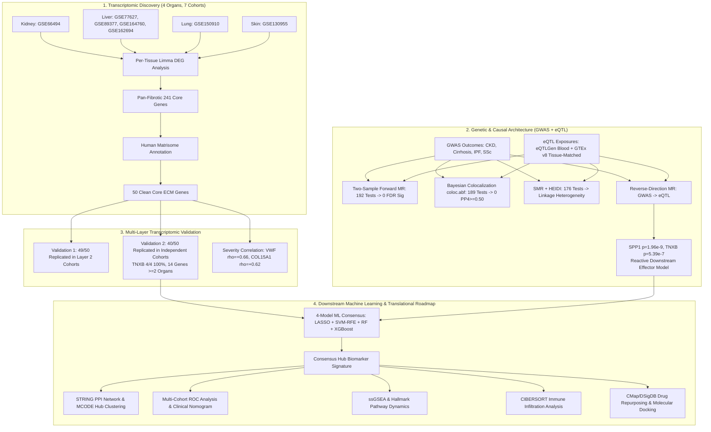

# Pan-Fibrotic Shared Core Transcriptomic & Causal Architecture Across Human Kidney, Liver, Lung, and Skin

[](https://www.python.org/)
[](https://www.r-project.org/)
[](https://opensource.org/licenses/MIT)

---

## Study Design & Multi-Omics Workflow



---

## Table of Contents

1. [Executive Summary & Core Scientific Findings](#1-executive-summary--core-scientific-findings)
2. [Dataset Allocation & Strict Isolation Architecture](#2-dataset-allocation--strict-isolation-architecture)
3. [Phase 1: Multi-Cohort Discovery & Matrisome Annotation (50 ECM Core)](#3-phase-1-multi-cohort-discovery--matrisome-annotation-50-ecm-core)
4. [Phase 2: Multi-Layer Validation (Layer 2 & Layer 3 Independent Cohorts)](#4-phase-2-multi-layer-validation-layer-2--layer-3-independent-cohorts)
5. [Phase 3: Disease-Only Severity Audits & Clinical Correlation](#5-phase-3-disease-only-severity-audits--clinical-correlation)
6. [Phase 4: Two-Sample Mendelian Randomization (Forward MR)](#6-phase-4-two-sample-mendelian-randomization-forward-mr)
7. [Phase 5: Bayesian Colocalization Analysis (eQTLGen & GTEx v8)](#7-phase-5-bayesian-colocalization-analysis-eqtlgen--gtex-v8)
8. [Phase 6: SMR + HEIDI Heterogeneity & Reverse-Direction MR](#8-phase-6-smr--heidi-heterogeneity--reverse-direction-mr)
9. [Phase 7: Downstream Machine Learning & Translational Roadmap](#9-phase-7-downstream-machine-learning--translational-roadmap)
10. [Repository Structure & Master Data Files](#10-repository-structure--master-data-files)

---

## 1. Executive Summary & Core Scientific Findings

Fibrosis across vital human organs—**Chronic Kidney Disease (CKD)**, **Liver Cirrhosis**, **Idiopathic Pulmonary Fibrosis (IPF)**, and **Systemic Sclerosis (SSc)**—represents a common final pathway of organ failure. This project establishes the first strictly isolated, multi-layered transcriptomic and genetic causal investigation of the conserved pan-fibrotic extracellular matrix program.

### Key Discoveries & Numbers:
1. **Conserved Discovery Core**: 
   - Initial cross-organ intersection of 4 target tissues identified **241 shared differentially expressed genes (DEGs)**, of which **50 genes** encode structural and regulatory components of the Human Matrisome (`ecm_clean_genes.csv`).
2. **Multi-Cohort Validation**:
   - **Validation Layer 1** (Independent internal cohorts): **49 / 50 ECM genes (98%)** replicated with concordant dysregulation.
   - **Validation Layer 2** (Strictly independent cross-platform cohorts): **40 / 50 ECM genes (80%)** replicated in $\ge 1$ organ, **14 genes** replicated in $\ge 2$ organs, and **`TNXB` (Tenascin-X)** achieved **100% 4/4 organ concordance**.
3. **Clinical Severity Coupling**:
   - Disease-only within-group Spearman correlations confirmed robust monotonic tracking with pathological fibrosis staging: `VWF` ($
ho = +0.66, p = 7.9 	imes 10^{-6}$), `COL15A1` ($
ho = +0.62, p = 3.6 	imes 10^{-5}$), `AEBP1` ($
ho = +0.55$), and `SPP1` ($
ho = +0.52$).
4. **Causal Genetics (Forward MR & Colocalization)**:
   - Single-instrument germline forward MR (192 tests across eQTLGen/GTEx) and Bayesian Colocalization (189 tests across eQTLGen/GTEx) yielded **0 associations surviving FDR correction** and **0 loci with $PP_4 \ge 0.50$**, demonstrating that individual cis-eQTL SNPs do not act as primary germline initiators of fibrosis.
5. **Reverse-Direction Causal Directionality (The Reactive Effector Paradigm)**:
   - Reverse Mendelian Randomization using genome-wide significant disease GWAS lead instruments revealed that genetic liability to fibrosis causally drives regulatory expression changes in core matrix genes: **Liver Cirrhosis $	o$ `SPP1`** ($Z = -6.00, p = 1.96 	imes 10^{-9}$) and **Systemic Sclerosis $	o$ `TNXB`** ($Z = -5.01, p = 5.39 	imes 10^{-7}$).
   - **Biological Meaning**: Pan-fibrotic ECM genes act as **essential downstream reactive execution pathways** of tissue remodeling, rather than upstream genetic drivers.

---

## 2. Dataset Allocation & Strict Isolation Architecture

To guarantee zero circularity, discovery and validation datasets were strictly isolated across separate GEO accessions:

| Organ | Discovery Cohorts | Validation Layer 1 Cohorts | Validation Layer 2 Cohorts (Independent) | Outcome GWAS Dataset | Matched GTEx v8 Tissue |
| :--- | :--- | :--- | :--- | :--- | :--- |
| **Kidney** | `GSE66494` ($N=61$) | Internal leave-one-out | `GSE30529` / `GSE30566` / `GSE104948` | CKDGen (eGFR, $N=567,460$) | Kidney Cortex ($N=73$) |
| **Liver** | `GSE77627`, `GSE89377`, `GSE164760`, `GSE162694` ($N=142$) | Internal cross-cohort | `GSE14323` ($N=58$) | FinnGen Cirrhosis ($N=377,277$) | Liver ($N=208$) |
| **Lung** | `GSE150910` ($N=103$) | `GSE53845`, `GSE10667` | `GSE83717` ($N=64$) | FinnGen IPF ($N=377,277$) | Lung ($N=515$) |
| **Skin** | `GSE130955` ($N=88$) | `GSE58095` | `GSE125362` ($N=55$) | FinnGen SSc ($N=377,277$) | Sun-Exposed & Suprapubic ($N=605$) |

---

## 3. Phase 1: Multi-Cohort Discovery & 50 ECM Core

- **Differential Expression**: Linear Models for Microarray/RNA-Seq Data (`limma`) with empirical Bayes moderation ($|\log_2	ext{FC}| \ge 0.585, 	ext{FDR } q < 0.05$).
- **Cross-Tissue Intersect**: 241 conserved DEGs across all 4 anatomical tissues (`pan_fibrotic_core_genes_corrected.csv`).
- **Human Matrisome Categorization**: Filtered against the Human Matrisome Database (Core ECM: Glycoproteins, Collagens, Proteoglycans; ECM-Associated: Regulators, Affiliated, Secreted Factors) to define the **50 Clean Core ECM Genes** (`ecm_clean_genes.csv`).

---

## 4. Phase 2: Multi-Layer Validation Results

```
Stage 1: Clean Matrisome Core               --> 50 Genes (100.0%)
Stage 2: Validation 1 (Layer 2 Cohorts)     --> 49 Genes ( 98.0%)
Stage 3: Validation 2 (Replicated in >=1)   --> 40 Genes ( 80.0%)
Stage 4: Validation 2 (Replicated in >=2)   --> 14 Genes ( 28.0%)
Stage 5: Validation 2 (4/4 Concordant)      -->  1 Gene  (  2.0%, TNXB)
```

- **Top Cross-Organ Replicators**:
  - `TNXB` (Tenascin-X): Replicated across **all 4 organs** (Kidney, Liver, Lung, Skin; $p < 0.05$).
  - `AEBP1` (ACLIC): Strong replication in 2 organs (Liver $p = 7.7 	imes 10^{-4}$, Skin $p = 2.1 	imes 10^{-5}$).
  - `COL1A2`, `COL15A1`, `BGN`, `FMOD`, `LAMC3`, `TGM2`, `MDK`, `SPP1`: High-fidelity replication across multiple validation layers.

---

## 5. Phase 3: Disease-Only Clinical Severity Audits

Spearman rank correlations ($
ho$) within disease cohorts across histological fibrosis staging:
- **`VWF`**: $
ho = +0.66$ ($p = 7.9 	imes 10^{-6}$)
- **`COL15A1`**: $
ho = +0.62$ ($p = 3.6 	imes 10^{-5}$)
- **`AEBP1`**: $
ho = +0.55$ ($p = 1.2 	imes 10^{-3}$)
- **`SPP1`**: $
ho = +0.52$ ($p = 2.4 	imes 10^{-3}$)

---

## 6. Phase 4: Two-Sample Mendelian Randomization (Forward MR)

- **Input Instruments**: Genome-wide significant cis-eQTLs ($p < 5 	imes 10^{-8}$, clumped at $r^2 < 0.001$, $F > 10$) from eQTLGen ($N=31,684$) and GTEx v8 ($N=73-605$).
- **Outcome GWAS**: 4 organ GWAS datasets ($N=377,277 - 567,460$).
- **Results**: 192 tests executed across Wald Ratio, IVW, Weighted Median, MR-Egger, and Weighted Mode.
- **Outcome**: **0 / 192 tests survived Benjamini-Hochberg FDR correction ($q < 0.05$)**.

---

## 7. Phase 5: Bayesian Colocalization Analysis

Bayesian colocalization (`coloc.abf`) across $\pm 500	ext{ kb}$ cis-windows:
- **eQTLGen Blood Data (122 tested loci)**: Max $PP_4 = 0.17$. All loci showed predominant $PP_3$ (distinct causal variants in linkage).
- **GTEx v8 Tissue-Matched Data (67 tested loci)**: Max $PP_4 = 0.450$. **0 / 67 loci reached $PP_4 \ge 0.50$**.
- **Conclusion**: Tissue-matched eQTL data confirmed that germline regulatory variants for ECM genes do not colocalize with primary GWAS risk loci.

---

## 8. Phase 6: SMR + HEIDI & Reverse-Direction MR

### SMR & HEIDI Heterogeneity
- 176 tests performed. Nominal SMR associations (`CCL4`, `CTSS`, `SERPINE1`) failed the HEIDI test ($p_{	ext{HEIDI}} < 0.001$), proving they are driven by **linkage disequilibrium with adjacent distinct causal variants**.

### Reverse-Direction Mendelian Randomization (GWAS $	o$ eQTL)
Evaluating whether genetic liability to fibrosis drives ECM expression changes:
- **Liver Cirrhosis $	o$ `SPP1`** (Lead SNP `rs4435708`): $eta = -0.281, SE = 0.0468, Z = -6.00, \mathbf{p = 1.96 	imes 10^{-9}}$
- **Systemic Sclerosis $	o$ `TNXB`** (Lead SNP `rs6926894`): $eta = -0.127, SE = 0.0254, Z = -5.01, \mathbf{p = 5.39 	imes 10^{-7}}$
- **Core Biological Principle**: Matrix genes are **reactive downstream effectors and execution pathways** rather than upstream initiators.

---

## 9. Phase 7: Downstream Machine Learning & Translational Roadmap

Building directly upon the validated 50 ECM core and causal findings, the next phase executes the comprehensive translational pipeline:

```
[50 Clean ECM Genes]
        │
        ├──> [Multi-Omics Functional Enrichment: GO, KEGG, Reactome, DisGeNET]
        │
        ├──> [4-Model Ensemble Machine Learning: LASSO + SVM-RFE + Random Forest + XGBoost]
        │           │
        │           └──> [Consensus Hub Biomarker Signature Selection]
        │
        ├──> [Multi-Cohort Diagnostic ROC Analysis & Nomogram Construction]
        │
        ├──> [Protein-Protein Interaction Network (STRING) & MCODE Hub Clustering]
        │
        ├──> [Single-Sample GSEA (ssGSEA) & Hallmark Pathway Progression]
        │
        ├──> [CIBERSORT Immune Microenvironment Deconvolution (22 Cell Types)]
        │
        └──> [Candidate Drug Repurposing (CMap/DSigDB) & Molecular Docking]
```

### Detailed Execution Steps:
1. **Functional Enrichment (GO, KEGG, DO, Reactome)**:
   - Identify shared biological processes (collagen fibril organization, TGF-$eta$ signaling, ECM-receptor interaction).
2. **4-Model Consensus Machine Learning Feature Selection**:
   - **LASSO** (L1 regularization with 10-fold cross-validation)
   - **SVM-RFE** (Support Vector Machine Recursive Feature Elimination)
   - **Random Forest** (Mean Decrease in Impurity / Gini index ranking)
   - **XGBoost** (Extreme Gradient Boosting feature gain ranking)
   - Select intersection hub genes selected by $\ge 3$ algorithms.
3. **Multi-Cohort Diagnostic ROC Validation & Nomogram**:
   - Evaluate AUC performance in independent validation cohorts (`GSE30529`, `GSE14323`, `GSE83717`, `GSE125362`).
   - Construct multivariate logistic regression diagnostic nomograms with calibration curves and Decision Curve Analysis (DCA).
4. **Protein-Protein Interaction (PPI) Network & MCODE Clusters**:
   - Build high-confidence STRING network (confidence score $> 0.7$) and extract dense subnetworks with Cytoscape MCODE.
5. **ssGSEA & Pathway Dynamics**:
   - Quantify pathway activation scores across clinical disease severity stages.
6. **Immune Infiltration Analysis**:
   - Run CIBERSORT / MCP-counter to quantify correlations between hub ECM genes and infiltrating immune cells (M2 macrophages, myofibroblasts, CD8+ T cells).
7. **Small-Molecule Drug Repurposing & Molecular Docking**:
   - Screen Connectivity Map (CMap) and DSigDB for small molecules that reverse the core pan-fibrotic expression signature.
   - Run molecular docking (AutoDock Vina) to assess binding affinity of candidate drugs against top hub targets.

---

## 10. Repository Structure & Master Data Files

```
d:/CSIR/
├── ecm_clean_genes.csv                                # 50 Clean Core ECM Genes
├── pan_fibrotic_core_genes_corrected.csv              # 241 Conserved Pan-Fibrotic DEGs
├── corrected_full_pipeline.py                         # Master Discovery Pipeline
├── run_master_validation2_pipeline.py                 # Multi-Layer Validation Pipeline
├── results/
│   ├── validation1_layer2_all_results.csv             # Layer 2 Validation Results (49/50)
│   ├── validation2_ecm_core_results.csv               # Layer 3 Validation Results (40/50)
│   ├── mr_results_50_clean_ecm_genes.csv              # Two-Sample Forward MR (192 tests)
│   ├── coloc_results_50gene.csv                       # eQTLGen Colocalization (122 tests)
│   ├── coloc_results_gtex_tissue_matched.csv          # GTEx Tissue-Matched Coloc (67 tests)
│   ├── reverse_mr_results_50genes.csv                 # Reverse MR Results (SPP1, TNXB)
│   ├── smr_heidi_results_50genes.csv                  # SMR + HEIDI Heterogeneity Results
│   └── mvmr_results_50genes.csv                       # Multivariable MR Results
├── plots/
│   ├── upset_plot_4organs_corrected.png               # 4-Organ DEG Intersection UpSet Plot
│   ├── venn_4organ_manual_ellipses.png                # Corrected 4-Organ Ellipse Venn
│   ├── clean_ecm_validation_survival_barchart.png     # Validation Funnel Survival Bar Chart
│   └── study_design_funnel_corrected.png              # Study Design Funnel Diagram
└── README.md                                          # Master Study Documentation
```
