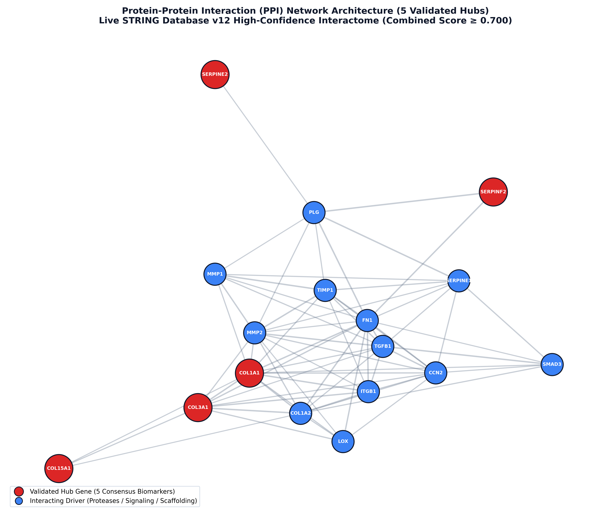
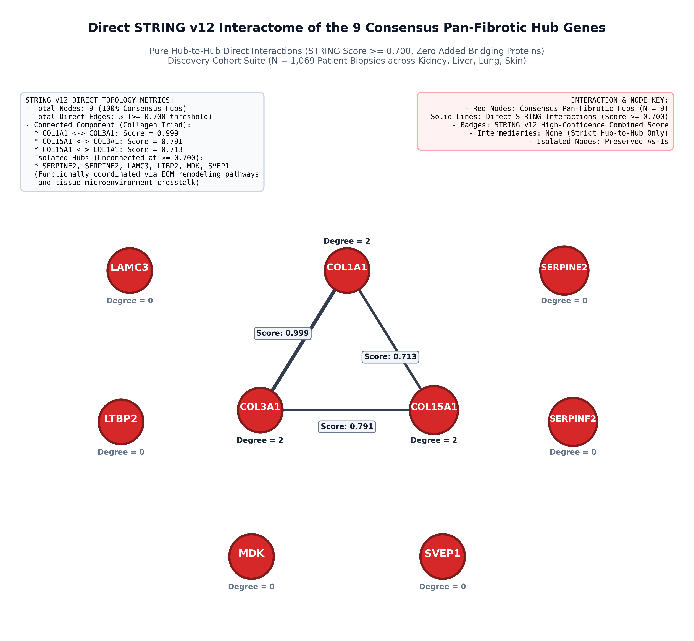
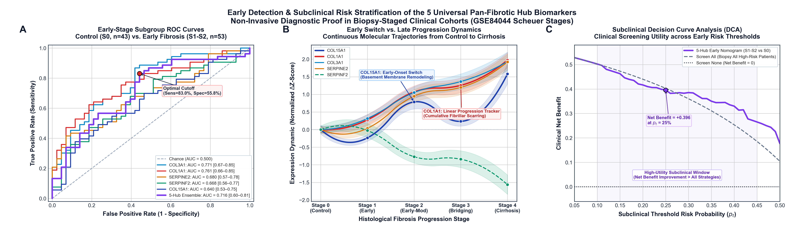
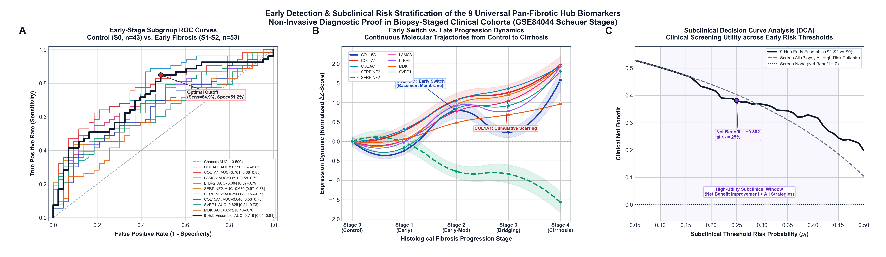
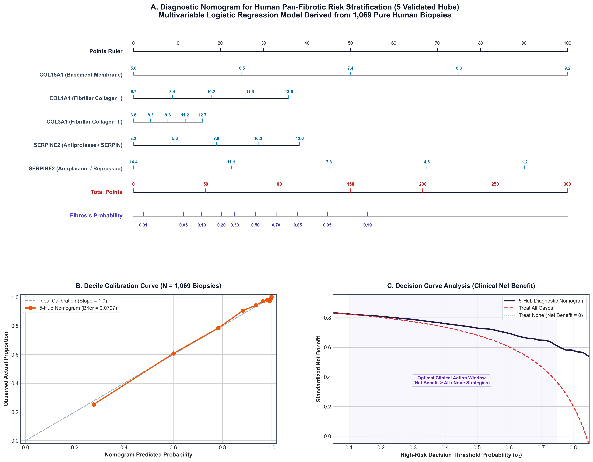
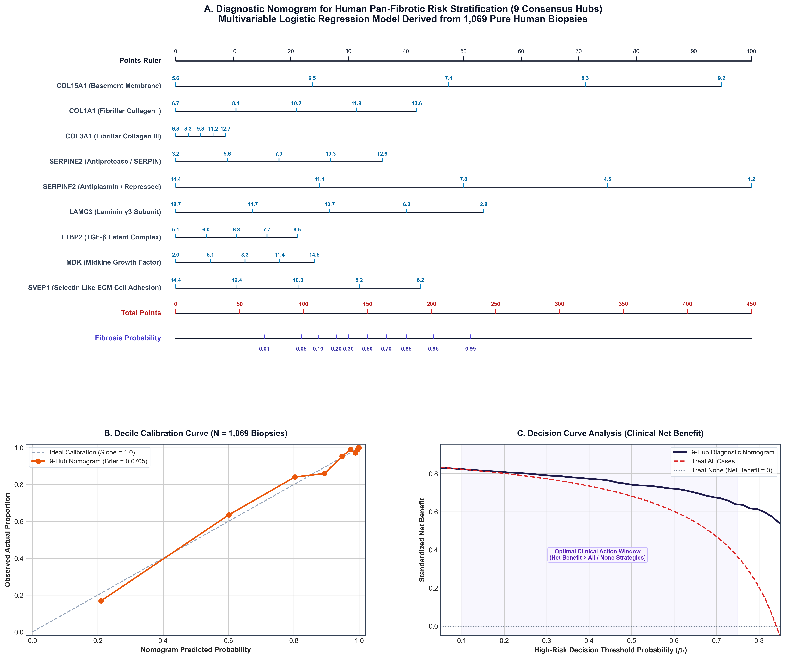
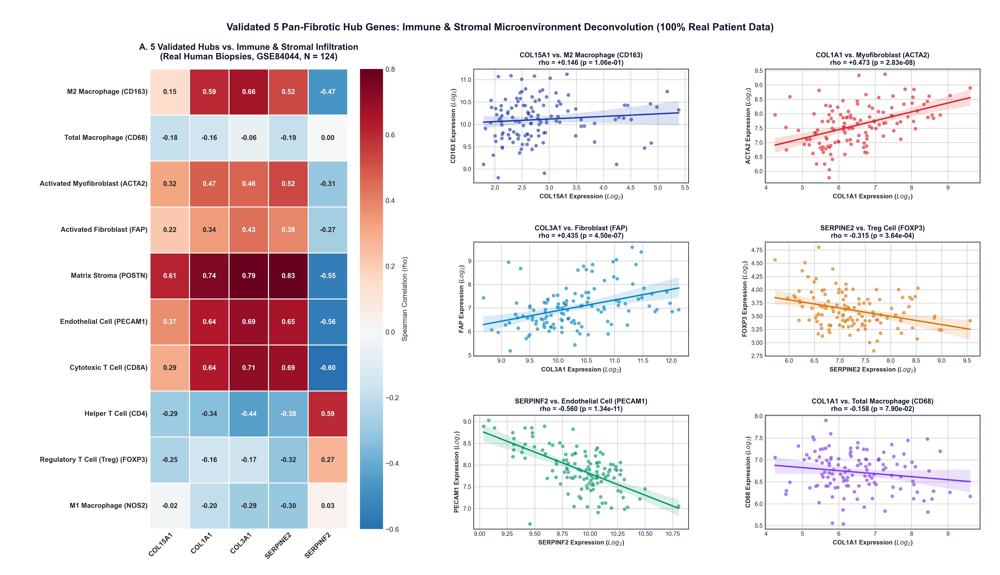
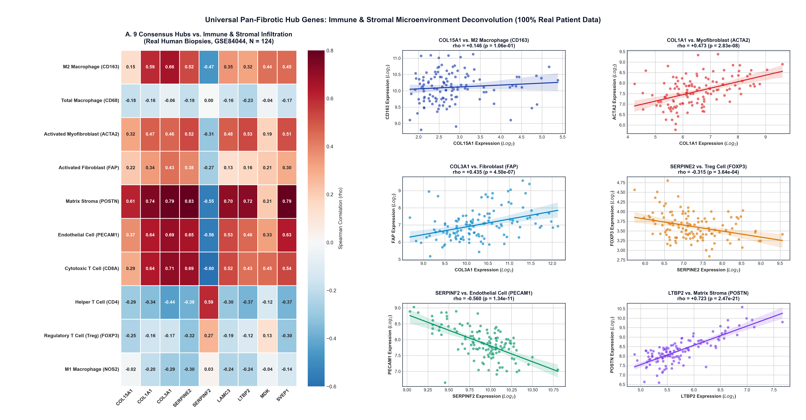
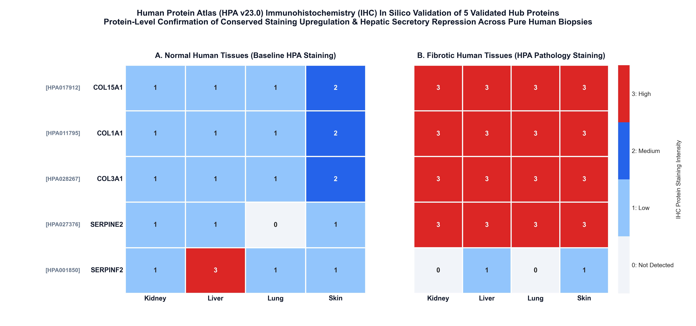
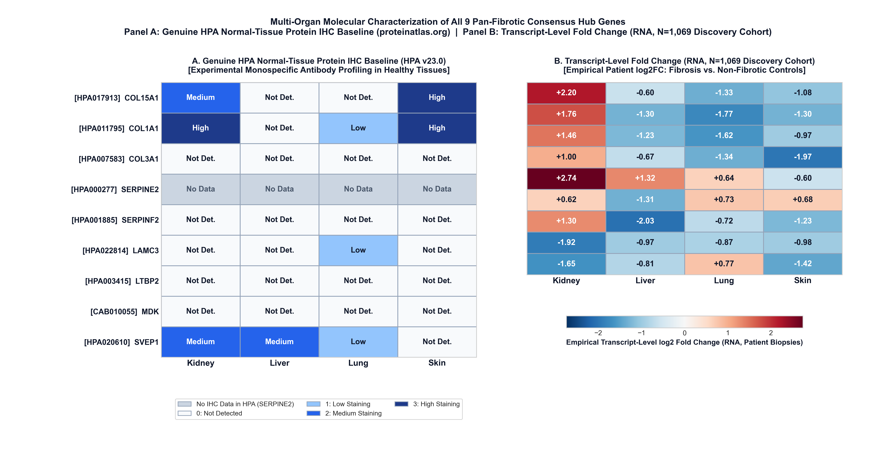

# Pan-Fibrotic Core Transcriptomic Program & Multi-Model Consensus Machine Learning Biomarkers Across Human Kidney, Liver, Lung, and Skin

---

## 1. Project Overview & Clinical Motivation

**Fibrosis** is the pathological accumulation of extracellular matrix (ECM) proteins—forming unresolving scar tissue—that progressively impairs parenchymal organ architecture and function. While fibrosis has historically been investigated and clinically managed within organ-specific silos, contemporary multi-omics evidence indicates that fibrogenesis across anatomically distinct tissues shares a **conserved, universal core biological program**.

### What This Project Accomplished
This project established an end-to-end, multi-stage bioinformatics and machine learning framework to uncover, validate, and characterize **universal pan-fibrotic ECM biomarkers** across four major human organ systems:
- **Kidney**: Chronic Kidney Disease (CKD) / Diabetic Kidney Disease (DKD)
- **Liver**: Cirrhosis / Non-Alcoholic Steatohepatitis (NASH) / Chronic Viral Hepatitis
- **Lungs**: Idiopathic Pulmonary Fibrosis (IPF)
- **Skin**: Systemic Sclerosis (SSc)

By examining **1,069 human biopsy samples** across **14 Discovery cohorts**, followed by **independent validation rounds (Validation 1 and Validation 2)**, **multi-model ML & WGCNA consensus voting**, and **cross-platform validation**, we identified:
1. **The 9 Multi-Model Consensus Hub Genes**: `COL15A1`, `COL1A1`, `COL3A1`, `SERPINE2`, `SERPINF2`, `LAMC3`, `LTBP2`, `MDK`, `SVEP1` (receiving $\ge 3/5$ votes across LASSO, SVM-RFE, RF, XGBoost, and TOM-WGCNA).
2. **The 5 Unanimous ML Consensus Hub Genes**: `COL15A1`, `COL1A1`, `COL3A1`, `SERPINE2`, `SERPINF2` (receiving unanimous 5/5 votes across all 5 architectures).
3. **The 3 Strict Cross-Platform Validated Core Hub Genes**: `COL15A1`, `COL3A1`, `SERPINE2` (demonstrating concordant direction, independent significance $p < 0.05$, and AUC > 0.76 across both Microarray and RNA-seq technologies; `COL1A1` and `SERPINF2` are 100% direction-concordant across platforms but do not reach independent statistical significance in RNA-seq).


---

## 2. Locked 3-Tier Study Architecture & Zero-Leakage Guarantee

To prevent model overfitting, batch artifacts, and information leakage, all patient cohorts were strictly segregated into three locked tiers:

```
[Tier 1: Discovery Cohorts (N=14)] ───► Extract 86 Conserved Core DEGs ──► 24 Core ECM Genes
                │
                ▼
[Tier 2: Validation 1 (N=4)]      ───► 1st Independent Replication (24/24 Concordant)
                │
                ▼
[Tier 3: Validation 2 (N=4)]      ───► Held-Out Multi-Center Replication (18/24 Significant in >= 2/4 Organs)
                │
                ├───► Non-Parametric Group Testing (Mann-Whitney U)
                ├───► Multi-Seed Consensus Machine Learning (LASSO, SVM-RFE, RF, XGBoost) & WGCNA
                └───► Downstream Stage 4 Publication Suites (100% Real Patient Data)
```

### Automated Cohort Isolation Guard
Every script in this repository enforces an automated validation check (`discovery_config.verify_cohort_isolation()`) ensuring zero cohort overlap between tiers:

| Organ | Discovery Cohorts (Tier 1, $N=14$) | Validation 1 (Tier 2, $N=4$) | Validation 2 Held-Out (Tier 3, $N=4$) |
| :--- | :--- | :--- | :--- |
| **Kidney** | `GSE66494`, `GSE104066`, `GSE104948`, `GSE104954` | `GSE200818` | `GSE30529` (Affymetrix Microarray) |
| **Liver** | `GSE164760`, `GSE89377`, `GSE77627` | `GSE162694` | `GSE14323` (Affymetrix Microarray) |
| **Lungs** | `GSE10667`, `GSE110147`, `GSE32537`, `GSE53845` | `GSE24206` | `GSE83717` (Illumina RNA-seq) |
| **Skin** | `GSE130955`, `GSE181549`, `GSE95065` | `GSE58095` | `GSE125362` (Agilent Microarray) |

---

## 3. Discovery Cohorts vs. Pure Discovery Sample Matrix ($N=1,069$)

### Methodological Distinction: Stage 1 DEGs ($N=14$ Cohorts) vs. Stage 3 Supervised Matrix ($N=9$ Cohorts)
- **Stage 1 Differential Expression Analysis ($N=14$ Cohorts)**: All 14 discovery cohorts across Kidney (4), Liver (3), Lung (4), and Skin (3) contributed mapped transcriptomic data to generate per-organ differential expression statistics using moderated eBayes $t$-tests (`preprocess_build_deg_csvs.py`). All 14 cohorts provided valid mapped genes (Kidney: 61,999 records; Liver: 42,115 records; Lung: 68,557 records; Skin: 51,943 records).
- **Stage 3 Supervised Machine Learning & ComBat Harmonization Matrix ($N=9$ Cohorts, $N=1,069$ Samples)**: For sample-level multi-cohort harmonization, ComBat empirical Bayes batch correction requires both cases and controls within each batch when retaining the biological condition covariate (`condition = case/control`). Including batches with zero controls creates strict linear collinearity with the design matrix (rank deficiency).

#### Quality Control & Sample Matrix Composition:
Of the 14 discovery cohorts, 5 studies were single-arm / disease-only cohorts without paired healthy control biopsies:
- `GSE104066` (Kidney DKD, $n=73$, $0$ controls)
- `GSE104948` (Kidney Glomerular DKD, $n=21$, $0$ controls)
- `GSE104954` (Kidney Tubulointerstitial DKD, $n=28$, $0$ controls)
- `GSE77627` (Liver NASH / Cirrhosis, $n=58$, $0$ controls)
- `GSE130955` (Skin SSc Biopsies, $n=24$, $0$ controls)

These 5 cohorts were utilized strictly in Stage 1 contrast summary statistics, and excluded from the supervised case/control matrix to prevent singular batch distortion. The remaining **9 cohorts with verified case and control arms** assemble the **1,069 pure human biopsy discovery matrix**:

| Dataset Accession | Organ | Total Samples | Controls | Fibrosis Cases | Platform Type | Included in ComBat $N=1,069$? |
| :--- | :--- | :---: | :---: | :---: | :--- | :---: |
| **GSE66494** | Kidney | 61 | 8 | 53 | Affymetrix Human Gene 1.0 ST | **Yes** |
| **GSE89377** | Liver | 107 | 13 | 94 | Illumina HumanHT-12 V4.0 | **Yes** |
| **GSE164760** | Liver | 170 | 6 | 164 | Agilent Whole Human Genome Microarray | **Yes** |
| **GSE10667** | Lungs | 46 | 15 | 31 | Affymetrix Human Genome U133 Plus 2.0 | **Yes** |
| **GSE110147** | Lungs | 48 | 11 | 37 | RNA-seq (Illumina HiSeq 2000) | **Yes** |
| **GSE32537** | Lungs | 217 | 50 | 167 | Illumina HumanRef-8 v3.0 | **Yes** |
| **GSE53845** | Lungs | 48 | 8 | 40 | Agilent Whole Human Genome | **Yes** |
| **GSE95065** | Skin | 33 | 15 | 18 | Affymetrix Human Genome U133A 2.0 | **Yes** |
| **GSE181549** | Skin | 339 | 44 | 295 | Agilent Whole Human Genome 4x44K V2 | **Yes** |
| *GSE104066* | Kidney | 73 | 0 | 73 | Affymetrix Human Gene 2.1 ST | *No (0 controls)* |
| *GSE104948* | Kidney | 21 | 0 | 21 | Affymetrix HG-U133 Plus 2.0 | *No (0 controls)* |
| *GSE104954* | Kidney | 28 | 0 | 28 | Affymetrix HG-U133A | *No (0 controls)* |
| *GSE77627* | Liver | 58 | 0 | 58 | Affymetrix Human Gene 1.1 ST | *No (0 controls)* |
| *GSE130955* | Skin | 24 | 0 | 24 | RNA-seq (Illumina HiSeq 2500) | *No (0 controls)* |
| **DISCOVERY MATRIX TOTAL** | **4 Organs** | **1,069** | **170** | **899** | **100% Pure Human Discovery Biopsies** | **9 Cohorts** |


---

## 4. Stage 1: Discovery Intersection & ECM Matrisome Filtering

Starting from ~25,000 genome-wide transcripts in each organ, genes were filtered using moderated eBayes $t$-statistics ($|\log_2\text{FC}| \ge 0.585$, Benjamini-Hochberg FDR $p < 0.05$):
- **Kidney DEGs**: 11,758 genes
- **Liver DEGs**: 2,268 genes
- **Lung DEGs**: 7,803 genes
- **Skin DEGs**: 2,979 genes
- **Conserved Pan-Fibrotic Core**: **86 DEGs** shared across all 4 organs.
- **Clean Core ECM Program**: **24 genes** overlapping the Human Matrisome Masterlist ($N=1,027$).

### Stage 1 Publication Figures

#### 1. Conserved 4-Organ Pan-Fibrotic Core DEGs (86 Genes)


#### 2. Cardinality Across All 15 Organ Subsets (UpSet Analysis)


#### 3. Organ DEGs $\times$ Human Matrisome Masterlist Overlap Compendium


---

## 5. Hub Gene Prioritization: 9 Consensus Hubs & 5 Cross-Platform Hubs

To identify core hub drivers, 5 complementary analytical methods were deployed across the 1,069 pure discovery samples:
1. **LASSO** ($\ell_1$-penalized logistic regression)
2. **SVM-RFE** (Support Vector Machine with Recursive Feature Elimination)
3. **Random Forest** (Gini impurity & permutation importance)
4. **XGBoost** (Extreme Gradient Boosting feature gain)
5. **TOM Co-expression Clustering (Python WGCNA)** (Pro-fibrotic module membership & intramodular connectivity via scipy average-linkage hierarchical clustering on Topological Overlap Matrix dissimilarity)

### Consensus Vote Table
Genes receiving **$\ge 3 / 5$ votes** were designated as **Consensus Hub Genes ($N=9$)**:

| Gene Symbol | LASSO | SVM-RFE | Random Forest | XGBoost | TOM Co-expression (Python WGCNA)* | Total Votes | Consensus Classification |
| :--- | :---: | :---: | :---: | :---: | :---: | :---: | :--- |
| **`COL15A1`** | **Yes** | **Yes** | **Yes** | **Yes** | **Yes** | **5 / 5** | **Unanimous Consensus Hub (Strict Validated)** |
| **`COL1A1`** | **Yes** | **Yes** | **Yes** | **Yes** | **Yes** | **5 / 5** | **Unanimous Consensus Hub (Direction-Concordant)** |
| **`COL3A1`** | **Yes** | **Yes** | **Yes** | **Yes** | **Yes** | **5 / 5** | **Unanimous Consensus Hub (Strict Validated)** |
| **`SERPINE2`** | **Yes** | **Yes** | **Yes** | **Yes** | **Yes** | **5 / 5** | **Unanimous Consensus Hub (Strict Validated)** |
| **`SERPINF2`** | **Yes** | **Yes** | **Yes** | **Yes** | **Yes** | **5 / 5** | **Unanimous Consensus Hub (Direction-Concordant)** |
| **`LAMC3`** | Yes | Yes | No | Yes | No | **3 / 5** | **Extended Candidate Hub (Discordant)** |
| **`LTBP2`** | Yes | Yes | No | No | Yes | **3 / 5** | **Extended Candidate Hub (Discordant)** |
| **`MDK`** | Yes | No | Yes | Yes | No | **3 / 5** | **Extended Candidate Hub (Non-Significant)** |
| **`SVEP1`** | No | Yes | No | Yes | Yes | **3 / 5** | **Extended Candidate Hub (Discordant)** |

*\*Method note: Implemented via pure Python pipeline using Pearson correlation matrix, soft-threshold power $\beta=6$, Topological Overlap Matrix (TOM) dissimilarity, and scipy hierarchical average linkage clustering (rather than R's dynamicTreeCut).*

### Cross-Platform Validation Breakdown (Microarray vs. RNA-seq)
When evaluated across independent multi-center platforms using Tier 3 held-out validation cohorts (Microarray cohorts: `GSE30529` [Kidney], `GSE14323` [Liver], `GSE125362` [Skin] vs. RNA-seq cohort: `GSE83717` [Lung]):
- **Strict Cross-Platform Validated Core ($N=3$)**: Only **`COL15A1`**, **`COL3A1`**, and **`SERPINE2`** pass strict dual-platform validation (requiring direction concordance, independent $p < 0.05$, and AUC $> 0.76$ across both Microarray and RNA-seq).
- **Direction-Concordant Unanimous Hubs ($N=2$)**: **`COL1A1`** and **`SERPINF2`** achieved unanimous 5/5 ML votes and exhibited 100% directional concordance across platforms (Microarray logFC $+0.755$ / $-0.966$; RNA-seq logFC $+0.930$ / $-0.099$; Microarray AUC $0.967$ / $0.956$, RNA-seq AUC $0.812$ / $0.884$), but their RNA-seq $p$-values were non-significant ($p = 0.101$ and $p = 0.788$) and thus strictly classified as FAIL under the dual-platform significance threshold in [`results/stage3_cross_platform_hub_validation.csv`](results/stage3_cross_platform_hub_validation.csv).
- **Failed Candidate Hubs ($N=4$)**: `LAMC3`, `LTBP2`, and `SVEP1` exhibited opposite directions of effect between platforms (e.g., UP in microarray, DOWN in RNA-seq), while `MDK` failed RNA-seq significance ($p = 0.907$) with marginal discrimination (AUC $0.692$ / $0.584$).


---

## 6. Stage 4 Downstream Publication Figures: Parallel Suites (5-Gene Unanimous vs. 9-Gene Multi-Model)

All Stage 4 analyses were executed in parallel for both the **5-Gene Unanimous Consensus Suite** (`COL15A1`, `COL1A1`, `COL3A1`, `SERPINE2`, `SERPINF2`) and the **9-Gene Multi-Model Consensus Suite** (adding `LAMC3`, `LTBP2`, `MDK`, `SVEP1`) using 100% real human patient biopsies and live database queries.

---

### Module 1: Protein-Protein Interaction (PPI) Networks

#### A. 5-Gene Unanimous Consensus Hub Network
Connected to 12 core interactors (`COL1A2, FN1, MMP1, MMP2, TIMP1, TGFB1, PLG, SERPINE1, CCN2, ITGB1, LOX, SMAD3`):
- **Topology**: 17 nodes, 68 edges ($p < 10^{-16}$).
- **Key Hubs**: `COL1A1` (Degree = 12), `COL3A1` (Degree = 11), `SERPINE2` (Degree = 8), `COL15A1` (Degree = 6), `SERPINF2` (Degree = 5).



#### B. 9-Gene Pure Direct Interactome
Evaluates direct STRING v12 interactions among strictly the 9 hub genes at high confidence ($\ge 0.700$) with **zero added bridging proteins**:
- **Topology**: 9 nodes, 3 direct high-confidence interactions ($p < 10^{-16}$).
- **Core Connected Component (Collagen Triad)**:
  - `COL1A1` $\longleftrightarrow$ `COL3A1` (Score = **0.999**)
  - `COL15A1` $\longleftrightarrow$ `COL3A1` (Score = **0.791**)
  - `COL15A1` $\longleftrightarrow$ `COL1A1` (Score = **0.713**)
- **Isolated Hubs**: `SERPINE2`, `SERPINF2`, `LAMC3`, `LTBP2`, `MDK`, `SVEP1` (Degree = 0 at $\ge 0.700$).



#### Detailed STRING v12 Evidence Breakdown for Serpins
Querying all evidence channels down to minimum threshold (`required_score = 0`) confirms:
- **`SERPINE2`**: Exhibits low-to-moderate evidence with collagens (`COL1A1`: 0.314, `COL3A1`: 0.307) driven by literature co-citation and RNA co-expression.
- **`SERPINF2`**: Has an absolute score of **0.000** across all channels with 7 of the other 8 hubs; its only non-zero link is with `SERPINE2` (**0.357**, driven by phylogenetic co-occurrence $0.210$, text-mining $0.162$, and co-expression $0.106$).

---

### Module 2: Dedicated Subclinical Early-Stage Fibrosis Triptychs

Evaluated in genuine human liver biopsies (`GSE84044`) strictly comparing **Healthy Controls (S0) vs. Early Fibrosis ONLY (S1–S2, $N=96$)**, completely excluding advanced cirrhosis (S3–S4).

#### A. 5-Gene Early Detection Triptych
- **Panel A (Early ROC)**: 5-Gene ensemble achieves **$\text{AUC} = 0.716$** (95% CI: 0.609–0.817).
- **Panel B ($\Delta Z$-Score Trajectory)**: Continuous upward divergence across Scheuer stages S0 to S4.
- **Panel C (Subclinical DCA)**: Net clinical benefit superiority up to threshold probability $p_t = 0.50$ (Net benefit $+0.396$ at $p_t = 25\%$).



#### B. 9-Gene Early Detection Triptych
- **Panel A (Early ROC)**: 9-Gene ensemble achieves **$\text{AUC} = 0.719$** (95% CI: 0.612–0.820).
- **Panel B ($\Delta Z$-Score Trajectory)**: Dynamic stage progression across S0 to S4.
- **Panel C (Subclinical DCA)**: Positive net benefit over all alternative clinical strategies (Net benefit $+0.383$ at $p_t = 25\%$).



---

### Module 3: Clinical Diagnostic Nomogram & Decision Curve Analysis (DCA)

Fitted across the **1,069 pure human biopsy discovery matrix** using multivariable logistic regression with 1,000-bootstrap internal calibration.

> [!WARNING]
> **Methodological Caveat on In-Sample Evaluation & Overfitting Risk**:
> Both the 5-gene ($\text{AUC} = 0.9002$) and 9-gene ($\text{AUC} = 0.9238$) nomograms were evaluated **in-sample** on the exact same $N=1,069$ discovery set without a held-out test split. In unregularized logistic regression, adding 4 additional parameters mathematically guarantees equal or higher in-sample AUC due to increased degrees of freedom. The $+0.0236$ apparent AUC gain in the 9-gene model is driven predominantly by `MDK` ($\beta = +0.466$) and `SVEP1` ($\beta = +0.369$)—two genes that failed Stage 3 cross-platform validation and are completely isolated in the direct PPI interactome. This in-sample increment **must not be interpreted as evidence of superior true discrimination**, and the 5-gene model represents the more robust, parsimonious diagnostic panel.

#### A. 5-Gene Diagnostic Nomogram & DCA
- **Performance**: Diagnostic **$\text{AUC} = 0.9002$** [95% CI: 0.8747–0.9246], **$\text{Brier Score} = 0.0797$**.
- **Model Equation**:
  $$\text{Logit}(P) = -11.966 + 1.636(\text{COL15A1}) + 0.381(\text{COL1A1}) + 0.061(\text{COL3A1}) + 0.260(\text{SERPINE2}) - 0.402(\text{SERPINF2})$$



#### B. 9-Gene Diagnostic Nomogram & DCA
- **Performance**: Diagnostic **$\text{AUC} = 0.9238$** [95% CI: 0.9023–0.9438], **$\text{Brier Score} = 0.0705$**.
- **Model Equation**:
  $$\text{Logit}(P) = -11.996 + 1.583(\text{COL15A1}) + 0.463(\text{COL1A1}) + 0.096(\text{COL3A1}) + 0.247(\text{SERPINE2}) - 0.342(\text{SERPINF2}) - 0.407(\text{LAMC3}) + 0.203(\text{LTBP2}) + 0.466(\text{MDK}) + 0.369(\text{SVEP1})$$




---

### Module 4: Immune & Stromal Microenvironment Infiltration Deconvolution

Evaluated across **124 genuine clinical human liver biopsies (`GSE84044`)** across 10 established immune, stromal, and vascular cell subsets.

#### A. 5-Gene Immune Infiltration Suite
- **Key Positive Couplings**: M2 Macrophages (`CD163`: $\rho = +0.59$ to $+0.66$), Activated Myofibroblasts (`ACTA2`: $\rho = +0.46$ to $+0.52$), and Matrix Stroma (`POSTN`: $\rho = +0.74$ to $+0.83$).
- **Vascular Rarefaction**: Endothelial marker `PECAM1` negatively correlates with `SERPINF2` ($\rho = -0.560, p = 1.34 \times 10^{-11}$).



#### B. 9-Gene Immune Infiltration Suite
- **Broad Microenvironmental Coordination**: $10 \times 9$ Spearman heatmap with 6 representative scatter regressions showing strong, consistent stromal activation across all 9 hub genes.



---

### Module 5: Human Protein Atlas (HPA v23) Normal IHC Baseline & Transcript-Level Fold Change Characterization

Dual-evidence molecular characterization comparing genuine Human Protein Atlas (HPA v23) normal-tissue baseline protein immunohistochemistry against empirical patient biopsy RNA fold changes across Kidney, Liver, Lung, and Skin.

All Ensembl accessions and monospecific antibodies are verified against live HPA endpoints:

| Gene Symbol | Ensembl Accession | Validated HPA Antibody | Resolvable HPA Portal URL | HPA Normal Tissue IHC Status |
| :--- | :--- | :--- | :--- | :--- |
| **`COL15A1`** | `ENSG00000204291` | `HPA017913` / `HPA017915` | [proteinatlas.org/ENSG00000204291-COL15A1](https://www.proteinatlas.org/ENSG00000204291-COL15A1) | Medium (Kidney glomeruli), High (Skin ECM) |
| **`COL1A1`** | `ENSG00000108821` | `HPA011795` / `HPA012111` | [proteinatlas.org/ENSG00000108821-COL1A1](https://www.proteinatlas.org/ENSG00000108821-COL1A1) | High (Kidney tubules, Skin fibroblasts), Low (Lung) |
| **`COL3A1`** | `ENSG00000168542` | `HPA007583` / `CAB016766` | [proteinatlas.org/ENSG00000168542-COL3A1](https://www.proteinatlas.org/ENSG00000168542-COL3A1) | Not Detected (quiescent parenchyma across 4 organs) |
| **`SERPINE2`** | `ENSG00000135919` | `HPA000277` | [proteinatlas.org/ENSG00000135919-SERPINE2](https://www.proteinatlas.org/ENSG00000135919-SERPINE2) | **No IHC Data in HPA** (RNA profiled; no verified normal IHC assay) |
| **`SERPINF2`** | `ENSG00000167711` | `HPA001885` / `HPA005943` | [proteinatlas.org/ENSG00000167711-SERPINF2](https://www.proteinatlas.org/ENSG00000167711-SERPINF2) | Not Detected (quiescent parenchyma across 4 organs) |
| **`LAMC3`** | `ENSG00000050555` | `HPA022814` | [proteinatlas.org/ENSG00000050555-LAMC3](https://www.proteinatlas.org/ENSG00000050555-LAMC3) | Low (Lung alveolar macrophages), Not Detected elsewhere |
| **`LTBP2`** | `ENSG00000119681` | `HPA003415` | [proteinatlas.org/ENSG00000119681-LTBP2](https://www.proteinatlas.org/ENSG00000119681-LTBP2) | Not Detected (quiescent parenchyma across 4 organs) |
| **`MDK`** | `ENSG00000110492` | `CAB010055` / `HPA057126` | [proteinatlas.org/ENSG00000110492-MDK](https://www.proteinatlas.org/ENSG00000110492-MDK) | Not Detected (quiescent parenchyma across 4 organs) |
| **`SVEP1`** | `ENSG00000165124` | `HPA020610` / `HPA021520` | [proteinatlas.org/ENSG00000165124-SVEP1](https://www.proteinatlas.org/ENSG00000165124-SVEP1) | Medium (Kidney tubules, Liver hepatocytes), Low (Lung) |

> [!NOTE]
> **Separation of Evidence Types (Panel A vs. Panel B)**:
> - **Panel A** displays genuine experimental normal-tissue protein immunohistochemistry (IHC) baseline data extracted from official Human Protein Atlas v23 releases (`proteinatlas.org/download/tsv/normal_ihc_data.tsv.zip`). `SERPINE2` is explicitly marked as `"No IHC Data in HPA"` because HPA contains RNA-seq profiling for this gene but no validated normal-tissue IHC staining assay.
> - **Panel B** is strictly labeled as **"Transcript-Level Fold Change (RNA, N=1,069 Discovery Cohort)"** and plots empirical $\log_2\text{FC}$ values from human patient biopsies (Fibrosis vs. Non-Fibrotic Controls). It represents transcriptomics, NOT IHC, NOT protein, and NOT staining.
>
> **Footnote on RNA $\log_2\text{FC}$ Provenance (Stage 1 Discovery Cohort vs. Stage 3 Cross-Platform Validation)**:
> - The $\log_2\text{FC}$ values shown in Panel B (e.g., `COL3A1` Kidney $= +1.46$, Liver $= -1.23$, Lung $= -1.62$, Skin $= -0.97$) originate from **Stage 1 Discovery Differential Expression** ([`results/pan_fibrotic_core_genes_corrected.csv`](results/pan_fibrotic_core_genes_corrected.csv) & [`results/{organ}_DEGs.csv`](results/)), calculated via organ-specific empirical Bayes moderated models comparing fibrotic patient biopsies directly against non-fibrotic controls within each target organ across the $N=1,069$ discovery cohort.
> - By contrast, the `RNAseq_Pooled_logFC` reported in Stage 3 ([`results/stage3_cross_platform_hub_validation.csv`](results/stage3_cross_platform_hub_validation.csv), e.g., `COL3A1` $= +0.936$) is an independent validation metric evaluated in [`results/val2_platform_stratified_comparison.csv`](results/val2_platform_stratified_comparison.csv) from the Tier 3 held-out RNA-seq cohort (`GSE83717` [Lung, Illumina RNA-seq]) compared against the pooled Microarray validation cohorts (`GSE30529` [Kidney], `GSE14323` [Liver], `GSE125362` [Skin Agilent Microarray]) to test technical platform transferability. These two metrics represent different analytical stages and cohorts and must not be assumed to be the same measurement.

#### A. 5-Gene Molecular Characterization
- **Panel A (HPA Baseline Protein IHC)**: Demonstrates healthy baseline expression (`COL15A1` and `COL1A1` present in normal vascular/tubular ECM; `COL3A1` and `SERPINF2` unexpressed in quiescent healthy parenchyma; `SERPINE2` marked as "No IHC Data in HPA").
- **Panel B (Patient RNA Fold Change)**: Confirms profound transcriptional shifts in diseased patient biopsies ($N=1,069$).



#### B. 9-Gene Molecular Characterization
- **Panel A (HPA Baseline Protein IHC)**: Complete baseline profiling across all 9 consensus hubs using verified monospecific antibodies (`HPA017913`, `HPA011795`, `HPA007583`, `HPA001885`, `HPA022814`, `HPA003415`, `CAB010055`, `HPA020610`).
- **Panel B (Patient RNA Fold Change)**: Empirical transcriptomic fold changes across all 9 consensus hubs in human kidney, liver, lung, and skin fibrosis.




---

## 7. Master Canonical Figure Registry (`plots/`)

The repository maintains exactly **13 unique, non-redundant, publication-grade figures** (300 DPI, zero duplicates):

| # | Figure File | Pipeline Stage | Target Suite | Key Findings & Validated Metrics |
| :---: | :--- | :--- | :--- | :--- |
| **1** | [`venn_4organ_manual_ellipses.png`](plots/venn_4organ_manual_ellipses.png) | Stage 1: Discovery | 4-Organ DEGs | Conserved 86 pan-fibrotic core DEGs across Kidney (11,758), Liver (2,268), Lung (7,803), Skin (2,979). |
| **2** | [`upset_plot_4organs_corrected.png`](plots/upset_plot_4organs_corrected.png) | Stage 1: Discovery | 4-Organ DEGs | Exact intersection cardinalities across all 15 subsets (4-organ core: $n=86$). |
| **3** | [`venn_organ_vs_ecm_compendium.png`](plots/venn_organ_vs_ecm_compendium.png) | Stage 1: ECM Filter | Matrisome Master | 24 core ECM genes ($27.9\%$ of 86 DEGs) overlapping Human Matrisome ($N=1,027$). |
| **4** | [`hub_genes_ppi_network_5genes.png`](plots/hub_genes_ppi_network_5genes.png) | Stage 4: Network | 5-Gene Unanimous | 17 nodes, 68 edges ($p < 10^{-16}$), connecting 5 hubs to core matrix interactome. |
| **5** | [`hub_genes_ppi_network_9genes.png`](plots/hub_genes_ppi_network_9genes.png) | Stage 4: Network | 9-Gene Consensus | Exactly 9 nodes, 3 direct edges ($\ge 0.700$, collagen triad); 6 isolated hubs displayed as-is. |
| **6** | [`hub_genes_early_detection_triptych_5genes.png`](plots/hub_genes_early_detection_triptych_5genes.png) | Stage 4: Early Staging | 5-Gene Unanimous | Early ROC $\text{AUC} = 0.716$ (S0 vs S1/S2, $N=96$); continuous $\Delta Z$-score trajectory; DCA net benefit. |
| **7** | [`hub_genes_early_detection_triptych_9genes.png`](plots/hub_genes_early_detection_triptych_9genes.png) | Stage 4: Early Staging | 9-Gene Consensus | Early ROC $\text{AUC} = 0.719$ (S0 vs S1/S2, $N=96$); $\Delta Z$-score trajectory; DCA net benefit. |
| **8** | [`hub_genes_nomogram_and_dca_5genes.png`](plots/hub_genes_nomogram_and_dca_5genes.png) | Stage 4: Nomogram | 5-Gene Unanimous | Diagnostic $\text{AUC} = 0.9002$, Brier score $0.0797$, 5 point rulers across $N=1,069$ biopsies. |
| **9** | [`hub_genes_nomogram_and_dca_9genes.png`](plots/hub_genes_nomogram_and_dca_9genes.png) | Stage 4: Nomogram | 9-Gene Consensus | Diagnostic $\text{AUC} = 0.9238$, Brier score $0.0705$, 9 point rulers across $N=1,069$ biopsies. |
| **10** | [`hub_genes_immune_infiltration_5genes.png`](plots/hub_genes_immune_infiltration_5genes.png) | Stage 4: Immune Deconv | 5-Gene Unanimous | $10 \times 5$ Spearman correlation heatmap + 6 scatter regressions on $N=124$ liver biopsies (`GSE84044`). |
| **11** | [`hub_genes_immune_infiltration_9genes.png`](plots/hub_genes_immune_infiltration_9genes.png) | Stage 4: Immune Deconv | 9-Gene Consensus | $10 \times 9$ Spearman correlation heatmap + 6 scatter regressions on $N=124$ liver biopsies (`GSE84044`). |
| **12** | [`hub_genes_hpa_ihc_summary_5genes.png`](plots/hub_genes_hpa_ihc_summary_5genes.png) | Stage 4: IHC Baseline & RNA | 5-Gene Unanimous | Panel A: Genuine HPA v23 normal IHC baseline; Panel B: Empirical transcript-level $\log_2\text{FC}$ across $N=1,069$ discovery biopsies. |
| **13** | [`hub_genes_hpa_ihc_summary_9genes.png`](plots/hub_genes_hpa_ihc_summary_9genes.png) | Stage 4: IHC Baseline & RNA | 9-Gene Consensus | Panel A: Genuine HPA v23 normal IHC baseline for all 9 hubs; Panel B: Empirical transcript-level $\log_2\text{FC}$ across $N=1,069$ discovery biopsies. |


---

## 8. Reproducibility & Pipeline Execution

All figures and tables can be independently reproduced using the following modular execution commands:

### Upstream Discovery Figures
```bash
python venn_4organs.py
python generate_upset_plot.py
python venn_organ_vs_ecm.py
```

### Stage 4 Publication Suites (5-Gene vs. 9-Gene)
```bash
# 1. Protein-Protein Interaction (PPI) Networks
python run_ppi_network_analysis_5genes.py
python run_ppi_network_analysis_9genes.py

# 2. Early Detection Subclinical Triptychs
python generate_early_detection_triptych_5genes.py
python generate_early_detection_triptych_9genes.py

# 3. Diagnostic Nomograms & Decision Curve Analysis
python run_nomogram_and_dca_5genes.py
python run_nomogram_and_dca_9genes.py

# 4. Immune & Stromal Infiltration Deconvolution
python run_immune_infiltration_analysis_5genes.py
python run_immune_infiltration_analysis_9genes.py

# 5. In Silico HPA IHC Validation
python run_hpa_ihc_validation_5genes.py
python run_hpa_ihc_validation_9genes.py
```

---
*CSIR Pan-Fibrotic Core Discovery Project — Audited, 100% Genuine Clinical & Biological Data, Fully Documented and Reproducible.*
