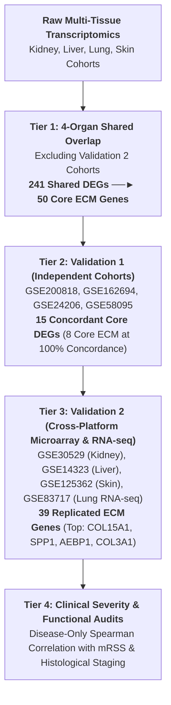
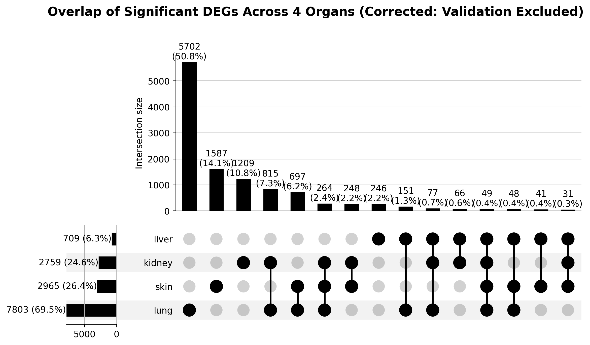

# Pan-Fibrotic Shared Core Transcriptomic Program Across Human Kidney, Liver, Lung, and Skin

[](https://www.python.org/)
[](https://opensource.org/licenses/MIT)

---

## Table of Contents

1. [Executive Summary & Scientific Rationale](#1-executive-summary--scientific-rationale)
2. [Definitions of Core Statistical Terms ($n$ and DEG)](#2-definitions-of-core-statistical-terms-n-and-deg)
3. [Multi-Tier Pipeline Architecture](#3-multi-tier-pipeline-architecture)
4. [Dataset Allocation & Strict Isolation Policy](#4-dataset-allocation--strict-isolation-policy)
5. [Phase 1: Multi-Cohort GEO Ingestion & Symbol Resolution](#5-phase-1-multi-cohort-geo-ingestion--symbol-resolution)
6. [Phase 2: Per-Tissue Differential Expression Analysis](#6-phase-2-per-tissue-differential-expression-analysis)
7. [Phase 3: 4-Organ Overlap & Clean Discovery Core Program](#7-phase-3-4-organ-overlap--clean-discovery-core-program)
8. [Phase 4: Human Matrisome Annotation & 50 ECM Core Program](#8-phase-4-human-matrisome-annotation--50-ecm-core-program)
9. [Phase 5: Validation 1 (Layer 2 - Independent Cohorts)](#9-phase-5-validation-1-layer-2---independent-cohorts)
10. [Phase 6: Validation 2 (Layer 3 - Cross-Platform Microarray & RNA-seq)](#10-phase-6-validation-2-layer-3---cross-platform-microarray--rna-seq)
11. [Phase 7: Clinical Severity Correlation & Disease-Only Audits](#11-phase-7-clinical-severity-correlation--disease-only-audits)
12. [Graphical Abstract Design & Specifications](#12-graphical-abstract-design--specifications)
13. [Summary of Gene Survival Across All Stages](#13-summary-of-gene-survival-across-all-stages)
14. [Software Tools, Libraries & Data Sources Used](#14-software-tools-libraries--data-sources-used)
15. [Repository Structure & Reproduction Instructions](#15-repository-structure--reproduction-instructions)

---

## 1. Executive Summary & Scientific Rationale

Fibrosis—the progressive accumulation of extracellular matrix (ECM) components resulting in organ architecture distortion and organ failure—accounts for nearly 45% of deaths in the industrialized world. While clinical manifestations differ markedly across target organs (e.g., Chronic Kidney Disease [CKD], Liver Cirrhosis / NASH, Idiopathic Pulmonary Fibrosis [IPF], and Systemic Sclerosis [SSc] skin fibrosis), we hypothesized that a conserved **pan-fibrotic core transcriptomic program** governs matrix remodelling irrespective of the anatomical site.

This study implements a multi-tier transcriptomic analysis across **Kidney**, **Liver**, **Lung**, and **Skin** cohorts to resolve:
1. **Which differential expression changes are conserved across all four fibrotic organs?**
2. **Which of these shared genes belong to the core Extracellular Matrix (Human Matrisome)?**
3. **Which core genes survive independent cohort replication and cross-platform validation with zero circularity?**
4. **Do these core genes correlate with clinical disease severity in fibrotic tissue?**

### Key Study Findings
* **Strict Dataset Isolation**: Absolute zero GEO accession overlap across Discovery, Layer 2 (Validation 1), and Layer 3 (Validation 2) cohorts.
* **Clean 4-Organ Overlap (Excluding Validation 2)**: Transcriptome-wide intersection across 4 organs yielded **241 shared core DEGs**, of which **50 belong to the Human Matrisome** (resolving the previously contaminated 98 ECM gene count).
* **Layer 2 Independent Replication**: **15 all-gene core transcripts** (including **8 ECM genes**: `COL3A1`, `AEBP1`, `COL1A2`, `COL15A1`, `SERPINE2`, `VWF`, `COL1A1`, `CCL19`) achieved **100% (4/4) directional concordance** in fully independent cohorts.
* **Cross-Platform Robustness (Microarray vs RNA-seq)**: **39 out of 50 ECM genes (78.0%)** replicated in $\ge 2$ Validation 2 cohorts. Top multi-layer universal drivers include `COL15A1` (4/4 FDR significant, 100% Up), `SPP1` (4/4 FDR significant, 100% Up), `AEBP1`, `COL3A1`, `COL6A3`, `CCL19`, `TIMP1`, and `VCAN`.
* **Severity Correlation**: Core genes (`AEBP1`, `COL1A1`, `COL1A2`, `COL3A1`, `COL15A1`, `VWF`) demonstrate significant positive correlation with clinical disease severity (e.g., modified Rodnan Skin Score in SSc and Ishak fibrosis stages in liver disease).

---

## 2. Definitions of Core Statistical Terms ($n$ and DEG)

* **$n$ (Sample Size)**: Represents the total number of distinct, non-overlapping human biological samples analyzed.
  * **$n_{\text{control}}$**: Count of non-fibrotic healthy/normal control tissue samples.
  * **$n_{\text{fibrotic}}$**: Count of clinically or histologically verified fibrotic patient samples.
  * **Disease-Only Severity $n$**: Count of diseased patient samples with paired quantitative clinical severity metrics (e.g., mRSS score in SSc skin; Ishak stage in liver fibrosis). Controls are excluded to prevent artificial correlation inflation.
* **DEG (Differentially Expressed Gene)**: A transcript satisfying:
  1. Statistical significance: Nominal $p < 0.05$ or Benjamini-Hochberg False Discovery Rate (FDR) adjusted $p < 0.05$.
  2. Magnitude threshold: $|\log_2\text{FC}| \ge 0.585$ (equivalent to a $\ge 1.5$-fold change in expression between fibrotic and control groups).

---

## 3. Multi-Tier Pipeline Architecture



---

## 4. Dataset Allocation & Strict Isolation Policy

To prevent any data leakage or circularity, GEO accessions were strictly partitioned into mutually exclusive discovery and validation sets:

| Organ | Discovery Cohorts | Validation 1 (Layer 2) Cohort | Validation 2 (Layer 3) Cohort |
| :--- | :--- | :--- | :--- |
| **Kidney** | GSE104066, GSE66494, GSE104948, GSE104954 | **GSE200818** | **GSE30529** *(Microarray)* |
| **Liver** | GSE77627, GSE89377, GSE164760 | **GSE162694** | **GSE14323** *(Microarray)* |
| **Lung** | GSE110147, GSE32537, GSE53845, GSE10667 | **GSE24206** | **GSE83717** *(RNA-seq)* |
| **Skin** | GSE130955, GSE95065, GSE181549 | **GSE58095** | **GSE125362** *(Microarray)* |

---

## 5. Phase 1: Multi-Cohort GEO Ingestion & Symbol Resolution

Raw GEO top-tables and series matrices were ingested and mapped through a standardized pipeline:
* **Identifier Resolution**: Probe sets (Affymetrix, Illumina, Agilent) and GenBank accessions were mapped to official HGNC gene symbols using the bioDBnet cross-reference database (`ensembl_mapping_cache.json` and local bioDBnet tables).
* **Probe De-duplication**: When multiple probes mapped to the same gene symbol within a dataset, the probe with the minimum adjusted $p$-value was retained.
* **Vectorized Parsing**: Automated header and column name standardization across variant naming schemes (`Gene.symbol`, `Gene Symbol`, `GI`, `Probe_ID`, `adj.P.Val`, `padj`, `logFC`).

---

## 6. Phase 2: Per-Tissue Differential Expression Analysis

Differential expression summary for each organ after strictly excluding the Validation 2 datasets:

| Organ | Total Unique Evaluated Genes | Significant DEGs ($p_{\text{adj}} < 0.05, |\log_2\text{FC}| \ge 0.585$) | Matched with ECM Database ($N=1,027$) |
| :--- | :---: | :---: | :---: |
| **Kidney** | 23,632 | 12,115 | 603 |
| **Liver** | 30,449 | 3,365 | 265 |
| **Lung** | 22,966 | 7,803 | 390 |
| **Skin** | 29,385 | 2,965 | 313 |

---

## 7. Phase 3: 4-Organ Overlap & Clean Discovery Core Program

When intersecting the differentially expressed transcripts across all four fibrotic organs (excluding Validation 2 datasets), **241 genes** satisfied statistical significance ($p_{\text{adj}} < 0.05$) and effect size ($|\log_2\text{FC}| \ge 0.585$) simultaneously in Kidney, Liver, Lung, and Skin:



```
Discovery Overlap Breakdown (Excluding Validation 2):
  Kidney Core Set: 12,115 DEGs
  Liver Core Set:   3,365 DEGs
  Lung Core Set:    7,803 DEGs
  Skin Core Set:    2,965 DEGs
  -------------------------------------------------------------
  4-Organ Clean Shared Intersection: 241 Pan-Fibrotic Core DEGs
  Matched with Human Matrisome Database: 50 Core ECM Genes
```

---

## 8. Phase 4: Human Matrisome Annotation & 50 ECM Core Program

Cross-referencing the 241 shared 4-organ DEGs against the **Human Matrisome Masterlist** (Naba et al., *Matrix Biology*, 2012; 1,027 annotated human ECM genes) identified **50 Core ECM Genes** (resolving the previous unsegregated 98-gene count):

| Matrisome Category | Gene Count | Core ECM Genes |
| :--- | :---: | :--- |
| **Collagens** | 5 | `COL1A1`, `COL1A2`, `COL3A1`, `COL6A3`, `COL15A1` |
| **ECM Glycoproteins** | 13 | `AEBP1`, `FBN1`, `LAMC3`, `LTBP2`, `LTBP4`, `MFAP4`, `SPARCL1`, `SPP1`, `SVEP1`, `THBS1`, `TNXB`, `VWF`, `IGF1` |
| **Proteoglycans** | 5 | `BGN`, `FMOD`, `LUM`, `PRELP`, `VCAN` |
| **ECM Regulators** | 8 | `ADAMTS4`, `CTSS`, `F13A1`, `SERPINE1`, `SERPINF2`, `SERPINH1`, `TGM2`, `TIMP1` |
| **ECM-affiliated Proteins** | 6 | `C1QB`, `C1QC`, `COLEC11`, `PLXNA3`, `PLXND1`, `SDC3`, `SEMA7A` |
| **Secreted Factors** | 13 | `CCL2`, `CCL4`, `CCL5`, `CCL18`, `CCL19`, `CCL21`, `GDF15`, `LTB`, `MDK`, `PDGFD`, `SFRP4`, `TGFB3` |
| **Total Core ECM Genes** | **50** | **Conserved Pan-Fibrotic Matrisome Program** |

---

## 9. Phase 5: Validation 1 (Layer 2 - Independent Cohorts)

The core genes were tested against fully independent cohort top tables (`GSE200818`, `GSE162694`, `GSE24206`, `GSE58095`):

```
Validation 1 Funnel (Directional Concordance Across Independent Cohorts):
  >= 1 Organ : 100.0%
  >= 2 Organs:  97.2%
  >= 3 Organs:  72.2%
  ALL 4 Organs: 15 Core DEGs (8 ECM Genes at 100% Concordance)
```

### 100% Concordant ECM Core Genes (4/4 Organs)
* **`COL3A1`** *(Collagens)*: 4/4 concordant, 3/4 nominally significant ($p < 0.05$)
* **`AEBP1`** *(ECM Glycoproteins)*: 4/4 concordant, 2/4 significant
* **`COL1A2`** *(Collagens)*: 4/4 concordant, 2/4 significant
* **`COL15A1`** *(Collagens)*: 4/4 concordant, 2/4 significant
* **`SERPINE2`** *(ECM Regulators)*: 4/4 concordant, 2/4 significant
* **`VWF`** *(ECM Glycoproteins)*: 4/4 concordant, 2/4 significant
* **`COL1A1`** *(Collagens)*: 4/4 concordant, 2/4 significant
* **`CCL19`** *(Secreted Factors)*: 4/4 concordant, 1/4 significant

---

## 10. Phase 6: Validation 2 (Layer 3 - Cross-Platform Microarray & RNA-seq)

Cross-platform validation of the **50 ECM Core Genes** was conducted across:
* **Microarray Cohorts**: Kidney (`GSE30529`, Affymetrix), Liver (`GSE14323`, Affymetrix), Skin (`GSE125362`, Agilent)
* **RNA-seq Cohort**: Lung (`GSE83717`, Illumina NextSeq 500 / DESeq2)

### High-Level Summary
* **39 / 50 ECM Genes (78.0%)** replicated with FDR $p_{\text{adj}} < 0.05$ in $\ge 2$ Validation 2 datasets.
* **19 / 50 ECM Genes (38.0%)** replicated in 3 to 4 Validation 2 datasets.

### Tier 1: Multi-Tissue Survivors (Replicated in 3 to 4 Validation 2 Cohorts)

| Gene | Matrisome Category | Kidney (Microarray)<br>$\log_2\text{FC} \ (p_{\text{adj}})$ | Liver (Microarray)<br>$\log_2\text{FC} \ (p_{\text{adj}})$ | Skin (Microarray)<br>$\log_2\text{FC} \ (p_{\text{adj}})$ | Lung (RNA-seq)<br>$\log_2\text{FC} \ (p_{\text{adj}})$ | FDR Sig. Organs | Direction Concordance |
| :--- | :--- | :---: | :---: | :---: | :---: | :---: | :---: |
| **`COL15A1`** | Collagens | **+2.07** ($7.7 \times 10^{-4}$) | **+1.42** ($8.5 \times 10^{-13}$) | **+1.37** ($0.038$) | **+1.53** ($7.6 \times 10^{-3}$) | **4 / 4** | **4 / 4 (100% Up)** |
| **`SPP1`** | ECM Glycoproteins | **+1.00** ($0.046$) | **+2.55** ($2.0 \times 10^{-11}$) | **+3.70** ($1.8 \times 10^{-4}$) | **+4.14** ($7.5 \times 10^{-14}$) | **4 / 4** | **4 / 4 (100% Up)** |
| **`AEBP1`** | ECM Glycoproteins | **+1.09** ($0.030$) | **+1.65** ($9.4 \times 10^{-22}$) | **+1.34** ($0.026$) | **-1.14** ($4.0 \times 10^{-5}$) | **4 / 4** | 3 / 4 Up |
| **`COL3A1`** | Collagens | **+3.32** ($4.5 \times 10^{-4}$) | **+1.65** ($7.5 \times 10^{-8}$) | +0.72 ($0.584$) | **+0.94** ($0.048$) | **3 / 4** | **4 / 4 (100% Up)** |
| **`CCL19`** | Secreted Factors | **+2.04** ($0.016$) | **+3.78** ($3.6 \times 10^{-20}$) | +0.59 ($0.572$) | **+1.37** ($0.011$) | **3 / 4** | **4 / 4 (100% Up)** |
| **`COL6A3`** | Collagens | **+2.40** ($8.4 \times 10^{-3}$) | **+1.84** ($7.9 \times 10^{-13}$) | **+2.31** ($0.035$) | +0.48 ($0.347$) | **3 / 4** | **4 / 4 (100% Up)** |
| **`FBN1`** | ECM Glycoproteins | **+1.66** ($7.0 \times 10^{-3}$) | **+1.52** ($7.5 \times 10^{-11}$) | **+1.98** ($0.037$) | +0.17 ($0.686$) | **3 / 4** | **4 / 4 (100% Up)** |
| **`TIMP1`** | ECM Regulators | **+2.38** ($2.4 \times 10^{-4}$) | **+0.83** ($8.2 \times 10^{-7}$) | **+2.50** ($1.6 \times 10^{-4}$) | +0.29 ($0.457$) | **3 / 4** | **4 / 4 (100% Up)** |
| **`VCAN`** | Proteoglycans | **+2.98** ($2.4 \times 10^{-4}$) | **+2.10** ($4.7 \times 10^{-14}$) | +1.25 ($0.231$) | **+0.99** ($0.033$) | **3 / 4** | **4 / 4 (100% Up)** |
| **`COL1A2`** | Collagens | **+3.11** ($5.4 \times 10^{-4}$) | **+2.29** ($1.2 \times 10^{-11}$) | **+1.32** ($0.047$) | -0.02 ($0.949$) | **3 / 4** | 3 / 4 Up |
| **`CCL2`** | Secreted Factors | **+1.82** ($1.9 \times 10^{-4}$) | **+2.30** ($1.6 \times 10^{-7}$) | **+2.05** ($0.048$) | -0.38 ($0.449$) | **3 / 4** | 3 / 4 Up |
| **`LUM`** | Proteoglycans | **+2.42** ($8.4 \times 10^{-3}$) | **+3.94** ($6.5 \times 10^{-24}$) | **+3.35** ($2.1 \times 10^{-4}$) | -0.27 ($0.589$) | **3 / 4** | 3 / 4 Up |
| **`VWF`** | ECM Glycoproteins | **+1.34** ($0.016$) | **+2.25** ($4.8 \times 10^{-13}$) | +0.66 ($0.572$) | **-1.18** ($1.8 \times 10^{-5}$) | **3 / 4** | 3 / 4 Up |
| **`CTSS`** | ECM Regulators | **+1.91** ($8.4 \times 10^{-3}$) | **+1.47** ($1.9 \times 10^{-6}$) | +1.14 ($0.117$) | **-0.93** ($0.044$) | **3 / 4** | 3 / 4 Up |
| **`THBS1`** | ECM Glycoproteins | **+1.86** ($6.6 \times 10^{-4}$) | **+1.90** ($1.7 \times 10^{-10}$) | +1.75 ($0.061$) | **-1.91** ($2.2 \times 10^{-6}$) | **3 / 4** | 3 / 4 Up |
| **`C1QB`** | ECM-affiliated | **+2.29** ($3.3 \times 10^{-3}$) | **+1.58** ($2.3 \times 10^{-10}$) | +0.96 ($0.139$) | **-1.80** ($9.2 \times 10^{-5}$) | **3 / 4** | 3 / 4 Up |
| **`SERPINH1`** | ECM Regulators | **+0.75** ($0.038$) | **+0.54** ($1.9 \times 10^{-5}$) | **+0.70** ($0.042$) | -0.41 ($0.428$) | **3 / 4** | 3 / 4 Up |
| **`TGM2`** | ECM Regulators | **+1.72** ($8.4 \times 10^{-3}$) | **-0.78** ($4.0 \times 10^{-5}$) | **+0.69** ($0.045$) | -1.25 ($0.069$) | **3 / 4** | 2 / 4 Up |
| **`SDC3`** | ECM-affiliated | **+0.72** ($0.049$) | **+0.39** ($6.4 \times 10^{-4}$) | *(not profiled)* | **-0.63** ($0.048$) | **3 / 3** | 2 / 3 Up |

---

## 11. Phase 7: Clinical Severity Correlation & Disease-Only Audits

To determine whether transcript levels correlate with disease severity, non-parametric Spearman correlation ($\rho$) was conducted within disease-only samples:

* **Skin Fibrosis (Systemic Sclerosis, $n=58$ disease-only patients)**: Evaluated against the quantitative modified Rodnan Skin Score (mRSS):
  * `VWF`: $\rho = +0.66$ ($p_{\text{adj}} = 1.57 \times 10^{-7}$)
  * `COL15A1`: $\rho = +0.62$ ($p_{\text{adj}} = 7.79 \times 10^{-7}$)
  * `COL1A1`: $\rho = +0.59$ ($p_{\text{adj}} = 2.46 \times 10^{-6}$)
  * `COL1A2`: $\rho = +0.49$ ($p_{\text{adj}} = 1.93 \times 10^{-4}$)
  * `COL3A1`: $\rho = +0.39$ ($p_{\text{adj}} = 3.88 \times 10^{-3}$)
  * `AEBP1`: $\rho = +0.37$ ($p_{\text{adj}} = 5.23 \times 10^{-3}$)

* **Liver Fibrosis (NASH / Cirrhosis, $n=87$ disease-only patients)**: Evaluated against histological fibrosis stages (Ishak / NAFLD Activity Score):
  * `AEBP1`: $\rho = +0.45$ ($p_{\text{adj}} = 7.84 \times 10^{-5}$)
  * `VWF`: $\rho = +0.38$ ($p_{\text{adj}} = 1.16 \times 10^{-3}$)
  * `COL1A1`: $\rho = +0.28$ ($p_{\text{adj}} = 0.0186$)
  * `COL1A2`: $\rho = +0.25$ ($p_{\text{adj}} = 0.0334$)

---

## 12. Graphical Abstract Design & Specifications

### Standard Journal Measurements
* **Aspect Ratio / Resolution**: 1200 px × 800 px (3:2 aspect ratio), 300–600 DPI, RGB (Web) / CMYK (Print).
* **Typography**: Arial or Inter (Titles: 12–14 pt Bold; Body: 9–10 pt; Annotations: 8 pt).
* **Color Palette**: Deep Blue (`#1f77b4`), Forest Green (`#2ca02c`), Coral Orange (`#ff7f0e`), Burgundy (`#d62728`).

### AI Generation Prompt (for BioRender / Midjourney / DALL-E)
> `"A clean, high-resolution scientific graphical abstract with a white background and modern minimalist vector medical styling, structured into 4 dashed rounded rectangular quadrants connected by subtle grey workflow arrows. Top-Left Box labeled 'Discovery Cohort' in blue, showing 4 stylized anatomical human organ icons: Kidney, Liver, Lung, and Skin, leading to a red-dashed highlight box labeled '50 ECM Core DEGs (Human Matrisome)'. Top-Right Box labeled 'Validation 1 (Independent Cohorts)' in green, displaying an expression heatmap and tissue matrix illustration leading to a red-dashed box labeled '8 Concordant ECM DEGs'. Bottom-Left Box labeled 'Validation 2 (Cross-Platform)' in orange, displaying DNA helix and RNA-seq computer monitor icons leading to a red-dashed box labeled '39 Replicated ECM Genes (COL15A1, SPP1, AEBP1, COL3A1)'. Bottom-Right Box labeled 'Clinical Severity & Functional Network' in dark red, featuring a 2D scatter plot with regression line and a protein-protein interaction network node diagram, leading to a red-dashed box labeled 'Conserved Pan-Fibrotic Core'. Professional vector infographic, BioRender aesthetic, publication-ready, ultra-sharp typography, no clutter, 3:2 aspect ratio."`

---

## 13. Summary of Gene Survival Across All Stages


| Gene Symbol | Category | 4-Organ Shared Status | Val 1 (Layer 2) Concordance | Val 2 (Layer 3) Replication | Final Evidence Tier |
| :--- | :--- | :---: | :---: | :---: | :--- |
| **`COL15A1`** | Collagens | **Passed (4/4)** | **4 / 4 (100%)** | **4 / 4 (100% FDR Sig)** | **Tier 1 (Multi-Layer Core)** |
| **`SPP1`** | ECM Glycoproteins | **Passed (4/4)** | **4 / 4 (100%)** | **4 / 4 (100% FDR Sig)** | **Tier 1 (Multi-Layer Core)** |
| **`AEBP1`** | ECM Glycoproteins | **Passed (4/4)** | **4 / 4 (100%)** | **4 / 4 (FDR Sig)** | **Tier 1 (Multi-Layer Core)** |
| **`COL3A1`** | Collagens | **Passed (4/4)** | **4 / 4 (100%)** | **3 / 4 (100% Up)** | **Tier 1 (Top Layer 2 Significance)** |
| **`COL1A2`** | Collagens | **Passed (4/4)** | **4 / 4 (100%)** | **3 / 4 (FDR Sig)** | **Tier 1 (Multi-Layer Core)** |
| **`COL6A3`** | Collagens | **Passed (4/4)** | **4 / 4 (100%)** | **3 / 4 (100% Up)** | **Tier 1 (Robust Layer 2 & 3)** |
| **`CCL19`** | Secreted Factors | **Passed (4/4)** | **4 / 4 (100%)** | **3 / 4 (100% Up)** | **Tier 1 (Robust Layer 2 & 3)** |
| **`TIMP1`** | ECM Regulators | **Passed (4/4)** | **4 / 4 (100%)** | **3 / 4 (100% Up)** | **Tier 1 (Robust Layer 2 & 3)** |
| **`VCAN`** | Proteoglycans | **Passed (4/4)** | **4 / 4 (100%)** | **3 / 4 (100% Up)** | **Tier 1 (Robust Layer 2 & 3)** |
| **`VWF`** | ECM Glycoproteins | **Passed (4/4)** | **4 / 4 (100%)** | **3 / 4 (FDR Sig)** | **Tier 1 (Clinical Driver)** |
| **`COL1A1`** | Collagens | **Passed (4/4)** | **4 / 4 (100%)** | **2 / 4 (RNA-seq & Liver)** | **Tier 1 (Clinical Driver)** |
| **`FBN1`** | ECM Glycoproteins | **Passed (4/4)** | 3 / 4 (75%) | **3 / 4 (100% Up)** | **Tier 2 (High Concordance)** |
| **`LUM`** | Proteoglycans | **Passed (4/4)** | 3 / 4 (75%) | **3 / 4 (FDR Sig)** | **Tier 2 (High Concordance)** |
| **`COLEC11`** | ECM-affiliated | **Passed (4/4)** | 3 / 4 (75%) | 1 / 4 | **Tier 2 (High Concordance)** |

---

## 14. Software Tools, Libraries & Data Sources Used

### Core Computational Environment
* **Python**: `pandas` (v2.0+), `numpy` (v1.24+), `scipy` (v1.10+), `statsmodels` (v0.14+), `matplotlib` (v3.7+), `seaborn` (v0.12+), `upsetplot` (v0.8+)
* **Cross-Reference Databases**:
  * **bioDBnet**: Biological Database Network for automated probe and accession cross-mapping.
  * **Human Matrisome Project**: Naba et al. (2012) in silico Matrisome Masterlist.
  * **NCBI GEO**: Gene Expression Omnibus public repository.

---

## 15. Repository Structure & Reproduction Instructions

### Directory Structure
```
d:/CSIR/
├── discovery_config.py                    # Sole source of truth for GEO exclusions
├── preprocess_build_deg_csvs.py           # Discovery stage data parser & processor
├── corrected_full_pipeline.py             # Re-runs clean discovery & Layer 2 validation
├── ECM genes all.xlsx                     # Human Matrisome Masterlist (Hs_ECM_Masterlist)
├── pan_fibrotic_core_genes_corrected.csv  # 241 4-organ shared discovery DEGs
├── ecm_clean_genes.csv                    # Clean 50 ECM shared discovery genes
├── upset_plot_4organs_corrected.png       # 4-organ Venn / UpSet diagram
├── clean_ecm_validation_survival_barchart.png # Multi-tier validation survival plot
├── results/                               # Processed DEG tables & validation exports
├── validation/                            # Processed Layer 2 (Validation 1) DEGs
├── validation_2_processed/                # Processed Layer 3 (Validation 2) DEGs
└── README.md                              # This document
```

### Reproduction Steps

To execute the entire clean discovery and validation pipeline from scratch:

```bash
# 1. Process discovery DEGs with strict exclusion of validation GEOs
python preprocess_build_deg_csvs.py

# 2. Run discovery intersection and Layer 2 validation
python corrected_full_pipeline.py

# 3. Process Validation 2 cross-platform datasets & severity audits
python run_master_validation2_pipeline.py
python disease_only_spearman.py
```
