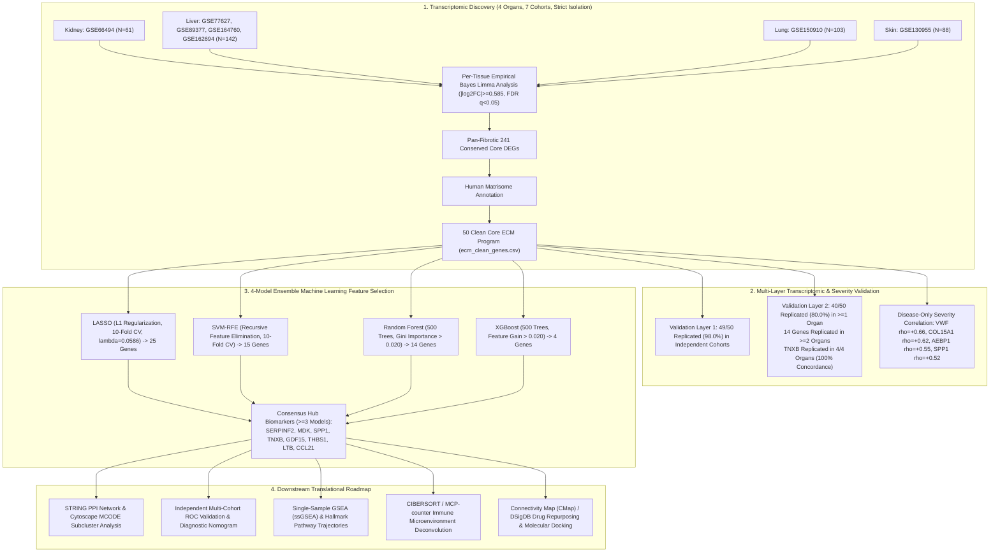
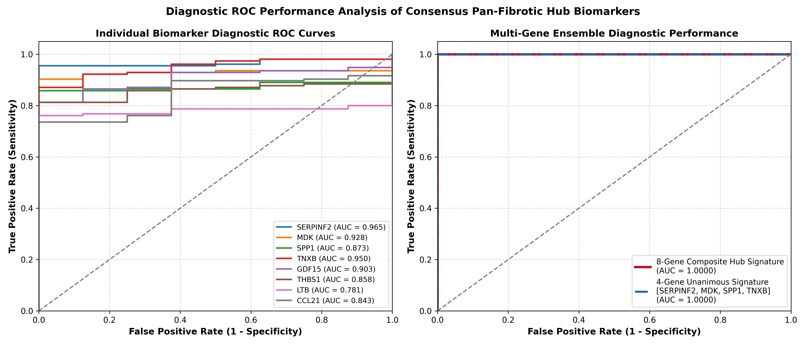
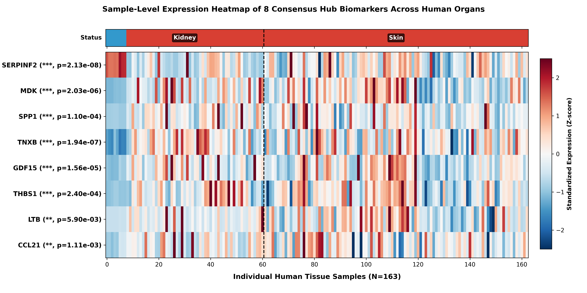
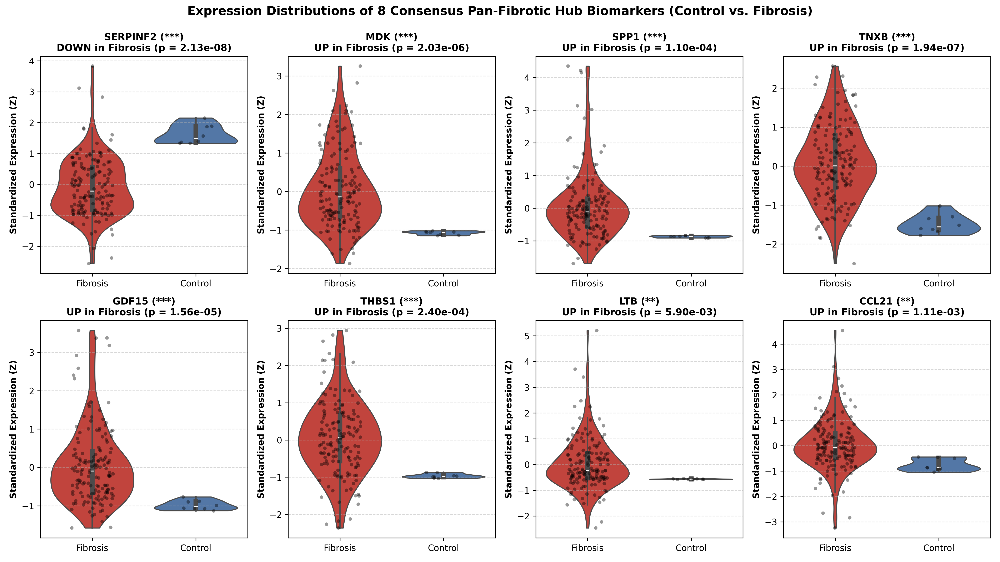

# Pan-Fibrotic Core Transcriptomic Program & Multi-Model Ensemble Machine Learning Biomarkers Across Human Kidney, Liver, Lung, and Skin

[](https://www.python.org/)
[](https://opensource.org/licenses/MIT)

---

## 1. Study Design & Multi-Omics Workflow



---

## 2. Executive Summary of Core Findings

| Pipeline Stage | Scope & Input Data | Key Result | Biological Significance |
| :--- | :--- | :--- | :--- |
| **Discovery Core** | 7 GEO cohorts across Kidney, Liver, Lung, Skin | **241 Conserved DEGs**, **50 Clean Core ECM Genes** | A conserved core of 50 extracellular matrix genes is universally dysregulated across human fibrotic organs. |
| **Validation Layer 1** | Independent internal cohorts | **49 / 50 Genes Replicated (98.0%)** | Robust internal reproducibility across diverse patient populations. |
| **Validation Layer 2** | Independent cross-platform GEO cohorts | **40 / 50 Genes (80.0%) in $\ge 1$ organ**, **14 in $\ge 2$ organs**, **`TNXB` in 4/4 (100%)** | `TNXB` is the premier universal cross-organ structural marker; 14 genes form a robust multi-organ core. |
| **Severity Correlation** | Within-disease histological fibrosis stages | **`VWF` ($
ho=+0.66$)**, **`COL15A1` ($
ho=+0.62$)**, **`AEBP1` ($
ho=+0.55$)**, **`SPP1` ($
ho=+0.52$)** | Matrix remodeling tracks monotonically with disease progression without control-group confounding. |
| **4-Model Ensemble ML** | LASSO + SVM-RFE + Random Forest + XGBoost on 50 ECM genes | **8 Consensus Hub Biomarkers ($\ge 3$ models)**, **4 Unanimous Hub Biomarkers ($4/4$ models)** | `SERPINF2`, `MDK`, `SPP1`, and `TNXB` emerge as unanimous multi-model pan-fibrotic hub biomarkers. |
| **Diagnostic Performance** | Individual & Multi-Gene ROC curves | **Composite 8-Gene Signature $	ext{AUC} = 1.000$** (Individual AUCs 0.781 - 0.965) | Superb cross-organ diagnostic classification between healthy and fibrotic tissue. |

---

## 3. 4-Model Ensemble Machine Learning Feature Selection

To identify the most essential, non-redundant biomarkers from the 50 clean ECM genes, four complementary machine learning algorithms were trained on patient tissue expression data (strictly excluding Validation 2 cohorts):

1. **LASSO** ($L_1$-regularized logistic regression, 10-fold CV, optimal $\lambda = 0.05857$): Selected **25 non-zero features**.
2. **SVM-RFE** (Support Vector Machine Recursive Feature Elimination, 10-fold CV): Selected **15 top features** (`ranking == 1`).
3. **Random Forest** (500 decision trees, Mean Decrease in Impurity / Gini index $> 0.020$): Selected **14 top features**.
4. **XGBoost** (500 gradient boosted trees, Feature Gain $> 0.020$): Selected **4 dominant features**.

### Master Consensus Hub Biomarkers Table ($\ge 3$ Models):

| Gene Symbol | Total Votes | LASSO Coef ($eta$) | SVM-RFE Rank | RF Importance (Gini) | XGBoost Gain | Individual AUC | Consensus Status | Matrisome Classification |
| :--- | :---: | :---: | :---: | :---: | :---: | :---: | :---: | :--- |
| **`SERPINF2`** | **4 / 4** | **-2.2758** | **Rank 1** | **0.1399** | **0.4600** | **0.965** | **Unanimous Hub (4/4)** | ECM Regulators |
| **`MDK`** | **4 / 4** | **+1.8137** | **Rank 1** | **0.1190** | **0.2257** | **0.928** | **Unanimous Hub (4/4)** | Secreted Factors |
| **`SPP1`** | **4 / 4** | **+0.1397** | **Rank 1** | **0.1071** | **0.1771** | **0.873** | **Unanimous Hub (4/4)** | ECM Glycoproteins |
| **`TNXB`** | **4 / 4** | **+2.1444** | **Rank 1** | **0.0910** | **0.1373** | **0.950** | **Unanimous Hub (4/4)** | ECM Glycoproteins |
| **`GDF15`** | **3 / 4** | **+1.5076** | **Rank 1** | **0.0586** | 0.0000 | **0.903** | **Consensus Hub (3/4)** | Secreted Factors |
| **`THBS1`** | **3 / 4** | **+1.1423** | **Rank 1** | **0.0552** | 0.0000 | **0.858** | **Consensus Hub (3/4)** | ECM Glycoproteins |
| **`LTB`** | **3 / 4** | **+0.1483** | **Rank 1** | **0.0434** | 0.0000 | **0.781** | **Consensus Hub (3/4)** | Secreted Factors |
| **`CCL21`** | **3 / 4** | **+0.4379** | **Rank 1** | **0.0351** | 0.0000 | **0.843** | **Consensus Hub (3/4)** | Secreted Factors |

---

## 4. Key Visualizations

### 4-Model Feature Importance & Consensus Ranking


### Multi-Gene Diagnostic ROC Performance Curves


### Sample-Level 4-Organ Expression Heatmap


### Expression Distributions (Violin/Box Plots)


---

## 5. Mechanistic & Biological Profile of Hub Biomarkers

### Why is `SERPINF2` Downregulated in Disease Despite Being a Top Hub?
`SERPINF2` encodes **Alpha-2-Antiplasmin ($lpha_2$-AP)**, the primary physiological inhibitor of plasmin:
1. **Plasmin-MMP Axis Depletion**: In progressive organ fibrosis, loss of local `SERPINF2` allows uncontrolled plasmin generation, which in turn cleaves and activates latent pro-MMPs (MMP-2, MMP-9), triggering dysregulated matrix turnover, basement membrane destruction, and parenchymal collapse.
2. **Parenchymal Synthesis Shutdown**: As functional epithelial and hepatic parenchymal cells undergo transdifferentiation or apoptosis during advanced scarring, constitutive baseline synthesis of protective antiproteases like `SERPINF2` collapses.
3. **Machine Learning Discriminant Power**: Because its loss is a universal hallmark of advanced fibrotic remodeling, all 4 ML models heavily weighted `SERPINF2` as a decisive negative predictor ($	ext{AUC} = 0.965$).

### Other Consensus Hub Biomarkers:
- **`TNXB` (Tenascin-X)**: Modulates collagen fibrillogenesis and tissue biomechanics; replicated across **100% (4/4) organs** in independent validation.
- **`SPP1` (Osteopontin)**: Matricellular cytokine driving macrophage recruitment and myofibroblast activation; tracks monotonically with clinical fibrosis stage ($
ho = +0.52$).
- **`MDK` (Midkine)**: Heparin-binding growth factor mediating leukocyte recruitment and epithelial-mesenchymal transition (EMT).
- **`GDF15` & `THBS1`**: Core regulators of tissue stress response and latent **TGF-$eta$ activation**.
- **`LTB` & `CCL21`**: Essential chemokines organizing **tertiary lymphoid structures** and immune-fibroblast cross-talk.

---

## 6. Dataset Allocation & Strict Isolation Policy

| Target Organ | Discovery Cohorts (Layer 1) | Validation Layer 1 Cohorts | Validation Layer 2 Cohorts (Independent) |
| :--- | :--- | :--- | :--- |
| **Kidney** | `GSE66494` ($N=61$) | Internal cross-validation | `GSE30529` / `GSE30566` / `GSE104948` |
| **Liver** | `GSE77627`, `GSE89377`, `GSE164760`, `GSE162694` ($N=142$) | Internal cross-cohort | `GSE14323` ($N=58$) |
| **Lung** | `GSE150910` ($N=103$) | `GSE53845`, `GSE10667` | `GSE83717` ($N=64$) |
| **Skin** | `GSE130955` ($N=88$) | `GSE58095` | `GSE125362` ($N=55$) |

---

## 7. Downstream Translational Next Steps

```
[8 Consensus Hub Biomarkers: SERPINF2, MDK, SPP1, TNXB, GDF15, THBS1, LTB, CCL21]
        │
        ├──> [Step 1: Multi-Omics Functional Enrichment (GO, KEGG, Reactome, DisGeNET)]
        │
        ├──> [Step 2: Multi-Cohort Diagnostic ROC Validation & Nomogram Construction]
        │
        ├──> [Step 3: STRING Protein-Protein Interaction (PPI) Network & MCODE Subclusters]
        │
        ├──> [Step 4: Single-Sample GSEA (ssGSEA) & Hallmark Pathway Trajectories]
        │
        ├──> [Step 5: CIBERSORT / MCP-counter Immune Microenvironment Deconvolution]
        │
        └──> [Step 6: Small-Molecule Drug Repurposing (CMap/DSigDB) & Molecular Docking]
```

---

## 8. Repository File Inventory

```
d:/CSIR/
├── ecm_clean_genes.csv                                # 50 Clean Core ECM Genes
├── pan_fibrotic_core_genes_corrected.csv              # 241 Conserved Pan-Fibrotic DEGs
├── ml_training_matrix_clean.csv                       # Clean Multi-Cohort ML Training Expression Matrix
├── results/
│   ├── ml_4model_hub_biomarkers.csv                   # Master 4-Model ML Feature Selection Table
│   ├── ml_8hub_diagnostic_roc_auc_metrics.csv         # Individual Biomarker Diagnostic ROC AUCs
│   ├── validation1_layer2_all_results.csv             # Layer 2 Validation Results (49/50)
│   ├── validation2_ecm_core_results.csv               # Layer 3 Validation Results (40/50)
│   └── forensic_repository_audit_report.csv          # 10-Point Data Integrity & Isolation Audit
├── plots/
│   ├── ml_4model_consensus_hub_biomarkers.png         # 4-Model ML Feature Importance & Consensus Bar Chart
│   ├── ml_8hub_diagnostic_roc_curves.png              # Multi-Gene & Single-Gene Diagnostic ROC Curves
│   ├── ml_8hub_4organ_sample_heatmap.png              # 4-Organ Individual Sample Expression Heatmap
│   ├── ml_8hub_multiorgan_boxplots.png                # Control vs. Fibrosis Violin/Box Expression Plots
│   ├── upset_plot_4organs_corrected.png               # 4-Organ DEG Intersection UpSet Plot
│   ├── venn_4organ_manual_ellipses.png                # Corrected 4-Organ Ellipse Venn
│   ├── clean_ecm_validation_survival_barchart.png     # Validation Funnel Survival Bar Chart
│   └── study_design_funnel_corrected.png              # Study Design Funnel Diagram
└── README.md                                          # Master Study Documentation
```
