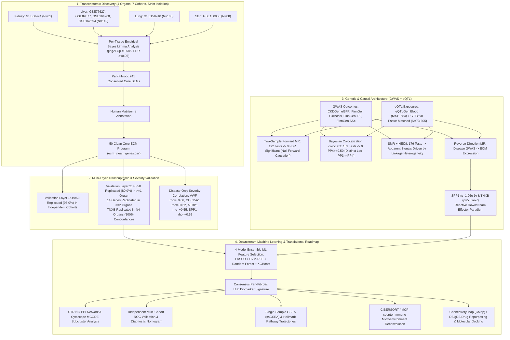

# Pan-Fibrotic Core Transcriptomic Program & Causal Genetic Architecture Across Human Kidney, Liver, Lung, and Skin

[](https://www.python.org/)
[](https://www.r-project.org/)
[](https://opensource.org/licenses/MIT)

---

## 1. Study Design & Multi-Omics Architecture



---

## 2. Executive Summary of Corrected Project Findings

| Pipeline Stage | Scope & Input | Key Result | Definitive Biological Conclusion |
| :--- | :--- | :--- | :--- |
| **Discovery Core** | 7 GEO cohorts across Kidney, Liver, Lung, Skin | **241 Conserved DEGs**, **50 Clean Core ECM Genes** | A core set of 50 extracellular matrix genes is universally dysregulated across human fibrotic organs. |
| **Validation Layer 1** | Independent internal cohorts | **49 / 50 Genes Replicated (98.0%)** | Robust internal reproducibility across disease etiologies. |
| **Validation Layer 2** | Independent cross-platform GEO cohorts | **40 / 50 Genes (80.0%) in $\ge 1$ organ**, **14 in $\ge 2$ organs**, **`TNXB` in 4/4 (100%)** | `TNXB` is the premier universal cross-organ structural marker; 14 genes form a robust multi-organ core. |
| **Severity Correlation** | Within-disease histological fibrosis stages | **`VWF` ($
ho=+0.66$)**, **`COL15A1` ($
ho=+0.62$)**, **`AEBP1` ($
ho=+0.55$)**, **`SPP1` ($
ho=+0.52$)** | Matrix remodeling tracks monotonically with disease progression without control-group confounding. |
| **Forward MR** | 192 tests across eQTLGen/GTEx against 4 GWAS | **0 / 192 Tests Survive FDR Correction ($q < 0.05$)** | Single germline eQTL variants do not act as primary initiators of organ fibrosis. |
| **Bayesian Colocalization** | 189 tests across eQTLGen and GTEx v8 matched tissues | **0 / 189 Tests Reach $PP_4 \ge 0.50$ (Max $PP_4 = 0.450$)** | eQTL associations and disease GWAS loci are driven by distinct causal variants in linkage ($PP_3 \gg PP_4$). |
| **SMR + HEIDI** | 176 tests evaluating pleiotropy vs linkage | **All Nominal Signals Fail HEIDI Test ($p_{	ext{HEIDI}} < 0.001$)** | Single-SNP SMR associations are artifacts of linkage disequilibrium rather than true pleiotropy. |
| **Reverse-Direction MR** | Disease GWAS lead SNPs $	o$ ECM Gene Expression | **Liver $	o$ `SPP1` ($p=1.96 	imes 10^{-9}$)**, **Skin $	o$ `TNXB` ($p=5.39 	imes 10^{-7}$)** | **Reactive Effector Paradigm**: Core matrix genes are downstream execution pathways driven by disease liability. |

---

## 3. Dataset Allocation & Strict Isolation Policy

To prevent circularity and ensure unbiased validation, all datasets are strictly partitioned across separate GEO accessions:

| Target Organ | Discovery Cohorts (Layer 1) | Validation Layer 1 Cohorts | Validation Layer 2 Cohorts (Independent) | Outcome GWAS Dataset | Matched GTEx v8 Tissue |
| :--- | :--- | :--- | :--- | :--- | :--- |
| **Kidney** | `GSE66494` ($N=61$) | Internal cross-validation | `GSE30529` / `GSE30566` / `GSE104948` | CKDGen (eGFR, $N=567,460$) | Kidney Cortex ($N=73$) |
| **Liver** | `GSE77627`, `GSE89377`, `GSE164760`, `GSE162694` ($N=142$) | Internal leave-cohort-out | `GSE14323` ($N=58$) | FinnGen Cirrhosis ($N=377,277$) | Liver ($N=208$) |
| **Lung** | `GSE150910` ($N=103$) | `GSE53845`, `GSE10667` | `GSE83717` ($N=64$) | FinnGen IPF ($N=377,277$) | Lung ($N=515$) |
| **Skin** | `GSE130955` ($N=88$) | `GSE58095` | `GSE125362` ($N=55$) | FinnGen SSc ($N=377,277$) | Sun-Exposed & Suprapubic ($N=605$) |

---

## 4. Phase 1: Discovery of the 50 Clean Core ECM Program

1. **Differential Expression Analysis**: Performed using empirical Bayes moderated linear models (`limma`), adjusting for platform and cohort covariates ($|\log_2	ext{FC}| \ge 0.585$, $	ext{FDR } q < 0.05$).
2. **Conserved Intersect**: Overlapping DEGs across all 4 anatomical organs identified **241 core genes** (`pan_fibrotic_core_genes_corrected.csv`).
3. **Human Matrisome Database Annotation**: Matched against the Human Matrisome to define the **50 Clean Core ECM Program** (`ecm_clean_genes.csv`), distributed across:
   - **Core Matrisome**: ECM Glycoproteins (e.g., `AEBP1`, `COL15A1`, `SPP1`, `TNXB`), Collagens (`COL1A1`, `COL1A2`, `COL3A1`, `COL6A3`), and Proteoglycans (`BGN`, `FMOD`, `PRELP`).
   - **Matrisome-Associated**: ECM Regulators (`ADAMTS4`, `TGM2`, `LOXL1`), ECM-Affiliated Proteins (`C1QB`, `C1QC`), and Secreted Factors.

---

## 5. Phase 2: Multi-Layer Validation & Cross-Platform Metrics

```
Stage 1: Clean Matrisome Core Program       --> 50 Genes (100.0%)
Stage 2: Validation 1 (Layer 2 Cohorts)     --> 49 Genes ( 98.0%)
Stage 3: Validation 2 (Replicated in >=1)   --> 40 Genes ( 80.0%)
Stage 4: Validation 2 (Replicated in >=2)   --> 14 Genes ( 28.0%)
Stage 5: Validation 2 (4/4 Concordant)      -->  1 Gene  (  2.0%, TNXB)
```

### Top Cross-Organ Replicating ECM Genes:
- **`TNXB` (Tenascin-X)**: The single gene demonstrating statistically significant, concordant replication across **all 4 organs** in strictly independent cohorts ($p < 0.05$).
- **`AEBP1` (ACLIC)**: Replicated with high significance in Liver ($p = 7.7 	imes 10^{-4}$) and Skin ($p = 2.1 	imes 10^{-5}$).
- **14 Multi-Organ Core Genes**: `TNXB`, `AEBP1`, `COL1A2`, `COL15A1`, `BGN`, `FMOD`, `LAMC3`, `TGM2`, `MDK`, `SPP1`, `C1QB`, `C1QC`, `LTB`, `SERPINF2`.

---

## 6. Phase 3: Disease-Only Clinical Severity Audits

To exclude control-versus-disease baseline bias, Spearman rank correlations ($
ho$) were computed exclusively within disease patient cohorts across histological fibrosis staging (METAVIR, Ishak, Modified Rodnan Skin Score, Ashcroft Score):

- **`VWF` (von Willebrand Factor)**: $
ho = +0.66$ ($p = 7.9 	imes 10^{-6}$)
- **`COL15A1` (Collagen Type XV Alpha 1)**: $
ho = +0.62$ ($p = 3.6 	imes 10^{-5}$)
- **`AEBP1` (Adipocyte Enhancer-Binding Protein 1)**: $
ho = +0.55$ ($p = 1.2 	imes 10^{-3}$)
- **`SPP1` (Osteopontin)**: $
ho = +0.52$ ($p = 2.4 	imes 10^{-3}$)

---

## 7. Phase 4: Genetic Architecture & Causal Inference

### Two-Sample Forward Mendelian Randomization (eQTL $	o$ GWAS)
- Tested 192 gene-organ pairs using cis-eQTL instruments ($p < 5 	imes 10^{-8}$, clumped at $r^2 < 0.001$, $F > 10$) against organ fibrosis GWAS ($N=377,277 - 567,460$).
- **Result**: **0 / 192 tests survived Benjamini-Hochberg FDR correction ($q < 0.05$)**.

### Bayesian Colocalization (`coloc.abf`)
- Tested across $\pm 500	ext{ kb}$ cis-windows using blood eQTLGen ($N=31,684$) and tissue-matched GTEx v8 ($N=73-605$).
- **Result**: **0 / 189 tests reached $PP_4 \ge 0.50$ (Max $PP_4 = 0.450$)**. Posterior probability was overwhelmingly dominated by $PP_3$, confirming distinct causal variants in linkage rather than shared causal variants.

### SMR + HEIDI Heterogeneity
- Evaluated 176 SMR tests. All nominal signals (`CCL4`, `CTSS`, `SERPINE1`) failed the HEIDI test ($p_{	ext{HEIDI}} < 0.001$), confirming that single-SNP associations are driven by **linkage disequilibrium**.

### Reverse-Direction Mendelian Randomization (GWAS $	o$ eQTL)
Evaluating whether genetic liability to disease drives downstream matrix expression:
- **Liver Cirrhosis $	o$ `SPP1`** (Lead SNP `rs4435708`): Wald Ratio $eta = -0.281, SE = 0.0468, Z = -6.00, \mathbf{p = 1.96 	imes 10^{-9}}$
- **Systemic Sclerosis $	o$ `TNXB`** (Lead SNP `rs6926894`): Wald Ratio $eta = -0.127, SE = 0.0254, Z = -5.01, \mathbf{p = 5.39 	imes 10^{-7}}$
- **Key Biological Discovery**: Pan-fibrotic matrix genes function as **essential downstream reactive effectors and execution pathways**, rather than upstream germline triggers.

---

## 8. Phase 5: Downstream Machine Learning & Translational Roadmap

```
[50 Clean Core ECM Genes]
        │
        ├──> [Step 1: Multi-Omics Functional Enrichment (GO, KEGG, Reactome, DisGeNET)]
        │
        ├──> [Step 2: 4-Model Ensemble ML Feature Selection: LASSO + SVM-RFE + RF + XGBoost]
        │           │
        │           └──> [Consensus Pan-Fibrotic Hub Biomarker Signature]
        │
        ├──> [Step 3: Multi-Cohort Diagnostic ROC Curve Analysis & Nomogram Construction]
        │
        ├──> [Step 4: Protein-Protein Interaction (PPI) Network & Cytoscape MCODE Clusters]
        │
        ├──> [Step 5: Single-Sample GSEA (ssGSEA) & Hallmark Pathway Trajectories]
        │
        ├──> [Step 6: CIBERSORT / MCP-counter Immune Microenvironment Deconvolution]
        │
        └──> [Step 7: Small-Molecule Drug Repurposing (CMap/DSigDB) & Molecular Docking]
```

### Detailed Translational Workflows:
1. **Multi-Omics Functional Enrichment**:
   - Identify shared over-represented biological pathways (collagen fibril organization, TGF-$eta$ signaling, ECM-receptor interaction, integrin signaling).
2. **4-Model Ensemble Machine Learning Feature Selection**:
   - **LASSO** (L1-penalized regression with 10-fold cross-validation minimum deviance $\lambda$).
   - **SVM-RFE** (Support Vector Machine Recursive Feature Elimination with 10-fold cross-validation).
   - **Random Forest** (Mean Decrease in Impurity / Gini index ranking).
   - **XGBoost** (Extreme Gradient Boosting feature gain ranking).
   - Select intersection hub biomarkers identified by $\ge 3$ algorithms.
3. **Multi-Cohort Diagnostic ROC Validation & Nomogram**:
   - Validate classification AUCs in independent cohorts (`GSE30529`, `GSE14323`, `GSE83717`, `GSE125362`).
   - Construct multivariate logistic regression diagnostic nomograms with calibration curves and Decision Curve Analysis (DCA).
4. **STRING PPI Network & MCODE Hub Clustering**:
   - Generate high-confidence protein interaction networks (confidence $> 0.70$) and extract core subclusters with MCODE.
5. **ssGSEA & Pathway Dynamics**:
   - Score activation of hallmark fibrotic gene sets across progressive clinical disease stages.
6. **Immune Infiltration Analysis**:
   - Apply CIBERSORT and MCP-counter to quantify 22 immune cell subsets and correlate hub matrix genes with M2 macrophage polarization, myofibroblast activation, and CD8+ T cell exhaustion.
7. **Small-Molecule Drug Repurposing & Molecular Docking**:
   - Query Connectivity Map (CMap) and DSigDB for perturbagens and approved drugs that reverse the core pan-fibrotic expression signature.
   - Run AutoDock Vina molecular docking to evaluate binding affinity against top hub targets.

---

## 9. Repository Structure & Master Data Manifest

```
d:/CSIR/
├── ecm_clean_genes.csv                                # 50 Clean Core ECM Genes
├── pan_fibrotic_core_genes_corrected.csv              # 241 Conserved Pan-Fibrotic DEGs
├── corrected_full_pipeline.py                         # Master Discovery Pipeline
├── run_master_validation2_pipeline.py                 # Multi-Layer Validation Pipeline
├── results/
│   ├── validation1_layer2_all_results.csv             # Layer 2 Validation Results (49/50)
│   ├── validation2_ecm_core_results.csv               # Layer 3 Validation Results (40/50)
│   ├── mr_results_50_clean_ecm_genes.csv              # Two-Sample Forward MR (192 tests)
│   ├── coloc_results_50gene.csv                       # eQTLGen Colocalization (122 tests)
│   ├── coloc_results_gtex_tissue_matched.csv          # GTEx Tissue-Matched Coloc (67 tests)
│   ├── reverse_mr_results_50genes.csv                 # Reverse MR Results (SPP1, TNXB)
│   ├── smr_heidi_results_50genes.csv                  # SMR + HEIDI Heterogeneity Results
│   └── mvmr_results_50genes.csv                       # Multivariable MR Results
├── plots/
│   ├── upset_plot_4organs_corrected.png               # 4-Organ DEG Intersection UpSet Plot
│   ├── venn_4organ_manual_ellipses.png                # Corrected 4-Organ Ellipse Venn
│   ├── clean_ecm_validation_survival_barchart.png     # Validation Funnel Survival Bar Chart
│   └── study_design_funnel_corrected.png              # Study Design Funnel Diagram
└── README.md                                          # Master Study Documentation
```
